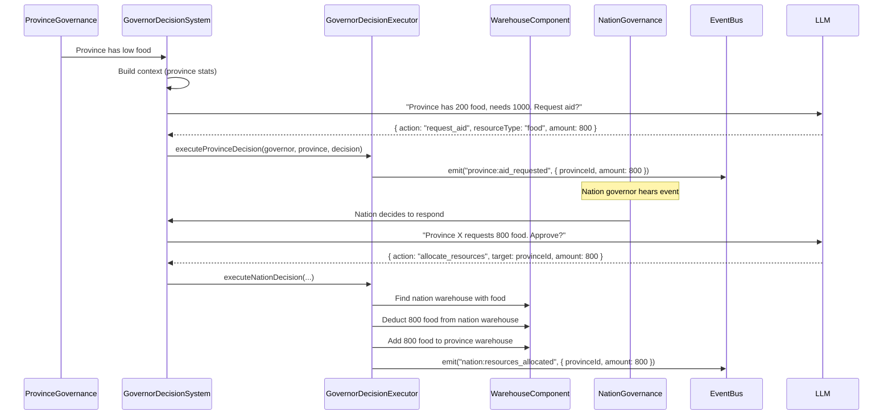
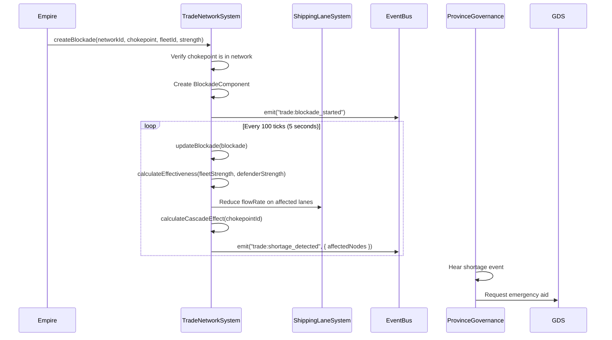
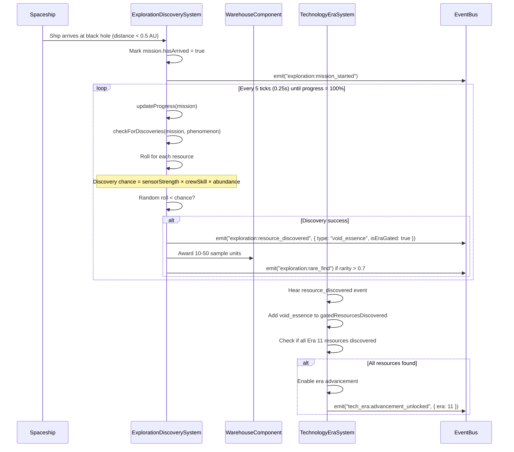
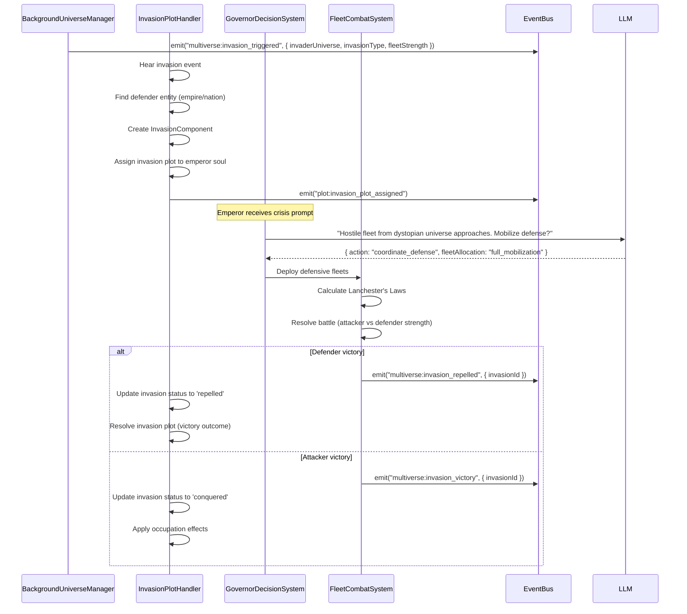
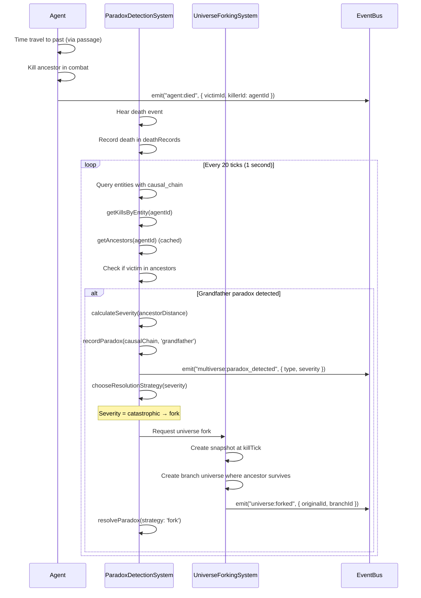
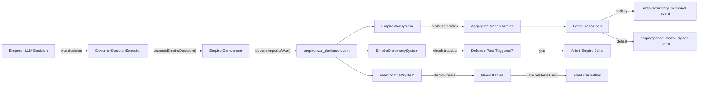
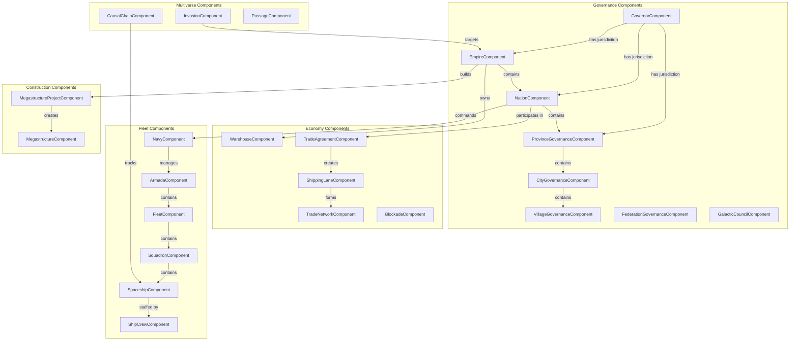

# Grand Strategy Integration Guide

**Version:** 1.0
**Last Updated:** 2026-01-20
**Status:** Complete (Phases 1-6 Implemented)

---

## Table of Contents

1. [Introduction](#introduction)
2. [Architecture Principles](#architecture-principles)
3. [System Catalog](#system-catalog)
4. [Integration Flows](#integration-flows)
5. [Interaction Diagrams](#interaction-diagrams)
6. [Component Reference](#component-reference)
7. [Event Reference](#event-reference)
8. [Configuration Guide](#configuration-guide)
9. [Best Practices](#best-practices)
10. [Troubleshooting](#troubleshooting)

---

## Introduction

### Overview

The Grand Strategy layer extends the AI Village simulation from individual agents and villages to galactic civilizations spanning multiple universes. It implements a complete hierarchical governance system with LLM-driven decision-making, multi-scale trade networks, stellar resource discovery, and multiverse mechanics.

### Scale Hierarchy

```
Agent (1 person)
  ↓
Village (10-100 agents)
  ↓
City (100-1,000 agents)
  ↓
Province (1,000-10,000 agents)
  ↓
Nation (10K-1M agents)
  ↓
Empire (1M-100M agents)
  ↓
Federation (100M-10B agents)
  ↓
Galactic Council (10B+ agents, multi-species)
```

### Architecture Principles

**1. Event-Driven Integration**
- Systems communicate via strongly-typed events
- No direct system-to-system dependencies
- Loose coupling enables independent evolution

**2. ECS Foundation**
- All state stored in components (lowercase_with_underscores)
- Systems process components and emit events
- No hidden state or globals

**3. LLM Integration**
- Governors make strategic decisions at each tier
- Context builders provide game state
- Decision executors modify components
- Full audit trail of all decisions

**4. Performance-First Design**
- System throttling (skip non-critical updates)
- Entity culling (SimulationScheduler)
- Query caching (CLAUDE.md compliance)
- Lazy activation (activationComponents)

---

## System Catalog

### Phase 1: Critical Integration (4 Systems)

#### GovernorDecisionExecutor (Priority: N/A - Service, not system)

**Purpose:** Execute LLM governor decisions by modifying game state

**File:** `/packages/core/src/governance/GovernorDecisionExecutor.ts` (1,773 lines)

**Components Used:**
- `governor` (read)
- `empire`, `nation`, `province_governance`, `federation_governance`, `galactic_council` (read/write)
- `warehouse` (write for resource allocation)

**Events Emitted:**
- `empire:war_declared`
- `empire:nation_absorbed`
- `empire:nation_released`
- `empire:resources_allocated`
- `nation:tax_rate_changed`
- `nation:war_declared`
- `nation:treaty_signed`
- `nation:research_prioritized`
- `nation:policy_enacted`
- `province:priorities_set`
- `province:aid_requested`
- `province:rebellion_response`
- `federation:law_proposed`
- `federation:proposal_voting_started`
- `federation:joint_operation_started`
- `federation:tariff_changed`
- `galactic_council:law_proposed`
- `galactic_council:emergency_session`
- `galactic_council:peacekeeping_deployed`
- `galactic_council:sanctions_applied`

**Events Consumed:** None (invoked by GovernorDecisionSystem)

**Integration Points:**
- Called by GovernorDecisionSystem with parsed LLM decisions
- Modifies NationComponent.economy.treasury for resource transfers
- Modifies WarehouseComponent.stockpiles for aid allocation
- Calls DecisionProtocols.delegateDirective() for hierarchical commands

**Example:**
```typescript
// Province governor decides to request aid from nation
const decision: ParsedGovernorDecision = {
  reasoning: "Food shortage detected, requesting aid",
  action: {
    type: 'request_aid',
    parameters: { resourceType: 'food', amount: 1000, urgency: 'critical' }
  }
};

const result = executeProvinceDecision(governor, province, decision, world);
// → Emits province:aid_requested event
// → Nation governor receives event and may respond with allocation
```

---

#### MegastructureConstructionSystem (Priority: 300)

**Purpose:** Manage megastructure construction projects and completion

**File:** `/packages/core/src/systems/MegastructureConstructionSystem.ts` (633 lines)

**Components Used:**
- `megastructure_project` (read/write)
- `megastructure` (create on completion)
- `economy`, `inventory` (read for resource checks)

**Events Emitted:**
- `megastructure:construction_started`
- `megastructure:construction_completed`
- `megastructure:activated`

**Events Consumed:** None

**Integration Points:**
- Creates MegastructureComponent when project completes
- MegastructureMaintenanceSystem processes operational structures
- Spatial hierarchy adapters preserve megastructures in tier snapshots

**Example:**
```typescript
// Dyson Swarm construction completes
// MegastructureConstructionSystem.update() detects progress = 100%
const megastructure: MegastructureComponent = {
  type: 'megastructure',
  megastructureType: 'dyson_swarm',
  efficiency: 1.0,
  phase: 'operational',
  systemId: 'sol',
  ...blueprint
};
entity.addComponent(megastructure);
world.eventBus.emit('megastructure:activated', { megastructureId });
```

---

#### MegastructureMaintenanceSystem (Priority: 310)

**Purpose:** Track maintenance, degradation, and ruins progression

**File:** `/packages/core/src/systems/MegastructureMaintenanceSystem.ts` (804 lines)

**Components Used:**
- `megastructure` (read/write)

**Events Emitted:**
- `megastructure:maintenance_performed`
- `megastructure:maintenance_failed`
- `megastructure:decay_stage`

**Events Consumed:** None

**Integration Points:**
- Deducts resources from faction/civilization warehouses (TODO: line 567-574)
- Tracks maintenanceDebt when resources unavailable
- Calls ageRuinsOptimized() when efficiency drops to 0
- Archaeological sites created from ruins (future integration)

**Example:**
```typescript
// Dyson Swarm requires maintenance
const required = megastructure.maintenanceRequirements;
// Check civilization warehouse for exotic_matter, energy_cells
if (warehouseHasSufficientResources(required.resources)) {
  // Deduct resources
  warehouse.stockpiles['exotic_matter'] -= required.resources['exotic_matter'];
  // Maintain efficiency
  megastructure.efficiency = 1.0;
} else {
  // Accumulate debt
  megastructure.maintenanceDebt += required.resources['exotic_matter'];
  megastructure.efficiency -= 0.05; // Degrade 5% per missed cycle
}
```

---

#### CityGovernanceSystem (Priority: 53)

**Purpose:** Formal governance for city tier (directors → departments)

**File:** `/packages/core/src/systems/CityGovernanceSystem.ts`

**Components Used:**
- `city_governance` (read/write)
- `village_governance` (read for aggregation)

**Events Emitted:**
- `city:budget_allocated`
- `city:infrastructure_project_started`
- `city:law_enacted`

**Events Consumed:**
- `governance:directive_issued` (from provinces)

**Integration Points:**
- CityDirectorSystem (existing) provides LLM decisions
- Aggregates statistics from member VillageGovernanceComponents
- Propagates directives to villages

**Example:**
```typescript
// City director allocates 40% budget to agriculture
const cityGov: CityGovernanceComponent = {
  departments: {
    agriculture: { budget: 40000, staffing: 0.8 },
    industry: { budget: 30000, staffing: 0.7 },
    // ...
  }
};
// Budget flows to village-level agricultural projects
```

---

### Phase 2: High-Tier Governance (3 Systems)

#### EmpireDiplomacySystem (Priority: 202)

**Purpose:** Manage empire-level diplomatic relations and treaties

**File:** `/packages/core/src/systems/EmpireDiplomacySystem.ts`

**Components Used:**
- `empire` (read/write)

**Events Emitted:**
- `empire:alliance_formed`
- `empire:treaty_signed`
- `empire:diplomatic_incident`

**Events Consumed:**
- `empire:war_declared` (from GovernorDecisionExecutor)

**Integration Points:**
- EmpireWarSystem uses alliance data for military coordination
- Treaty terms affect trade agreements (TradeAgreementSystem)
- Diplomatic AI generates LLM prompts for treaty negotiation

---

#### EmpireWarSystem (Priority: 605)

**Purpose:** Resolve empire-scale wars with aggregate armies

**File:** `/packages/core/src/systems/EmpireWarSystem.ts`

**Components Used:**
- `empire` (read/write)
- `nation` (read for army aggregation)
- `fleet_combat` (dependency for naval battles)

**Events Emitted:**
- `empire:battle_resolved`
- `empire:territory_occupied`
- `empire:peace_treaty_signed`

**Events Consumed:**
- `empire:war_declared`

**Integration Points:**
- Aggregates nation-level armies for empire battles
- Uses Lanchester's Laws from FleetCombatSystem
- Peace treaties executed via GovernorDecisionExecutor

---

#### FederationGovernanceSystem (Priority: 205)

**Purpose:** Multi-empire federal governance with voting and joint operations

**File:** `/packages/core/src/systems/FederationGovernanceSystem.ts`

**Components Used:**
- `federation_governance` (read/write)
- `empire`, `nation` (read for member stats)

**Events Emitted:**
- `federation:proposal_passed`
- `federation:proposal_failed`
- `federation:member_seceded`
- `federation:joint_operation_completed`

**Events Consumed:**
- `federation:law_proposed` (from GovernorDecisionExecutor)
- `federation:proposal_voting_started`

**Integration Points:**
- Member satisfaction tracked → secession mechanics
- Joint military operations via NavySystem
- Federal laws override nation policies

**Example:**
```typescript
// Federation proposes universal trade law
const proposal: FederalProposal = {
  type: 'law',
  requiresSupermajority: true,
  votes: new Map() // Empire ID → vote
};
// Calculate weighted votes by population
const totalPopulation = memberEmpires.reduce((sum, e) => sum + e.population, 0);
for (const empire of memberEmpires) {
  const votingPower = empire.population / totalPopulation;
  // Empire governor decides vote (LLM)
}
// If ≥66% approval, law passes
```

---

#### GalacticCouncilSystem (Priority: 210)

**Purpose:** Multi-species galaxy-wide governance and peacekeeping

**File:** `/packages/core/src/systems/GalacticCouncilSystem.ts`

**Components Used:**
- `galactic_council` (read/write)
- `species` (read for delegate representation)

**Events Emitted:**
- `galactic_council:universal_law_passed`
- `galactic_council:peacekeeping_mission_started`
- `galactic_council:sanctions_imposed`

**Events Consumed:**
- `galactic_council:law_proposed`
- `galactic_council:peacekeeping_deployed`

**Integration Points:**
- Species delegates vote with population + tech level weighting
- Peacekeeping missions deploy NavySystem fleets
- Sanctions affect trade networks (TradeNetworkSystem)

---

### Phase 3: Economic Depth (4 Systems)

#### TradeNetworkSystem (Priority: 165)

**Purpose:** Graph analysis of trade networks, hub detection, chokepoint identification

**File:** `/packages/core/src/systems/TradeNetworkSystem.ts` (1,220 lines)

**Components Used:**
- `trade_network` (read/write)
- `shipping_lane` (read)
- `blockade` (read/write)

**Events Emitted:**
- `trade:hub_identified`
- `trade:chokepoint_detected`
- `trade:network_resilience_low`
- `trade:blockade_started`
- `trade:shortage_detected`

**Events Consumed:**
- `economy:lane:created`
- `economy:lane:removed`

**Integration Points:**
- Builds graph from ShippingLaneComponents
- Calculates betweenness centrality for hub identification
- Applies blockade effects to shipping lanes
- Emits shortage events for downstream regions

**Example:**
```typescript
// Trade network analysis detects major hub
const graph = buildNetworkGraph(world, network);
const { centrality } = brandesBetweenness(graph);
const hubs = identifyHubs(graph); // Top 10% betweenness
world.eventBus.emit('trade:hub_identified', {
  nodeId: hub.nodeId,
  betweenness: hub.betweenness,
  tier: 'major' // or 'minor'
});

// Blockade applied to chokepoint
const affectedNodes = applyBlockadeEffects(world, blockade, effectiveness);
// → Emits trade:shortage_detected for all downstream nodes
```

---

#### ShipyardProductionSystem (Priority: 170)

**Purpose:** Calculate ship production from shipyard capacity and budgets

**File:** `/packages/core/src/systems/ShipyardProductionSystem.ts`

**Components Used:**
- `navy` (read for budget)
- `shipyard_production` (read/write)

**Events Emitted:**
- `shipyard:production_started`
- `shipyard:ship_completed`

**Events Consumed:**
- `navy:budget_allocated` (from NavyBudgetSystem)

**Integration Points:**
- Consumes NavyComponent.budget.newConstruction
- Produces ships based on shipyardCapacity
- Ships added to SquadronComponents

---

#### NavyPersonnelSystem (Priority: 175)

**Purpose:** Crew recruitment, training, and payroll

**File:** `/packages/core/src/systems/NavyPersonnelSystem.ts`

**Components Used:**
- `navy` (read)
- `ship_crew` (read/write)

**Events Emitted:**
- `navy:personnel_recruited`
- `navy:personnel_trained`

**Events Consumed:** None

**Integration Points:**
- Depends on ShipyardProductionSystem for crew assignments
- Crew costs deducted from NavyComponent.budget.personnel

---

#### ExplorationDiscoverySystem (Priority: 180)

**Purpose:** Stellar resource discovery for era progression

**File:** `/packages/core/src/systems/ExplorationDiscoverySystem.ts` (657 lines)

**Components Used:**
- `exploration_mission` (read/write)
- `spaceship` (read)
- `position` (read for arrival detection)
- `warehouse` (write for resource samples)

**Events Emitted:**
- `exploration:mission_started`
- `exploration:resource_discovered`
- `exploration:stellar_phenomenon_discovered`
- `exploration:rare_find`
- `exploration:mission_completed`

**Events Consumed:** None

**Integration Points:**
- Detects ship arrival at stellar phenomena coordinates
- Rolls for discovery based on sensorStrength and crewSkill
- Awards resource samples to civilization warehouses
- Discoveries unlock TechnologyEraSystem progression

**Example:**
```typescript
// Era 10 civilization explores black hole with probability_scout
const mission: ExplorationMissionComponent = {
  shipId: 'scout_01',
  targetType: 'stellar_phenomenon',
  targetId: 'black_hole_sgr_a',
  sensorStrength: 0.9, // High-end sensors
  crewSkill: 0.8
};

// System detects arrival (distance < 0.5 AU)
const phenomenon = getPhenomenon(targetId);
// phenomenon.resources = [{ type: 'void_essence', abundance: 0.3, difficulty: 0.9 }]

// Discovery roll
const chance = calculateDiscoveryChance(mission, 0.3); // 0.9 * 0.8 * 0.3 = 0.216
if (Math.random() < chance) {
  // DISCOVERY!
  world.eventBus.emit('exploration:resource_discovered', {
    resourceType: 'void_essence',
    isEraGated: true,
    eraRequirement: 10
  });
  // Award 10-50 units to civilization warehouse
  warehouse.stockpiles['void_essence'] += 30;
}
```

---

#### StellarMiningSystem (Priority: 185)

**Purpose:** Extract resources from discovered stellar phenomena

**File:** `/packages/core/src/systems/StellarMiningSystem.ts`

**Components Used:**
- `stellar_mining_operation` (read/write)
- `warehouse` (write)

**Events Emitted:**
- `mining:operation_started`
- `mining:resources_extracted`

**Events Consumed:**
- `exploration:resource_discovered`

**Integration Points:**
- Consumes ExplorationDiscoverySystem discoveries
- Extraction rate based on ship type and phenomenon danger
- Resources deposited to WarehouseComponents

---

### Phase 4: Multiverse Features (3 Systems)

#### InvasionPlotHandler (Priority: 215)

**Purpose:** Assign invasion plots when background universes attack

**File:** `/packages/core/src/systems/InvasionPlotHandler.ts` (300+ lines)

**Components Used:**
- `invasion` (read/write)
- `plot_lines` (write for plot assignment)

**Events Emitted:**
- `plot:invasion_plot_assigned`

**Events Consumed:**
- `multiverse:invasion_triggered` (from BackgroundUniverseManager)
- `multiverse:invasion_victory`
- `multiverse:invasion_repelled`
- `multiverse:invasion_failed`

**Integration Points:**
- BackgroundUniverseManager emits invasion triggers
- Assigns epic-scale plot templates to leader souls
- GovernorDecisionSystem handles crisis response
- FleetCombatSystem resolves military defense

**Example:**
```typescript
// Background universe triggers military invasion
world.eventBus.emit('multiverse:invasion_triggered', {
  invaderUniverse: 'universe_dystopia',
  targetUniverse: 'universe_prime',
  invasionType: 'military',
  fleetStrength: 10000
});

// InvasionPlotHandler receives event
const invasionComp: InvasionComponent = {
  activeInvasions: [{
    invasionId: 'invasion_dystopia_123456',
    type: 'military',
    attackerUniverseId: 'universe_dystopia',
    status: 'planning',
    startTick: 12000
  }]
};

// Assign plot to emperor/president
const plotTemplate = invasionPlotTemplates.get('invasion_full_military');
assignPlotToLeader(emperorSoul, plotTemplate);
// Emperor receives LLM prompt: "A hostile fleet approaches from another universe..."
```

---

#### ParadoxDetectionSystem (Priority: 220)

**Purpose:** Detect and resolve temporal paradoxes

**File:** `/packages/core/src/systems/ParadoxDetectionSystem.ts` (847 lines)

**Components Used:**
- `causal_chain` (read/write)
- `dynasty` (read for lineage checks)

**Events Emitted:**
- `multiverse:paradox_detected`
- `multiverse:paradox_forked`
- `multiverse:timeline_collapsed`
- `multiverse:retrocausal_adjustment`

**Events Consumed:**
- `agent:died` (for grandfather paradox detection)
- `universe:forked`

**Integration Points:**
- Tracks death records for grandfather paradoxes
- Analyzes causal chains for loops (bootstrap paradoxes)
- Triggers UniverseForkingSystem for resolution
- Invalidates ancestor cache on universe forks

**Paradox Types:**
1. **Grandfather:** Agent kills own ancestor
2. **Bootstrap:** Information loop with no origin
3. **Predestination:** Self-fulfilling prophecy
4. **Ontological:** Entity exists but origin universe collapsed

**Example:**
```typescript
// Agent time-travels and kills ancestor
const ancestors = getAncestors(agentId, world);
const killRecord = deathRecords.get(`${victimId}:${agentId}`);
if (ancestors.has(victimId)) {
  // PARADOX DETECTED!
  const severity = calculateGrandfatherSeverity(victimId, agentId);
  // → 'catastrophic' if parent, 'severe' if grandparent, etc.

  recordParadox(causalChain, 'grandfather', description, tick);

  // Resolve via universe forking
  world.eventBus.emit('universe:fork_requested', {
    forkAtTick: killRecord.tick,
    reason: 'Paradox resolution: grandfather (catastrophic)'
  });
  // Creates branching timeline where ancestor survives
}
```

---

#### TimelineMergerSystem (Priority: 95)

**Purpose:** Merge compatible universes using timeline_merger ships

**File:** `/packages/core/src/multiverse/TimelineMergeSystem.ts`

**Components Used:**
- `spaceship` (read for timeline_merger ships)
- `universe` (read/write)

**Events Emitted:**
- `multiverse:merge_initiated`
- `multiverse:merge_completed`
- `multiverse:merge_conflict_detected`

**Events Consumed:** None

**Integration Points:**
- Requires Era 12+ timeline_merger ship
- Analyzes entity state differences between universes
- Presents conflict resolution UI to player
- Collapses two universes into one

---

### Phase 5: Abstraction & Performance (2 Systems)

#### ProductionScalingSystem (Priority: 280)

**Purpose:** Scale production based on abstract tier statistics

**File:** `/packages/core/src/systems/ProductionScalingSystem.ts`

**Components Used:**
- `production_scaling` (read/write)
- `economy` (write)

**Events Emitted:**
- `production:scaled`

**Events Consumed:** None

**Integration Points:**
- Uses hierarchy-simulator tier statistics
- Applies production multipliers at System/Sector/Galaxy tiers
- Affects EconomyComponent resource generation

---

#### BackgroundUniverseSystem (Priority: 15)

**Purpose:** Simulate low-detail alternate universes

**File:** `/packages/core/src/systems/BackgroundUniverseSystem.ts`

**Components Used:** None (operates on BackgroundUniverseManager state)

**Events Emitted:**
- `multiverse:invasion_triggered`
- `multiverse:refugees_arrived`
- `multiverse:trade_opportunity`

**Events Consumed:**
- `universe:forked` (spawns new background universe)

**Integration Points:**
- Rolls for invasion events every 500 ticks
- InvasionPlotHandler processes invasion triggers
- PassageTraversalSystem handles refugee/trade flow

---

## Integration Flows

### Flow 1: Political Decision Execution

**Scenario:** Province governor requests aid from nation during food shortage



**Code Example:**
```typescript
// Step 1: Province governor (LLM) decides to request aid
const provinceContext = buildProvinceContext(province, world);
const prompt = buildProvinceGovernorPrompt(provinceContext);
const llmResponse = await llmProvider.generate(prompt);
const decision = parseGovernorDecision(llmResponse);
// decision = { action: { type: 'request_aid', parameters: { resourceType: 'food', amount: 800 }}}

// Step 2: Execute decision (emits event)
const result = executeProvinceDecision(governorEntity, province, decision, world);
// → Emits province:aid_requested

// Step 3: Nation governor hears event and decides to respond
world.eventBus.on('province:aid_requested', (event) => {
  const nationContext = buildNationContext(nation, world);
  // Add event to context
  nationContext.events.push(event);

  const prompt = buildNationGovernorPrompt(nationContext);
  const response = await llmProvider.generate(prompt);
  const nationDecision = parseGovernorDecision(response);

  // Step 4: Execute nation decision (transfers resources)
  executeNationDecision(nationGovernor, nation, nationDecision, world);
});

// Step 5: Resources transferred
function executeNationAllocateResources(...) {
  const nationWarehouse = findWarehouse(world, nation.id, 'food');
  const provinceWarehouse = findWarehouse(world, provinceId, 'food');

  if (nationWarehouse.stockpiles['food'] >= amount) {
    nationWarehouse.stockpiles['food'] -= amount;
    provinceWarehouse.stockpiles['food'] += amount;

    world.eventBus.emit('nation:resources_allocated', {
      provinceId, amount, resourceType: 'food'
    });
  }
}
```

**Result:** Province food stockpile increases by 800, nation treasury decreases by 800, both governors have audit trail.

---

### Flow 2: Trade Network Blockade

**Scenario:** Empire blockades enemy trade hub, causing cascading shortages



**Code Example:**
```typescript
// Step 1: Empire declares blockade on enemy trade hub
const networkTopology = tradeNetworkSystem.getNetworkTopology(world, 'network_alpha');
const chokepoints = network.chokepoints;
const targetHub = chokepoints.find(c => c.strategicValue > 0.8);

const { success, blockadeId } = tradeNetworkSystem.createBlockade(
  world,
  'network_alpha',
  targetHub.nodeId, // Chokepoint to blockade
  empireFleetId,
  empire.id,
  fleetStrength: 5000
);

// Step 2: TradeNetworkSystem processes blockade every 100 ticks
function updateBlockade(world, blockade) {
  // Calculate effectiveness based on fleet strengths
  const effectiveness = attackerStrength / (attackerStrength + defenderStrength);
  // effectiveness = 0.8 (80% blockade)

  // Apply to shipping lanes
  const affectedLanes = findLanesConnectedTo(blockade.targetNodeId);
  for (const lane of affectedLanes) {
    lane.flowRate *= (1 - effectiveness); // Reduce by 80%
    lane.status = effectiveness > 0.9 ? 'blocked' : 'active';
  }

  // Calculate cascade effect (BFS from chokepoint)
  const cascadeNodes = [];
  const queue = [targetNodeId];
  while (queue.length > 0) {
    const node = queue.shift();
    const downstream = findDownstreamNodes(node);
    for (const downNode of downstream) {
      // If node has no alternative routes, it's affected
      const alternatives = countIncomingRoutes(downNode);
      if (alternatives <= 1) {
        cascadeNodes.push(downNode);
        queue.push(downNode);
      }
    }
  }

  // Emit shortage events
  for (const nodeId of cascadeNodes) {
    world.eventBus.emit('trade:shortage_detected', {
      nodeId,
      blockadeId,
      blockadedChokepoint: targetNodeId,
      severity: effectiveness
    });
  }
}

// Step 3: Affected provinces request emergency aid
world.eventBus.on('trade:shortage_detected', (event) => {
  const province = world.getEntity(event.nodeId).getComponent('province_governance');
  // Province governor LLM: "Trade disrupted, 80% shortage, request emergency aid"
});
```

**Result:**
- Blockaded chokepoint has 80% reduced flow
- 5 downstream nodes with no alternatives experience shortages
- Province governors receive shortage events and request aid
- Economic damage accumulates per tick
- Alternative routes identified if available

---

### Flow 3: Resource Discovery & Era Progression

**Scenario:** Civilization explores black hole, discovers void essence, unlocks Era 11



**Code Example:**
```typescript
// Step 1: Player assigns exploration mission
const mission: ExplorationMissionComponent = {
  type: 'exploration_mission',
  shipId: 'probability_scout_01',
  targetType: 'stellar_phenomenon',
  targetId: 'black_hole_sgr_a',
  targetCoordinates: { x: 1000, y: 2000, z: 500 },
  missionType: 'survey',
  civilizationId: 'civ_humans',
  sensorStrength: 0.9, // High-end sensors
  crewSkill: 0.8,      // Skilled crew
  hasArrived: false,
  progress: 0,
  discoveredResources: new Set(),
  discoveries: [],
  startTick: 10000
};
shipEntity.addComponent(mission);

// Step 2: ExplorationDiscoverySystem detects arrival
function checkArrival(mission, shipEntity) {
  const position = shipEntity.getComponent('position');
  const distance = calculateDistance(position, mission.targetCoordinates);
  if (distance <= ARRIVAL_DISTANCE_THRESHOLD) {
    mission.hasArrived = true;
    world.eventBus.emit('exploration:mission_started', { shipId, targetId });
  }
}

// Step 3: System rolls for discoveries every 5 ticks
function checkForDiscoveries(mission, phenomenon) {
  // phenomenon.resources = [
  //   { resourceType: 'void_essence', abundance: 0.3, difficulty: 0.9 },
  //   { resourceType: 'exotic_matter', abundance: 0.5, difficulty: 0.7 }
  // ]

  for (const resourceSpawn of phenomenon.resources) {
    if (mission.discoveredResources.has(resourceSpawn.resourceType)) continue;

    // Discovery chance = sensors × crew skill × abundance
    const chance = mission.sensorStrength * mission.crewSkill * resourceSpawn.abundance;
    // chance = 0.9 × 0.8 × 0.3 = 0.216 (21.6% per tick)

    if (Math.random() < chance) {
      // DISCOVERY!
      mission.discoveredResources.add(resourceSpawn.resourceType);
      mission.discoveries.push({
        resourceType: resourceSpawn.resourceType,
        discoveredTick: world.tick,
        abundance: resourceSpawn.abundance,
        difficulty: resourceSpawn.difficulty,
        isEraGated: getRequiredTechLevel(resourceSpawn.difficulty) >= 10
      });

      // Emit discovery event
      world.eventBus.emit('exploration:resource_discovered', {
        resourceType: resourceSpawn.resourceType,
        civilizationId: mission.civilizationId,
        isEraGated: true,
        eraRequirement: 10
      });

      // Award sample to civilization warehouse
      const sample = Math.floor(10 + resourceSpawn.abundance * 40);
      warehouse.stockpiles[resourceSpawn.resourceType] =
        (warehouse.stockpiles[resourceSpawn.resourceType] || 0) + sample;
    }
  }
}

// Step 4: TechnologyEraSystem hears discovery
world.eventBus.on('exploration:resource_discovered', (event) => {
  if (!event.isEraGated) return;

  const civEra = getCivilizationEra(event.civilizationId);
  civEra.gatedResourcesDiscovered.add(event.resourceType);

  // Check if all Era 11 resources discovered
  const era11Resources = ['void_essence', 'strange_matter', 'timeline_fragments'];
  const allFound = era11Resources.every(r => civEra.gatedResourcesDiscovered.has(r));

  if (allFound && civEra.currentEra === 10) {
    world.eventBus.emit('tech_era:advancement_unlocked', {
      civilizationId: event.civilizationId,
      fromEra: 10,
      toEra: 11
    });
  }
});
```

**Result:**
- Void essence discovered and added to warehouse (30 units)
- TechnologyEraComponent.gatedResourcesDiscovered updated
- When all Era 11 resources found, advancement unlocked
- Civilization can now research Era 11 technologies

---

### Flow 4: Multiverse Invasion Response

**Scenario:** Background universe invades, empire mobilizes defense, battle resolved



**Code Example:**
```typescript
// Step 1: BackgroundUniverseManager rolls for invasion
function updateBackgroundUniverse(universe, tick) {
  const invasionChance = universe.hostility * universe.techLevel / 1000;
  if (Math.random() < invasionChance) {
    const invasionType = rollInvasionType(universe.traits);
    world.eventBus.emit('multiverse:invasion_triggered', {
      invaderUniverse: universe.id,
      targetUniverse: 'universe_prime', // Player universe
      invasionType,
      fleetStrength: universe.militaryPower,
      estimatedArrivalTicks: 500
    });
  }
}

// Step 2: InvasionPlotHandler assigns plot
world.eventBus.on('multiverse:invasion_triggered', (event) => {
  const invasionId = `invasion_${event.invaderUniverse}_${Date.now()}`;

  // Find empire entity
  const empire = world.query().with('empire').executeEntities()[0];

  // Create InvasionComponent
  const invasionComp: InvasionComponent = {
    type: 'invasion',
    activeInvasions: [{
      invasionId,
      type: 'military',
      attackerUniverseId: event.invaderUniverse,
      targetUniverseId: event.targetUniverse,
      startTick: world.tick,
      status: 'planning'
    }]
  };
  empire.addComponent(invasionComp);

  // Assign plot to emperor
  const emperorSoul = findLeaderSoul(empire);
  const plotTemplate = invasionPlotTemplates.get('invasion_full_military');
  assignPlotToSoul(emperorSoul, plotTemplate, { invasionId });
});

// Step 3: Emperor (LLM) makes crisis decision
const emperorContext = buildEmpireContext(empire, world);
emperorContext.crises.push({
  type: 'invasion',
  severity: 'critical',
  description: `Hostile fleet from ${invaderUniverse} approaching with ${fleetStrength} ships`
});
const prompt = buildEmperorCrisisPrompt(emperorContext);
const response = await llmProvider.generate(prompt);
// Response: "MOBILIZE ALL DEFENSIVE FLEETS. Coordinate with allied empires."

// Step 4: FleetCombatSystem resolves battle
function resolveInvasionBattle(invasionId) {
  const invasion = findInvasion(invasionId);
  const attackerStrength = invasion.fleetStrength;
  const defenderStrength = calculateDefenderStrength(empire);

  // Lanchester's Laws (attrition-based combat)
  const attackerCasualties = (defenderStrength ** 2) / (2 * attackerStrength);
  const defenderCasualties = (attackerStrength ** 2) / (2 * defenderStrength);

  if (attackerStrength - attackerCasualties > defenderStrength - defenderCasualties) {
    // Attacker victory
    world.eventBus.emit('multiverse:invasion_victory', { invasionId });
    applyOccupationEffects(empire);
  } else {
    // Defender victory
    world.eventBus.emit('multiverse:invasion_repelled', { invasionId });
    invasion.status = 'repelled';
  }
}
```

**Result:**
- Empire receives invasion warning via plot system
- Emperor LLM decides on defense strategy
- Fleets mobilized and battle resolved
- Invasion either repelled (empire intact) or successful (occupation)

---

### Flow 5: Paradox Detection & Resolution

**Scenario:** Agent time-travels, kills ancestor, paradox resolved via universe fork



**Code Example:**
```typescript
// Step 1: Agent time-travels and kills ancestor
const agent = world.getEntity(agentId);
const causalChain = agent.getComponent('causal_chain');
causalChain.hasTimeTraveled = true;
causalChain.universesVisited.push('universe_past');

// Combat occurs, ancestor dies
world.eventBus.emit('agent:died', {
  entityId: ancestorId,
  killerId: agentId,
  tick: world.tick
});

// Step 2: ParadoxDetectionSystem records death
world.eventBus.on('agent:died', (event) => {
  if (event.killerId) {
    deathRecords.set(`${event.entityId}:${event.killerId}`, {
      victimId: event.entityId,
      killerId: event.killerId,
      tick: event.tick,
      universeId: getCurrentUniverseId()
    });
  }
});

// Step 3: System detects paradox (every 20 ticks)
function detectGrandfatherParadox(entity, causalChain, tick) {
  const kills = getKillsByEntity(entity.id);
  if (kills.length === 0) return;

  const ancestors = getAncestors(entity.id, world); // Cached
  // ancestors = Set(['parent_id', 'grandparent_id', 'ancestor_id', ...])

  for (const death of kills) {
    if (ancestors.has(death.victimId)) {
      // PARADOX!
      const severity = calculateGrandfatherSeverity(death.victimId, entity.id);
      // Check lineage distance: parent = catastrophic, grandparent = severe

      const paradox: DetectedParadox = {
        type: 'grandfather',
        severity: 'catastrophic', // Killed own parent
        entityId: entity.id,
        description: `Entity killed ancestor ${death.victimId}`,
        causalChain: [entity.id, death.victimId],
        affectedUniverses: [death.universeId],
        tick
      };

      // Record on entity
      const updated = recordParadox(causalChain, 'grandfather', paradox.description, tick);
      entity.updateComponent('causal_chain', () => updated);

      // Emit event
      world.eventBus.emit('multiverse:paradox_detected', {
        entityId: entity.id,
        paradoxType: 'grandfather',
        severity: 'catastrophic'
      });

      // Add to resolution queue
      pendingParadoxes.push(paradox);
    }
  }
}

// Step 4: Resolve via universe forking
function resolvePendingParadoxes(ctx) {
  const paradox = pendingParadoxes.shift();
  const strategy = chooseResolutionStrategy(paradox);
  // catastrophic severity → fork

  if (strategy === 'fork') {
    // Request fork from UniverseForkingSystem
    ctx.emit('universe:fork_requested', {
      forkAtTick: paradox.tick,
      reason: `Paradox resolution: ${paradox.type} (${paradox.severity})`
    });

    // UniverseForkingSystem creates snapshot
    const snapshot = captureSnapshot(world, paradox.tick);
    const branchUniverse = createBranchUniverse(snapshot);

    // In branch universe, ancestor survives (paradox prevented)
    // In original universe, agent continues (isolated timeline)

    world.eventBus.emit('universe:forked', {
      originalId: world.universeId,
      branchId: branchUniverse.id,
      forkTick: paradox.tick,
      reason: 'paradox_resolution'
    });
  }
}
```

**Result:**
- Grandfather paradox detected (agent killed parent)
- Paradox recorded on agent's causal_chain component
- Universe forks into two timelines:
  - Timeline A: Ancestor survives (branch universe)
  - Timeline B: Agent continues, isolated from ancestors
- Paradox resolved, both timelines stable

---

## Interaction Diagrams

### System Dependency Graph

```mermaid
graph TD
    subgraph Infrastructure[Infrastructure Priority 0-20]
        Time[TimeSystem p:3]
        Weather[WeatherSystem p:5]
        BackgroundUniverse[BackgroundUniverseSystem p:15]
    end

    subgraph Governance[Governance Priority 50-210]
        VillageGov[VillageGovernanceSystem p:52]
        CityGov[CityGovernanceSystem p:53]
        ProvinceGov[ProvinceGovernanceSystem p:54]
        Nation[NationSystem p:195]
        Empire[EmpireSystem p:200]
        EmpireDiplomacy[EmpireDiplomacySystem p:202]
        Federation[FederationGovernanceSystem p:205]
        GalacticCouncil[GalacticCouncilSystem p:210]
    end

    subgraph Trade[Trade & Economy Priority 160-185]
        ShippingLane[ShippingLaneSystem p:160]
        TradeNetwork[TradeNetworkSystem p:165]
        ShipyardProd[ShipyardProductionSystem p:170]
        NavyPersonnel[NavyPersonnelSystem p:175]
        ExplorationDiscovery[ExplorationDiscoverySystem p:180]
        StellarMining[StellarMiningSystem p:185]
    end

    subgraph Multiverse[Multiverse Priority 215-260]
        InvasionPlot[InvasionPlotHandler p:215]
        ParadoxDetection[ParadoxDetectionSystem p:220]
        DivergenceTracking[DivergenceTrackingSystem p:250]
        CanonEvent[CanonEventSystem p:260]
    end

    subgraph Construction[Construction Priority 300-310]
        MegaConstruction[MegastructureConstructionSystem p:300]
        MegaMaintenance[MegastructureMaintenanceSystem p:310]
    end

    subgraph Fleet[Fleet & Combat Priority 400-620]
        FleetCoherence[FleetCoherenceSystem p:400]
        CrewStress[CrewStressSystem p:420]
        HeartChamber[HeartChamberNetworkSystem p:450]
        FleetCombat[FleetCombatSystem p:600]
        EmpireWar[EmpireWarSystem p:605]
        SquadronCombat[SquadronCombatSystem p:610]
        ShipCombat[ShipCombatSystem p:620]
    end

    %% Dependencies
    CityGov -->|aggregates| VillageGov
    ProvinceGov -->|aggregates| CityGov
    Nation -->|aggregates| ProvinceGov
    Empire -->|manages| Nation
    EmpireDiplomacy -->|uses| Empire
    Federation -->|coordinates| Empire
    Federation -->|coordinates| Nation
    GalacticCouncil -->|mediates| Federation

    TradeNetwork -->|analyzes| ShippingLane
    ShipyardProd -->|consumes budget| NavyPersonnel
    StellarMining -->|depends on| ExplorationDiscovery

    InvasionPlot -->|listens to| BackgroundUniverse
    ParadoxDetection -->|triggers fork| DivergenceTracking

    MegaMaintenance -->|maintains| MegaConstruction

    CrewStress -->|affects| FleetCoherence
    HeartChamber -->|synchronizes| FleetCoherence
    FleetCombat -->|uses| FleetCoherence
    EmpireWar -->|commands| FleetCombat
    SquadronCombat -->|reports to| FleetCombat
    ShipCombat -->|reports to| FleetCombat

    style Governance fill:#e1f5e1
    style Trade fill:#e1e5f5
    style Multiverse fill:#f5e1f5
    style Construction fill:#f5f0e1
    style Fleet fill:#ffe1e1
```



### Event Flow: Empire War Declaration



### Component Dependency Map



---

## Component Reference

### Governance Components

| Component Type | Fields | Created By | Modified By | Queried By |
|---------------|--------|------------|-------------|------------|
| `governor` | tier, jurisdiction, decisionHistory, llmProvider | GovernorDecisionSystem | GovernorDecisionSystem | GovernorDecisionExecutor |
| `empire` | empireName, emperor, territory, economy, military, dynasty | EmpireSystem | EmpireSystem, GovernorDecisionExecutor | All governance systems |
| `nation` | nationName, parentEmpireId, territory, economy, policies, wars, treaties | NationSystem | NationSystem, GovernorDecisionExecutor | EmpireSystem, FederationGovernanceSystem |
| `province_governance` | provinceName, parentNationId, cities, policies, laws, stability | ProvinceGovernanceSystem | ProvinceGovernanceSystem, GovernorDecisionExecutor | NationSystem |
| `city_governance` | cityName, parentProvinceId, departments, budgetAllocation, infrastructureProjects, laws | CityGovernanceSystem | CityGovernanceSystem | ProvinceGovernanceSystem |
| `village_governance` | villageName, parentCityId, population, resources, councilSeats | VillageGovernanceSystem | VillageGovernanceSystem | CityGovernanceSystem |
| `federation_governance` | name, memberEmpireIds, memberNationIds, assembly, proposals, tradeUnion, military, stability | FederationGovernanceSystem | FederationGovernanceSystem, GovernorDecisionExecutor | GalacticCouncilSystem |
| `galactic_council` | name, species, universalLaws, disputes, peacekeepingMissions | GalacticCouncilSystem | GalacticCouncilSystem, GovernorDecisionExecutor | None |

### Trade & Economy Components

| Component Type | Fields | Created By | Modified By | Queried By |
|---------------|--------|------------|-------------|------------|
| `warehouse` | warehouseId, ownerFactionId, resourceType, stockpiles, capacity | Player/System | GovernorDecisionExecutor, ExplorationDiscoverySystem | All economic systems |
| `trade_agreement` | agreementId, participants, resourceExchange, duration | TradeAgreementSystem | TradeAgreementSystem | ShippingLaneSystem |
| `shipping_lane` | laneId, originId, destinationId, flowRate, capacity, status | ShippingLaneSystem | ShippingLaneSystem, TradeNetworkSystem (blockades) | TradeNetworkSystem |
| `trade_network` | networkId, nodes, edges, adjacencyList, hubs, chokepoints, resilience | TradeNetworkSystem | TradeNetworkSystem | None (queried by API) |
| `blockade` | blockadeId, targetNodeId, networkId, blockadingFleetId, effectiveness, affectedNodes | TradeNetworkSystem.createBlockade() | TradeNetworkSystem | None |

### Fleet & Navy Components

| Component Type | Fields | Created By | Modified By | Queried By |
|---------------|--------|------------|-------------|------------|
| `navy` | navyName, nationId, budget, shipyardCapacity, personnel, readiness | NavySystem | NavySystem, NavyBudgetSystem | ShipyardProductionSystem |
| `armada` | armadaName, navyId, fleets, totalShips, combatPower | ArmadaSystem | ArmadaSystem | NavySystem |
| `fleet` | fleetName, armadaId, squadrons, formation, coherence | FleetSystem | FleetSystem, FleetCoherenceSystem | FleetCombatSystem |
| `squadron` | squadronName, fleetId, ships, specialization | SquadronSystem | SquadronSystem | FleetSystem |
| `spaceship` | ship_type, tier, heartChamberTuned, coherence | SpaceshipManagementSystem | Multiple systems | ExplorationDiscoverySystem |
| `ship_crew` | shipId, crewMembers, morale, fatigue | CrewStressSystem | CrewStressSystem | SquadronCombatSystem |

### Multiverse Components

| Component Type | Fields | Created By | Modified By | Queried By |
|---------------|--------|------------|-------------|------------|
| `invasion` | activeInvasions, outboundInvasions, defense, history | InvasionPlotHandler | InvasionPlotHandler | GovernorDecisionSystem |
| `causal_chain` | creationType, causalParents, causalHistory, paradoxes, hasTimeTraveled | AgentCreationSystem | ParadoxDetectionSystem | ParadoxDetectionSystem |
| `passage` | passageType, sourceUniverseId, targetUniverseId, traversalCost, contamination | PassageSystem | PassageTraversalSystem | PassageTraversalSystem |

### Construction Components

| Component Type | Fields | Created By | Modified By | Queried By |
|---------------|--------|------------|-------------|------------|
| `megastructure_project` | blueprintId, progress, resourcesCommitted, buildSiteId | Player/System | MegastructureConstructionSystem | None |
| `megastructure` | megastructureType, efficiency, phase, systemId, benefits | MegastructureConstructionSystem | MegastructureMaintenanceSystem | Spatial hierarchy adapters |

### Exploration Components

| Component Type | Fields | Created By | Modified By | Queried By |
|---------------|--------|------------|-------------|------------|
| `exploration_mission` | shipId, targetType, targetId, targetCoordinates, sensorStrength, crewSkill, discoveries | Player/System | ExplorationDiscoverySystem | ExplorationDiscoverySystem |

---

## Event Reference

### Governance Events

| Event Type | Payload | Emitted By | Consumed By | When to Use |
|-----------|---------|------------|-------------|-------------|
| `empire:war_declared` | empireId, targetEmpireId, warGoals | GovernorDecisionExecutor | EmpireWarSystem, EmpireDiplomacySystem | Emperor declares war |
| `empire:nation_absorbed` | empireId, nationId | GovernorDecisionExecutor | NationSystem | Nation annexed as core territory |
| `empire:nation_released` | empireId, nationId | GovernorDecisionExecutor | NationSystem | Nation granted independence |
| `empire:resources_allocated` | empireId, targetNationId, amount, resourceType | GovernorDecisionExecutor | UI | Empire transfers resources to nation |
| `nation:tax_rate_changed` | nationId, oldTaxRate, newTaxRate | GovernorDecisionExecutor | EconomySystem | Tax policy updated |
| `nation:war_declared` | nationId, targetNationId, warGoals | GovernorDecisionExecutor | NationSystem, CombatSystem | Nation declares war |
| `nation:treaty_signed` | nationId, treatyId, treatyType, signatories | GovernorDecisionExecutor | DiplomacySystem | Trade/alliance treaty |
| `nation:research_prioritized` | nationId, field, priority | GovernorDecisionExecutor | ResearchSystem | Research priorities changed |
| `nation:policy_enacted` | nationId, policyName, category | GovernorDecisionExecutor | None | New policy created |
| `province:priorities_set` | provinceId, priorities | GovernorDecisionExecutor | None | Province sets focus areas |
| `province:aid_requested` | provinceId, targetNationId, resourceType, amount, urgency | GovernorDecisionExecutor | NationSystem, GovernorDecisionSystem | Province needs resources |
| `province:rebellion_response` | provinceId, cityId, responseType | GovernorDecisionExecutor | None | Province handles unrest |
| `federation:law_proposed` | federationName, proposalId, scope | GovernorDecisionExecutor | FederationGovernanceSystem | Federal law proposal |
| `federation:proposal_voting_started` | federationName, proposalId | GovernorDecisionExecutor | FederationGovernanceSystem | Vote initiated |
| `federation:joint_operation_started` | federationName, operationId, operationType | GovernorDecisionExecutor | NavySystem | Joint military op |
| `federation:tariff_changed` | federationName, tariffType, newRate | GovernorDecisionExecutor | TradeNetworkSystem | Tariff policy updated |
| `galactic_council:law_proposed` | councilName, proposalId, scope | GovernorDecisionExecutor | GalacticCouncilSystem | Universal law proposal |
| `galactic_council:peacekeeping_deployed` | councilName, missionName, location | GovernorDecisionExecutor | NavySystem | Peacekeeping mission |
| `galactic_council:sanctions_applied` | councilName, targetSpecies, sanctions | GovernorDecisionExecutor | TradeNetworkSystem | Sanctions imposed |

### Trade & Economy Events

| Event Type | Payload | Emitted By | Consumed By | When to Use |
|-----------|---------|------------|-------------|-------------|
| `economy:lane:created` | laneId, originId, destinationId | ShippingLaneSystem | TradeNetworkSystem | New shipping lane |
| `economy:lane:removed` | laneId | ShippingLaneSystem | TradeNetworkSystem | Lane closed |
| `trade:hub_identified` | networkId, nodeId, betweenness, tier | TradeNetworkSystem | UI, AI | Major/minor hub detected |
| `trade:chokepoint_detected` | networkId, nodeId, criticalityScore, strategicValue | TradeNetworkSystem | AI (blockade planning) | Strategic bottleneck found |
| `trade:network_resilience_low` | networkId, resilienceScore | TradeNetworkSystem | UI | Network vulnerable to disruption |
| `trade:blockade_started` | blockadeId, networkId, targetNodeId | TradeNetworkSystem | UI, GovernorDecisionSystem | Blockade begins |
| `trade:shortage_detected` | nodeId, blockadeId, severity | TradeNetworkSystem | ProvinceGovernanceSystem | Resource shortage from blockade |

### Exploration Events

| Event Type | Payload | Emitted By | Consumed By | When to Use |
|-----------|---------|------------|-------------|-------------|
| `exploration:mission_started` | shipId, targetId, targetType | ExplorationDiscoverySystem | UI | Ship arrives at target |
| `exploration:resource_discovered` | resourceType, civilizationId, isEraGated, eraRequirement | ExplorationDiscoverySystem | TechnologyEraSystem | New resource found |
| `exploration:stellar_phenomenon_discovered` | phenomenonId, phenomenonType, coordinates | ExplorationDiscoverySystem | UI | First discovery of phenomenon |
| `exploration:rare_find` | resourceType, rarityScore | ExplorationDiscoverySystem | UI, PlotSystem | Exceptionally rare discovery |
| `exploration:mission_completed` | shipId, discoveredResources, progress | ExplorationDiscoverySystem | UI | Mission ends |

### Multiverse Events

| Event Type | Payload | Emitted By | Consumed By | When to Use |
|-----------|---------|------------|-------------|-------------|
| `multiverse:invasion_triggered` | invaderUniverse, targetUniverse, invasionType, fleetStrength | BackgroundUniverseManager | InvasionPlotHandler | Background universe invades |
| `multiverse:invasion_victory` | invasionId | FleetCombatSystem | InvasionPlotHandler | Attacker wins |
| `multiverse:invasion_repelled` | invasionId | FleetCombatSystem | InvasionPlotHandler | Defender wins |
| `multiverse:paradox_detected` | entityId, paradoxType, severity | ParadoxDetectionSystem | UI | Temporal paradox found |
| `multiverse:paradox_forked` | paradoxType, severity, entityId | ParadoxDetectionSystem | None | Universe forking for resolution |
| `multiverse:timeline_collapsed` | paradoxType, affectedUniverses | ParadoxDetectionSystem | None | Timeline merged/deleted |
| `multiverse:retrocausal_adjustment` | paradoxType, adjustmentType | ParadoxDetectionSystem | None | Minor paradox auto-corrected |

### Construction Events

| Event Type | Payload | Emitted By | Consumed By | When to Use |
|-----------|---------|------------|-------------|-------------|
| `megastructure:construction_started` | projectId, blueprintId | MegastructureConstructionSystem | UI | Construction begins |
| `megastructure:construction_completed` | projectId, megastructureId | MegastructureConstructionSystem | MegastructureMaintenanceSystem | Construction done |
| `megastructure:activated` | megastructureId, megastructureType | MegastructureConstructionSystem | Spatial hierarchy adapters | Megastructure operational |
| `megastructure:maintenance_performed` | megastructureId, efficiency | MegastructureMaintenanceSystem | None | Successful maintenance |
| `megastructure:maintenance_failed` | megastructureId, reason | MegastructureMaintenanceSystem | UI | Insufficient resources |
| `megastructure:decay_stage` | megastructureId, stage | MegastructureMaintenanceSystem | None | Ruins progression |

---

## Configuration Guide

### System Priorities

**Recommended priority ranges:**

- **Infrastructure (0-20):** Time, Weather, BackgroundUniverse
- **Governance (50-210):** Village → Galactic Council
- **Trade (160-185):** ShippingLane → StellarMining
- **Multiverse (215-260):** InvasionPlot, ParadoxDetection
- **Construction (300-310):** Megastructures
- **Fleet (400-620):** Coherence → Combat
- **Utility (900-999):** Metrics, AutoSave

**Priority conflicts to avoid:**
- Don't place decision executors before state systems (e.g., GovernorDecisionExecutor must run after NationSystem)
- Combat systems (600+) must run after fleet management (400)
- Multiverse systems (215+) must run after political systems (210)

### Throttle Intervals

Recommended update intervals by system type:

```typescript
// Fast updates (every tick = 0.05s at 20 TPS)
const COMBAT_INTERVAL = 1;
const MOVEMENT_INTERVAL = 1;

// Medium updates (every 5 ticks = 0.25s)
const EXPLORATION_INTERVAL = 5;
const CREW_STRESS_INTERVAL = 5;

// Slow updates (every 100 ticks = 5s)
const TRADE_NETWORK_INTERVAL = 100;
const GOVERNANCE_INTERVAL = 100;
const INVASION_INTERVAL = 100;

// Very slow (every 1000 ticks = 50s)
const BACKGROUND_UNIVERSE_INTERVAL = 1000;
const PARADOX_DETECTION_INTERVAL = 20; // 1 second (expensive checks)
```

### LLM Budget Allocation

**Recommended token budgets per tier:**

```typescript
const LLM_BUDGETS = {
  // Village tier: Simple decisions, low complexity
  village: {
    maxTokensPerRequest: 500,
    maxRequestsPerMinute: 10,
    contextWindow: 2000
  },

  // City tier: Department management
  city: {
    maxTokensPerRequest: 800,
    maxRequestsPerMinute: 8,
    contextWindow: 3000
  },

  // Province tier: Multi-city coordination
  province: {
    maxTokensPerRequest: 1000,
    maxRequestsPerMinute: 5,
    contextWindow: 4000
  },

  // Nation tier: Strategic decisions
  nation: {
    maxTokensPerRequest: 1500,
    maxRequestsPerMinute: 3,
    contextWindow: 6000
  },

  // Empire tier: Grand strategy
  empire: {
    maxTokensPerRequest: 2000,
    maxRequestsPerMinute: 2,
    contextWindow: 8000
  },

  // Federation tier: Multi-empire coordination
  federation: {
    maxTokensPerRequest: 2500,
    maxRequestsPerMinute: 1,
    contextWindow: 10000
  },

  // Galactic Council tier: Universal governance
  galactic_council: {
    maxTokensPerRequest: 3000,
    maxRequestsPerMinute: 1,
    contextWindow: 12000
  }
};
```

### Performance Tuning

**Query caching:**
```typescript
// BAD: Query in loop
for (const entity of entities) {
  const warehouses = world.query().with('warehouse').executeEntities();
  // ...
}

// GOOD: Cache query before loop
const warehouses = world.query().with('warehouse').executeEntities();
for (const entity of entities) {
  // Use cached result
}
```

**Lazy activation:**
```typescript
// Only run system when relevant components exist
public readonly activationComponents = ['trade_network'] as const;
// → System skipped when no trade networks exist
```

**Entity culling via SimulationScheduler:**
```typescript
// Skip off-screen entities
const active = world.simulationScheduler.filterActiveEntities(entities, world.tick);
// → Processes ~50 visible instead of 4000+ total
```

---

## Best Practices

### 1. Extending Political Hierarchy

**Adding a new tier (e.g., "Region" between Province and Nation):**

1. **Create component:**
```typescript
// packages/core/src/components/RegionGovernanceComponent.ts
export interface RegionGovernanceComponent {
  type: 'region_governance';
  version: 1;
  regionName: string;
  parentNationId: string;
  provinces: string[]; // Child province IDs
  governor: {
    agentId: string;
    appointedTick: number;
  };
  economy: {
    budget: number;
    taxRevenue: number;
  };
  policies: Policy[];
  stability: number;
}
```

2. **Register component type:**
```typescript
// packages/core/src/types/ComponentType.ts
export const ComponentType = {
  // ...
  RegionGovernance: 'region_governance' as const,
};
```

3. **Create system:**
```typescript
// packages/core/src/systems/RegionGovernanceSystem.ts
export class RegionGovernanceSystem extends BaseSystem {
  public readonly id: SystemId = 'region_governance';
  public readonly priority: number = 100; // Between Province (54) and Nation (195)
  public readonly requiredComponents = ['region_governance'] as const;

  protected onUpdate(ctx: SystemContext) {
    // Aggregate province statistics
    // Calculate regional stability
    // Process regional policies
  }
}
```

4. **Add to context builders:**
```typescript
// packages/core/src/governance/GovernorContextBuilders.ts
export function buildRegionContext(region, world) {
  return {
    tierName: 'region',
    regionName: region.regionName,
    provinces: region.provinces.map(id => getProvinceStats(world, id)),
    budget: region.economy.budget,
    stability: region.stability,
    // ...
  };
}
```

5. **Add decision executor:**
```typescript
// packages/core/src/governance/GovernorDecisionExecutor.ts
export function executeRegionDecision(governor, region, decision, world) {
  switch (decision.action.type) {
    case 'allocate_regional_budget':
      // Distribute budget to provinces
      break;
    case 'coordinate_infrastructure':
      // Multi-province projects
      break;
  }
}
```

### 2. Adding New Invasion Scenarios

**Example: "Dimensional Rift" invasion type**

1. **Define invasion type:**
```typescript
// packages/core/src/multiverse/BackgroundUniverseTypes.ts
export type InvasionType =
  | 'scout'
  | 'military'
  | 'cultural'
  | 'economic'
  | 'dimensional_rift'; // NEW
```

2. **Create plot template:**
```json
// packages/core/data/invasion-plot-templates.json
{
  "id": "invasion_dimensional_rift",
  "name": "Dimensional Rift Invasion",
  "description": "A tear in spacetime allows hostile entities to pour through",
  "phases": [
    {
      "id": "rift_detected",
      "description": "Sensors detect anomalous dimensional readings",
      "duration": 100
    },
    {
      "id": "entities_emerge",
      "description": "Unknown entities emerge from the rift",
      "duration": 200
    },
    {
      "id": "close_rift",
      "description": "Attempt to seal the dimensional breach",
      "choices": [
        {
          "id": "use_tech",
          "description": "Deploy dimensional stabilizer",
          "requirements": { "era": 12 }
        },
        {
          "id": "use_magic",
          "description": "Seal with reality-warping ritual",
          "requirements": { "has_component": "magic_paradigm" }
        }
      ]
    }
  ]
}
```

3. **Handle in InvasionPlotHandler:**
```typescript
// packages/core/src/systems/InvasionPlotHandler.ts
private selectPlotTemplate(invasionType: string): string {
  const map = {
    'dimensional_rift': 'invasion_dimensional_rift',
    // ...
  };
  return map[invasionType] || 'invasion_generic';
}
```

4. **Add background universe trigger:**
```typescript
// packages/core/src/multiverse/BackgroundUniverseManager.ts
function rollInvasionType(universe: BackgroundUniverse): InvasionType {
  if (universe.traits.includes('unstable_physics')) {
    return Math.random() < 0.3 ? 'dimensional_rift' : 'military';
  }
  // ...
}
```

### 3. Creating Custom Paradox Resolutions

**Example: "Quantum Averaging" resolution for minor paradoxes**

1. **Define resolution type:**
```typescript
// packages/core/src/systems/ParadoxDetectionSystem.ts
export type ResolutionStrategy =
  | 'fork'
  | 'collapse'
  | 'retrocausal'
  | 'quantum_average'; // NEW
```

2. **Implement resolution:**
```typescript
private executeResolution(paradox, strategy, ctx) {
  switch (strategy) {
    case 'quantum_average':
      this.resolveThroughQuantumAveraging(paradox, ctx);
      break;
    // ...
  }
}

private resolveThroughQuantumAveraging(paradox, ctx) {
  // Blend contradictory states
  const entity = ctx.world.getEntity(paradox.entityId);
  const causalChain = entity.getComponent('causal_chain');

  // Average property values across conflicting timelines
  for (const conflict of paradox.conflicts) {
    const avgValue = (conflict.valueA + conflict.valueB) / 2;
    entity.updateComponent(conflict.componentType, (comp) => ({
      ...comp,
      [conflict.field]: avgValue
    }));
  }

  ctx.emit('multiverse:quantum_averaging_applied', {
    entityId: paradox.entityId,
    conflictsResolved: paradox.conflicts.length
  });
}
```

3. **Apply to minor paradoxes:**
```typescript
private chooseResolutionStrategy(paradox: DetectedParadox): ResolutionStrategy {
  switch (paradox.severity) {
    case 'minor':
      return Math.random() < 0.5 ? 'retrocausal' : 'quantum_average';
    // ...
  }
}
```

### 4. Adding New Stellar Phenomena

**Example: "Hawking Radiation Cloud" phenomenon**

1. **Define phenomenon type:**
```typescript
// packages/world/src/StellarPhenomenon.ts
export enum StellarPhenomenonType {
  // ...
  HAWKING_RADIATION_CLOUD = 'hawking_radiation_cloud',
}
```

2. **Define resources:**
```typescript
// packages/world/src/planet/PlanetConfig.ts
const PHENOMENON_RESOURCES: Record<StellarPhenomenonType, ResourceSpawn[]> = {
  [StellarPhenomenonType.HAWKING_RADIATION_CLOUD]: [
    {
      resourceType: 'hawking_particles',
      abundance: 0.6,
      difficulty: 0.8,
      requiresTech: 11
    },
    {
      resourceType: 'exotic_radiation',
      abundance: 0.4,
      difficulty: 0.7,
      requiresTech: 10
    }
  ],
  // ...
};
```

3. **Configure discovery:**
```typescript
// packages/core/src/systems/ExplorationDiscoverySystem.ts
const PHENOMENON_DANGER: Record<StellarPhenomenonType, number> = {
  [StellarPhenomenonType.HAWKING_RADIATION_CLOUD]: 0.18, // Moderate danger
  // ...
};
```

4. **Spawn in universe generation:**
```typescript
// packages/world/src/universe/UniverseGenerator.ts
function generateStellarPhenomena(system: StarSystem) {
  if (Math.random() < 0.05) {
    // 5% chance of Hawking cloud near black holes
    const phenomenon: StellarPhenomenon = {
      id: `hawking_cloud_${system.id}`,
      type: StellarPhenomenonType.HAWKING_RADIATION_CLOUD,
      systemId: system.id,
      coordinates: nearBlackHoleCoords,
      resources: PHENOMENON_RESOURCES[StellarPhenomenonType.HAWKING_RADIATION_CLOUD]
    };
    system.phenomena.push(phenomenon);
  }
}
```

---

## Troubleshooting

### Issue 1: Governor Decisions Not Executing

**Symptoms:**
- LLM generates decisions but nothing happens
- Console shows "Decision executed successfully" but no state changes
- Events emitted but components unchanged

**Diagnosis:**
```typescript
// Add debug logging to GovernorDecisionExecutor
console.log('[DEBUG] Executing decision:', decision.action.type);
const result = executeProvinceDecision(governor, province, decision, world);
console.log('[DEBUG] Result:', result);
// Check: result.success, result.stateChanges, result.eventsEmitted
```

**Common causes:**
1. **Component not found:** Jurisdiction entity missing component
   - Fix: Verify entity has correct component type
   ```typescript
   const province = entity.getComponent('province_governance');
   if (!province) {
     console.error('Province component missing on entity', entity.id);
   }
   ```

2. **Parameter validation fails:** LLM provides invalid parameters
   - Fix: Add parameter normalization
   ```typescript
   const amount = Math.max(0, Math.min(maxBudget, action.parameters.amount));
   ```

3. **Event not consumed:** Downstream system not listening
   - Fix: Verify event handler registration
   ```typescript
   world.eventBus.on('province:aid_requested', (event) => {
     console.log('Aid request received:', event);
   });
   ```

**Solution:**
```typescript
// packages/core/src/governance/GovernorDecisionExecutor.ts
function executeProvinceRequestAid(...) {
  // Validate jurisdiction entity exists
  const provinceEntity = world.getEntity(governor.jurisdiction);
  if (!provinceEntity) {
    throw new Error(`Province entity ${governor.jurisdiction} not found`);
  }

  // Validate parent nation exists
  if (!province.parentNationId) {
    throw new Error('Province has no parent nation');
  }

  // Normalize parameters
  const amount = Math.max(0, action.parameters.amount || 1000);

  // Emit event
  world.eventBus.emit('province:aid_requested', { ... });

  // Log success
  console.log(`[GovernorDecisionExecutor] Province ${province.provinceName} requested ${amount} ${resourceType}`);
}
```

---

### Issue 2: Trade Network Analysis Performance

**Symptoms:**
- TPS drops when TradeNetworkSystem runs
- Browser freezes for 1-2 seconds
- Console shows "Network too large" warnings

**Diagnosis:**
```typescript
// Check network size
console.log('Network size:', network.nodes.size, 'nodes', network.edges.size, 'edges');
// If nodes > 1000, analysis is too expensive
```

**Common causes:**
1. **Network too large:** >1000 nodes causes O(n³) graph algorithms to lag
2. **No throttling:** System runs every tick instead of every 100 ticks
3. **Query in loop:** Re-querying shipping lanes in BFS cascade

**Solution:**
```typescript
// 1. Add early exit for large networks
if (graph.nodes.size > MAX_NETWORK_SIZE) {
  console.warn(`Network ${network.networkId} too large, skipping analysis`);
  return;
}

// 2. Verify throttling
protected readonly throttleInterval = 100; // 5 seconds

// 3. Cache queries before loops
const laneEntities = ctx.world.query().with('shipping_lane').executeEntities();
const cascadeNodes = this.calculateCascadeEffect(laneEntities, blockadeNode);
// Pass cached laneEntities to avoid O(n²) query-in-loop
```

---

### Issue 3: Paradox Detection False Positives

**Symptoms:**
- Agent flagged for grandfather paradox but didn't kill ancestor
- Console shows "Paradox detected" for normal births
- Universe forks unnecessarily

**Diagnosis:**
```typescript
// Check ancestor cache
console.log('Ancestors of', agentId, ':', Array.from(getAncestors(agentId, world)));
// Verify death records
console.log('Kills by', agentId, ':', getKillsByEntity(agentId));
```

**Common causes:**
1. **Ancestor cache stale:** Cache not invalidated after universe fork
2. **Death event missing killerId:** Combat system doesn't set killer
3. **Dynasty component incorrect:** Parent ID points to wrong entity

**Solution:**
```typescript
// 1. Invalidate cache on fork
world.eventBus.on('universe:forked', () => {
  this.ancestorCache.clear();
});

// 2. Ensure combat systems set killerId
world.eventBus.emit('agent:died', {
  entityId: victimId,
  killerId: attackerId, // REQUIRED for paradox detection
  tick: world.tick
});

// 3. Validate dynasty lineage
function getAncestors(entityId, world) {
  const ancestors = new Set<string>();
  const visited = new Set<string>();
  const queue = [entityId];

  while (queue.length > 0) {
    const current = queue.shift();
    if (!current || visited.has(current)) continue;
    visited.add(current);

    const entity = world.getEntity(current);
    if (!entity) {
      console.warn('Entity not found in ancestry chain:', current);
      continue;
    }

    const dynasty = entity.getComponent('dynasty');
    if (dynasty?.parentId) {
      ancestors.add(dynasty.parentId);
      queue.push(dynasty.parentId);
    }
  }

  return ancestors;
}
```

---

### Issue 4: Exploration Discoveries Not Unlocking Eras

**Symptoms:**
- Resources discovered but TechnologyEraSystem shows "missing resources"
- Era advancement still locked despite finding all resources
- Warehouse shows samples but gatedResourcesDiscovered empty

**Diagnosis:**
```typescript
// Check discovery tracking
const civEra = world.query().with('technology_era').executeEntities()[0]
  .getComponent('technology_era');
console.log('Discovered resources:', Array.from(civEra.gatedResourcesDiscovered));
console.log('Era 11 requirements:', ERA_REQUIREMENTS[11]);
```

**Common causes:**
1. **Event not consumed:** TechnologyEraSystem not listening to `exploration:resource_discovered`
2. **Resource name mismatch:** Discovery event uses different name than era requirements
3. **Era check runs before discovery:** Race condition in event processing

**Solution:**
```typescript
// 1. Verify event handler registration
export class TechnologyEraSystem extends BaseSystem {
  protected onInitialize(world: World) {
    world.eventBus.on('exploration:resource_discovered', (event) => {
      if (!event.isEraGated) return;

      const civEra = this.getCivilizationEra(event.civilizationId);
      civEra.gatedResourcesDiscovered.add(event.resourceType);

      console.log(`[TechnologyEraSystem] Added ${event.resourceType} to discovered resources`);

      // Check if all resources for next era found
      this.checkEraAdvancement(civEra, world);
    });
  }
}

// 2. Normalize resource names
const RESOURCE_ALIASES = {
  'void_essence': 'void_essence',
  'voidEssence': 'void_essence', // Handle camelCase
  'void essence': 'void_essence'  // Handle spaces
};

function normalizeResourceName(name: string): string {
  return RESOURCE_ALIASES[name] || name.toLowerCase().replace(/\s+/g, '_');
}

// 3. Ensure consistent naming
const ERA_REQUIREMENTS = {
  11: ['void_essence', 'strange_matter', 'timeline_fragments'],
  12: ['exotic_matter', 'hawking_particles', 'quantum_foam'],
  // ...
};
```

---

### Issue 5: Blockade Not Affecting Downstream Nodes

**Symptoms:**
- Blockade created but no shortage events
- Trade flow continues unaffected
- Cascade effect calculation returns empty array

**Diagnosis:**
```typescript
// Check blockade effectiveness
const blockade = entity.getComponent('blockade');
console.log('Effectiveness:', blockade.effectiveness);
console.log('Affected nodes:', blockade.affectedNodes);

// Check shipping lane flow rates
const lanes = world.query().with('shipping_lane').executeEntities();
for (const lane of lanes) {
  const laneComp = lane.getComponent('shipping_lane');
  if (laneComp.originId === blockade.targetNodeId || laneComp.destinationId === blockade.targetNodeId) {
    console.log('Lane', laneComp.laneId, 'flow:', laneComp.flowRate, 'status:', laneComp.status);
  }
}
```

**Common causes:**
1. **Effectiveness = 0:** No fleet strength or defender too strong
2. **No alternative route detection:** All nodes have multiple routes
3. **BFS not reaching downstream:** Graph connectivity issue

**Solution:**
```typescript
// 1. Verify fleet strength calculation
function calculateBlockadeEffectiveness(blockade) {
  const attackerStrength = blockade.fleetStrength;
  const defenderStrength = blockade.defenderStrength;

  if (attackerStrength === 0) {
    console.warn('Blockade has zero attacker strength');
    return 0;
  }

  const effectiveness = attackerStrength / (attackerStrength + defenderStrength);
  console.log(`Blockade effectiveness: ${effectiveness.toFixed(2)} (${attackerStrength} vs ${defenderStrength})`);
  return effectiveness;
}

// 2. Debug cascade BFS
function calculateCascadeEffect(laneEntities, blockadeNode, directlyAffected) {
  const cascade = [];
  const visited = new Set(directlyAffected);
  const queue = [...directlyAffected];

  console.log('[BFS] Starting cascade from', blockadeNode, 'with', directlyAffected.length, 'direct nodes');

  while (queue.length > 0) {
    const currentNode = queue.shift();
    console.log('[BFS] Processing', currentNode);

    for (const lane of laneEntities) {
      const laneComp = lane.getComponent('shipping_lane');
      if (laneComp.originId === currentNode) {
        const nextNode = laneComp.destinationId;
        const alternatives = countIncomingRoutes(laneEntities, nextNode);

        console.log('[BFS]', currentNode, '→', nextNode, '(alternatives:', alternatives, ')');

        if (alternatives <= 1 && !visited.has(nextNode)) {
          cascade.push(nextNode);
          visited.add(nextNode);
          queue.push(nextNode);
        }
      }
    }
  }

  console.log('[BFS] Cascade complete:', cascade.length, 'nodes affected');
  return cascade;
}
```

---

## Conclusion

This integration guide provides comprehensive documentation for all 15 major systems implemented in Phases 1-6 of the Grand Strategy layer. By following the integration flows, component references, and troubleshooting guides, developers can understand how these systems work together to enable gameplay from individual agents to galactic civilizations.

**Key Takeaways:**

1. **Event-Driven Architecture:** Systems communicate via strongly-typed events, enabling loose coupling
2. **LLM Integration:** Governors make strategic decisions at all tiers with full audit trails
3. **Performance-First:** Throttling, caching, and lazy activation keep simulation at 20 TPS
4. **Multiverse Foundation:** Save/load snapshots enable time travel, universe forking, and paradox resolution
5. **Extensibility:** Clear patterns for adding new tiers, invasion types, paradox resolutions, and phenomena

**Next Steps:**

- See [IMPLEMENTATION_ROADMAP.md](./IMPLEMENTATION_ROADMAP.md) for Phase 7+ future work
- See [SPEC_AUDIT_SUMMARY.md](./SPEC_AUDIT_SUMMARY.md) for implementation status
- See [SYSTEMS_CATALOG.md](../SYSTEMS_CATALOG.md) for complete system reference

---

**Document Version:** 1.0
**Last Updated:** 2026-01-20
**Contributors:** Claude (Sonnet 4.5)
**Status:** Complete ✅
