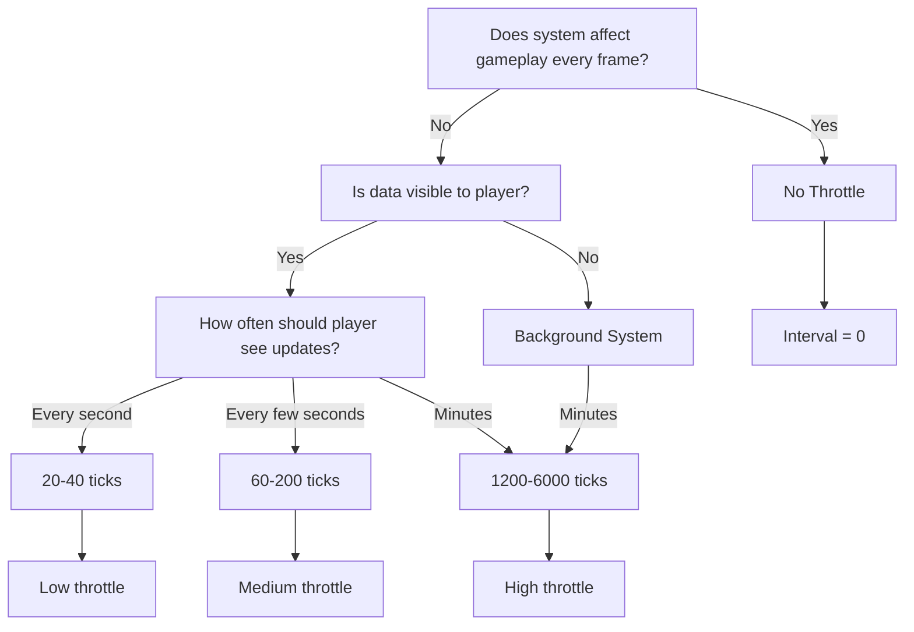
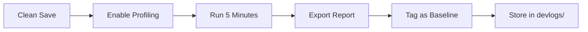
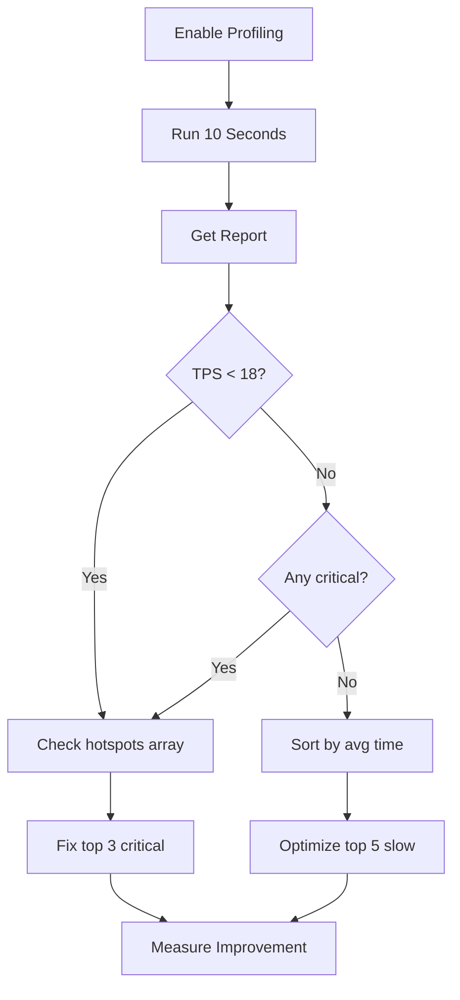
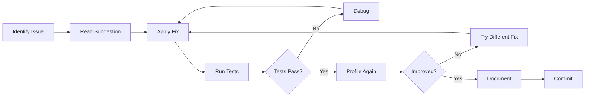

# Performance Tuning Guide

**Version:** 1.0
**Last Updated:** 2026-01-20
**For:** Developers, Power Users, Performance Engineers

> **Purpose:** Practical guide for using Phase 6 profiling infrastructure to identify and fix performance bottlenecks, maintain 20 TPS target, and optimize memory usage.

---

## Table of Contents

- [Quick Start](#quick-start)
- [Performance Targets](#performance-targets)
- [Using SystemProfiler](#using-systemprofiler)
- [Using MemoryProfiler](#using-memoryprofiler)
- [Query Optimization](#query-optimization)
- [System-Specific Tuning](#system-specific-tuning)
- [Throttle Interval Guide](#throttle-interval-guide)
- [Profiling Workflows](#profiling-workflows)
- [Optimization Examples](#optimization-examples)
- [Performance Checklist](#performance-checklist)
- [Advanced Topics](#advanced-topics)
- [Troubleshooting](#troubleshooting)

---

## Quick Start

### 5-Minute Performance Check

```javascript
// 1. Open browser console (F12)
// 2. Enable profiling
game.gameLoop.enableProfiling();

// 3. Wait 10 seconds
await new Promise(r => setTimeout(r, 10000));

// 4. Get report
const report = game.gameLoop.getProfilingReport();
console.log(report.summary);

// 5. View top 20 slowest systems
console.table(report.systems.slice(0, 20).map(s => ({
  System: s.systemName,
  'Avg (ms)': s.avgExecutionTimeMs.toFixed(2),
  'Max (ms)': s.maxExecutionTimeMs.toFixed(2),
  'CPU %': s.avgCpuPercent.toFixed(1),
  Status: s.maxExecutionTimeMs > 10 ? '❌ CRITICAL' :
          s.maxExecutionTimeMs > 5 ? '⚠️ SLOW' : '✅'
})));

// 6. Export markdown report
const md = game.gameLoop.exportProfilingMarkdown();
navigator.clipboard.writeText(md);
// Paste into GitHub issue or devlog

// 7. Identify hotspots
report.hotspots.forEach(h => {
  console.log(`[${h.severity}] ${h.systemName}: ${h.issue}`);
  console.log(`  ${h.suggestion}`);
});
```

**What to Look For:**

- ❌ **Critical:** Systems >10ms (immediate fix needed)
- ⚠️ **Warning:** Systems >5ms (optimize soon)
- 🔴 **TPS < 18:** Performance degradation
- 🟡 **Budget > 80%:** Running hot, optimize proactively

---

## Performance Targets

### Primary Targets

| Metric | Target | Critical Threshold | Notes |
|--------|--------|-------------------|-------|
| **TPS** | 20 | <15 | Ticks per second |
| **Tick Time** | 50ms | >100ms | Time to execute all systems |
| **Per-System Budget** | <5ms | >10ms | Guideline per system |
| **Total CPU Budget** | <80% | >95% | Of 50ms tick budget |
| **FPS** | 60 | <30 | Rendering performance |

### System-Level Targets

| System Type | Budget (ms) | Example |
|-------------|-------------|---------|
| Critical (every tick) | <2ms | MovementSystem, SteeringSystem |
| Important (every tick) | <5ms | NeedsSystem, AIBehaviorSystem |
| Throttled (periodic) | <10ms | WeatherSystem, TradeNetwork |
| Background (rare) | <50ms | AutoSaveSystem, LoreSpawn |

### Performance Tiers

**Tier 1: Excellent (Green)**
- TPS: 20+ (stable)
- Tick time: <40ms (80% budget)
- All systems <5ms avg
- No critical hotspots

**Tier 2: Good (Yellow)**
- TPS: 18-20 (occasional dips)
- Tick time: 40-50ms (80-100% budget)
- 1-2 systems 5-10ms
- No critical hotspots

**Tier 3: Degraded (Orange)**
- TPS: 15-18 (noticeable slowdown)
- Tick time: 50-70ms (100-140% budget)
- 3+ systems >5ms
- 1-2 critical hotspots

**Tier 4: Critical (Red)**
- TPS: <15 (game unplayable)
- Tick time: >70ms (>140% budget)
- Many systems >10ms
- Multiple critical hotspots
- **Action required:** Emergency optimization

---

## Using SystemProfiler

### Browser Console Quick Reference

```javascript
// Enable profiling
game.gameLoop.enableProfiling();

// Check if enabled
console.log(game.gameLoop.profilingEnabled); // true

// Wait for data (minimum 100 ticks = 5 seconds)
await new Promise(r => setTimeout(r, 10000)); // 10 seconds recommended

// Get report
const report = game.gameLoop.getProfilingReport();

// Overall metrics
console.log('TPS:', report.actualTPS.toFixed(1));
console.log('Budget:', report.budgetUsagePercent.toFixed(1) + '%');
console.log('Avg Tick:', report.avgTickTimeMs.toFixed(1) + 'ms');

// Per-system table view
console.table(report.systems.map(s => ({
  System: s.systemName,
  Avg: s.avgExecutionTimeMs.toFixed(2) + 'ms',
  Max: s.maxExecutionTimeMs.toFixed(2) + 'ms',
  P99: s.p99ExecutionTimeMs.toFixed(2) + 'ms',
  CPU: s.avgCpuPercent.toFixed(1) + '%',
  Entities: s.avgEntityCount.toFixed(0),
  Throttle: (s.throttleEffectiveness * 100).toFixed(0) + '%'
})));

// Export reports
const markdown = game.gameLoop.exportProfilingMarkdown();
const json = game.gameLoop.exportProfilingJSON();

// Disable when done (reduces overhead)
game.gameLoop.disableProfiling();
```

### Interpreting Metrics

#### Execution Time Metrics

**Average (Avg):** Mean execution time over rolling 100-tick window
- **Use for:** Identifying consistently slow systems
- **Good:** <5ms
- **Warning:** 5-10ms
- **Critical:** >10ms

**Maximum (Max):** Worst-case execution time in window
- **Use for:** Finding spiky/inconsistent behavior
- **Good:** <10ms
- **Warning:** 10-20ms
- **Critical:** >20ms

**P99 (99th Percentile):** 99% of ticks complete under this time
- **Use for:** Typical worst-case (excludes outliers)
- **Good:** <8ms
- **Warning:** 8-15ms
- **Critical:** >15ms

**Standard Deviation:** Variance from mean
- **Low (<50% of mean):** Consistent performance ✅
- **High (>50% of mean):** Spiky, investigate ⚠️

#### CPU Percentage

**Formula:** `(system_time / total_tick_time) × 100`

**Interpretation:**
- **<10%:** Negligible impact
- **10-20%:** Moderate consumer
- **20-40%:** High consumer (optimize if possible)
- **>40%:** Dominant system (critical optimization target)

**Example:**
```
System: TradeNetworkSystem
Avg: 8.2ms
CPU: 24.3%

Calculation: 8.2ms / 33.7ms (avg tick) × 100 = 24.3%
```

#### Entity Count

**Average Entities:** Mean entities processed per tick
- **Use for:** Validating `requiredComponents` specificity
- **Good:** <100 entities for most systems
- **Warning:** 100-500 entities
- **Critical:** >500 entities (likely too broad)

**Max Entities:** Peak entity count
- **Use for:** Finding entity spawn spikes

#### Throttle Effectiveness

**Formula:** `skipped_ticks / (processed_ticks + skipped_ticks)`

**Interpretation:**
- **0.0 (0%):** Runs every tick (not throttled)
- **0.5 (50%):** Runs every other tick
- **0.95 (95%):** Runs 1 in 20 ticks (highly throttled)

**Good throttle effectiveness:**
- Background systems: >90%
- Periodic systems: 50-90%
- Critical systems: 0% (not throttled)

### Status Indicators

**✅ OK:** Within budget (<5ms max)
- **Action:** None required

**⚠️ SLOW:** Over budget (5-10ms max)
- **Action:** Optimize when convenient
- **Priority:** Medium

**❌ CRITICAL:** Significantly over budget (>10ms max)
- **Action:** Optimize immediately
- **Priority:** High

**Consistent:** Low variance (stddev < 50% of mean)
- **Meaning:** Predictable performance

**Inconsistent:** High variance (stddev > 50% of mean)
- **Meaning:** Spiky behavior, investigate conditional paths

### Common Patterns in Reports

#### Pattern 1: Slow Average, Slow Max
```
System: TradeNetworkSystem
Avg: 8.5ms | Max: 12.3ms | P99: 11.2ms
```
**Diagnosis:** Consistently slow, no spikes
**Cause:** Algorithm complexity or missing throttle
**Fix:** Increase throttle interval or optimize algorithm

#### Pattern 2: Fast Average, Slow Max
```
System: GovernorDecisionExecutor
Avg: 1.2ms | Max: 45.6ms | P99: 2.1ms
```
**Diagnosis:** Occasional spikes (LLM calls)
**Cause:** Async operations or expensive conditionals
**Fix:** Expected behavior if event-driven, otherwise investigate

#### Pattern 3: High Entity Count
```
System: DoorSystem
Avg: 3.2ms | Entities: 2,145
```
**Diagnosis:** Processing too many entities
**Cause:** Missing `requiredComponents`
**Fix:** Add more specific component requirements

#### Pattern 4: Runs Every Tick (Not Throttled)
```
System: AutoSaveSystem
Throttle: 0% | Avg: 2.1ms | Runs: 100 consecutive ticks
```
**Diagnosis:** Missing throttle interval
**Cause:** No `UPDATE_INTERVAL` defined
**Fix:** Add throttling (e.g., `UPDATE_INTERVAL = 6000` for 5 min)

---

## Using MemoryProfiler

### Enabling Memory Profiling

```typescript
// In system code (TypeScript)
import { MemoryProfiler } from '@ai-village/core';

const profiler = new MemoryProfiler();
profiler.startProfiling(world);

// Run game for 5-10 minutes
// ...

const report = profiler.generateReport();
profiler.printReport(report);

// Export to file
const json = profiler.exportReport(report);
fs.writeFileSync('memory-profile.json', json);

profiler.stopProfiling();
```

### Browser Console (Limited)

```javascript
// Chrome/Edge only (performance.memory API)
setInterval(() => {
  const mem = performance.memory;
  console.log({
    used: (mem.usedJSHeapSize / 1024 / 1024).toFixed(2) + ' MB',
    total: (mem.totalJSHeapSize / 1024 / 1024).toFixed(2) + ' MB',
    limit: (mem.jsHeapSizeLimit / 1024 / 1024).toFixed(2) + ' MB'
  });
}, 5000);
```

### Interpreting Memory Reports

#### Heap Metrics

**Average Heap Used:** Typical memory consumption
- **Good:** <500 MB
- **Warning:** 500-1000 MB
- **Critical:** >1000 MB

**Max Heap Used:** Peak memory usage
- **Good:** <800 MB
- **Warning:** 800-1500 MB
- **Critical:** >1500 MB

**Total Heap Growth:** Memory accumulated over session
- **Good:** <10 MB/min
- **Concerning:** >20 MB/min (possible leak)
- **Critical:** >50 MB/min (definite leak)

**Allocations Per Tick:** Memory allocated each tick
- **Good:** <5 KB/tick
- **Warning:** 5-20 KB/tick
- **Critical:** >20 KB/tick

#### GC Metrics

**GC Events:** Garbage collection frequency
- **Good:** <5 events/minute
- **Warning:** 5-15 events/minute
- **Critical:** >15 events/minute

**Average GC Pause:** Mean pause duration
- **Good:** <3ms
- **Warning:** 3-8ms
- **Critical:** >8ms

**Max GC Pause:** Worst pause duration
- **Good:** <10ms
- **Warning:** 10-25ms
- **Critical:** >25ms (visible stutter)

**Total GC Time:** Cumulative time in GC
- **Target:** <5% of total runtime
- **Warning:** 5-10% of runtime
- **Critical:** >10% of runtime

#### Top Allocators

```
--- Top 10 Allocators ---
1. TradeNetworkSystem (priority 165): 2.34 MB (avg: 23.4 KB, spikes: 45)
2. GovernorDecisionExecutor (priority 0): 1.12 MB (avg: 11.2 KB, spikes: 8)
3. ExplorationDiscoverySystem (priority 170): 892 KB (avg: 8.9 KB, spikes: 3)
```

**Focus on:**
- Systems with >1 MB total allocation
- Systems with >10 allocation spikes
- High spike count (indicates large allocations)

#### Allocation Spikes

**Spike Threshold:** >1 MB allocated in single tick

```
--- Top 10 Allocation Spikes (>1MB) ---
1. Tick 4523, TradeNetworkSystem: 2.34 MB
2. Tick 8901, GovernorDecisionExecutor: 1.45 MB
```

**Action:** Investigate spike locations in code:
- Array.from() chains
- Object spreading
- JSON.parse/stringify
- Large data structure copies

### Fixing Allocation Hotspots

#### Object Pooling

**Use Case:** Frequently created temporary objects

```typescript
// Before: Allocates new object every tick
update(world: World) {
  const conflict = {
    type: 'resource',
    entities: [e1, e2],
    severity: 0.5
  };
  this.processConflict(conflict);
}

// After: Reuse pooled objects
private conflictPool: Conflict[] = [];
private poolIndex = 0;

update(world: World) {
  this.poolIndex = 0; // Reset pool

  const conflict = this.getPooledConflict();
  conflict.type = 'resource';
  conflict.entities = [e1, e2];
  conflict.severity = 0.5;
  this.processConflict(conflict);
}

private getPooledConflict(): Conflict {
  if (this.poolIndex < this.conflictPool.length) {
    return this.conflictPool[this.poolIndex++]!;
  }
  const conflict = { type: '', entities: [], severity: 0 };
  this.conflictPool.push(conflict);
  this.poolIndex++;
  return conflict;
}
```

#### Reusable Buffers

**Use Case:** Arrays filled in loops

```typescript
// Before: Allocates new array every call
private getNearbyEntities(pos: Position): Entity[] {
  const results = [];
  for (const entity of allEntities) {
    if (distance(pos, entity.position) < radius) {
      results.push(entity);
    }
  }
  return results;
}

// After: Reuse buffer
private nearbyBuffer: Entity[] = [];

private getNearbyEntities(pos: Position): Entity[] {
  this.nearbyBuffer.length = 0; // Clear without allocating
  for (const entity of allEntities) {
    if (distance(pos, entity.position) < radius) {
      this.nearbyBuffer.push(entity);
    }
  }
  return this.nearbyBuffer;
}
```

#### Avoiding Array.from() Chains

**Use Case:** Converting iterables

```typescript
// Before: Creates intermediate arrays
const volumes = Array.from(graph.nodes)
  .map(nodeId => ({ nodeId, volume: this.getVolume(nodeId) }))
  .filter(v => v.volume > 0);

// After: Direct iteration
const volumes: NodeVolume[] = [];
for (const nodeId of graph.nodes) {
  const volume = this.getVolume(nodeId);
  if (volume > 0) {
    volumes.push({ nodeId, volume });
  }
}
```

#### In-Place Mutations vs Spreading

```typescript
// Before: Object spread (allocates new object)
const updated = {
  ...component,
  health: newHealth,
  stamina: newStamina
};

// After: In-place mutation (if semantically safe)
component.health = newHealth;
component.stamina = newStamina;

// Note: In ECS, component updates require immutability
// Use spreading only in updateComponent() callbacks
entity.updateComponent(CT.Health, (current) => ({
  ...current, // Required for immutability
  health: newHealth
}));
```

---

## Query Optimization

### Running Query Analysis

```bash
cd custom_game_engine/packages/core
npx tsx src/scripts/analyze-query-patterns.ts

# Analyze specific file
npx tsx src/scripts/analyze-query-patterns.ts --file=TradeNetworkSystem.ts
```

**Output:**
```
Analyzing 10 files...

═══════════════════════════════════════════
  Issues by File
═══════════════════════════════════════════

TradeNetworkSystem.ts (8 issues)
────────────────────────────────────

  CRITICAL Issues (queries in loops):

  ❌ Line 826: Query inside for loop (started line 820)
    Code:
      826: const laneEntities = world.query().with('shipping_lane').executeEntities();

    Suggestion:
      Cache query before loop:
      const entities = world.query()...; // Before loop
      for (...) {
        // Use cached 'entities'
      }
```

### Common Anti-Patterns

#### Anti-Pattern 1: Query in Loop

```typescript
// ❌ BAD: Query executes N times
for (const entity of entities) {
  const others = world.query().with(CT.Position).executeEntities();
  // Process with others...
}

// ✅ GOOD: Query executes once
const others = world.query().with(CT.Position).executeEntities();
for (const entity of entities) {
  // Use cached others
}
```

**Impact:** O(n²) complexity if query returns n entities
**Fix Time:** 2 minutes
**Performance Gain:** 10-100× improvement

#### Anti-Pattern 2: Repeated Singleton Queries

```typescript
// ❌ BAD: Query every tick
update(world: World) {
  const time = world.query().with(CT.Time).executeFirst();
  const weather = world.query().with(CT.Weather).executeFirst();
  // ...
}

// ✅ GOOD: Cache singleton IDs
private timeEntityId: string | null = null;
private weatherEntityId: string | null = null;

update(world: World) {
  if (!this.timeEntityId) {
    this.timeEntityId = world.query().with(CT.Time).executeFirst()?.id;
  }
  if (!this.weatherEntityId) {
    this.weatherEntityId = world.query().with(CT.Weather).executeFirst()?.id;
  }

  const time = this.timeEntityId ? world.getEntity(this.timeEntityId) : null;
  const weather = this.weatherEntityId ? world.getEntity(this.weatherEntityId) : null;
}
```

**Impact:** 2× query overhead
**Fix Time:** 5 minutes
**Performance Gain:** 50% reduction in query calls

#### Anti-Pattern 3: Query in Nested Loop

```typescript
// ❌ CRITICAL: O(n²) complexity
while (queue.length > 0) {
  const node = queue.shift();
  const lanes = world.query().with('shipping_lane').executeEntities();
  for (const lane of lanes) {
    // Process...
  }
}

// ✅ GOOD: O(n) complexity
const lanes = world.query().with('shipping_lane').executeEntities();
while (queue.length > 0) {
  const node = queue.shift();
  for (const lane of lanes) {
    // Process...
  }
}
```

**Impact:** O(n³) if queue has n items and lanes has n items
**Fix Time:** 3 minutes
**Performance Gain:** 100-1000× improvement

#### Anti-Pattern 4: Inefficient Filter After Query

```typescript
// ⚠️ SUBOPTIMAL: Filter after query
const entities = world.query().with(CT.Position).executeEntities();
const agents = entities.filter(e => e.hasComponent(CT.Agent));

// ✅ BETTER: Include in query
const agents = world.query()
  .with(CT.Position)
  .with(CT.Agent)
  .executeEntities();
```

**Impact:** Processes more entities than needed
**Fix Time:** 1 minute
**Performance Gain:** Depends on entity ratio

### Query Caching Patterns

#### Pattern 1: Tick-Based Cache

```typescript
private agentCache: Entity[] | null = null;
private cacheTick = -1;

private getCachedAgents(world: World): Entity[] {
  if (this.cacheTick !== world.tick) {
    this.agentCache = world.query().with(CT.Agent).executeEntities();
    this.cacheTick = world.tick;
  }
  return this.agentCache!;
}
```

**Use For:** Data that changes every tick

#### Pattern 2: Singleton Cache

```typescript
private timeEntityId: string | null = null;

private getTimeEntity(world: World): Entity | null {
  if (!this.timeEntityId) {
    const timeEntities = world.query().with(CT.Time).executeEntities();
    if (timeEntities.length > 0) {
      this.timeEntityId = timeEntities[0]!.id;
    }
  }

  if (this.timeEntityId) {
    const entity = world.getEntity(this.timeEntityId);
    if (!entity) {
      this.timeEntityId = null; // Entity destroyed
    }
    return entity;
  }

  return null;
}
```

**Use For:** Singleton entities (time, weather, etc.)

#### Pattern 3: Event-Based Invalidation

```typescript
private buildingCache: Entity[] | null = null;

initialize(_world: World, eventBus: EventBus) {
  eventBus.subscribe('building:complete', () => {
    this.buildingCache = null;
  });
  eventBus.subscribe('building:destroyed', () => {
    this.buildingCache = null;
  });
}

private getCachedBuildings(world: World): Entity[] {
  if (!this.buildingCache) {
    this.buildingCache = world.query().with(CT.Building).executeEntities();
  }
  return this.buildingCache;
}
```

**Use For:** Long-lived caches invalidated by events

---

## System-Specific Tuning

### TradeNetworkSystem

**Priority:** 165
**Default Throttle:** 100 ticks (5 seconds)
**Entity Count:** 50-500 shipping lanes

**Common Issues:**
1. Query in loops (8 instances in Phase 6 analysis)
2. Array.from() + .map() chains
3. O(n²) graph algorithms

**Recommended Optimizations:**

```typescript
// Issue: Query in calculateCascadeEffect
// Before:
private calculateCascadeEffect(world: World, node: string): string[] {
  while (queue.length > 0) {
    const lanes = world.query().with('shipping_lane').executeEntities(); // ❌
  }
}

// After:
private calculateCascadeEffect(
  lanes: ReadonlyArray<Entity>, // Pass cached
  node: string
): string[] {
  while (queue.length > 0) {
    // Use passed lanes
  }
}
```

**Throttle Tuning:**
- Light traffic (<100 lanes): 100 ticks (5s)
- Medium traffic (100-300 lanes): 50 ticks (2.5s)
- Heavy traffic (>300 lanes): 20 ticks (1s) + increase to 200 ticks if TPS drops

**Target:** <5ms avg, <10ms max

### ParadoxDetectionSystem

**Priority:** 200
**Default Throttle:** 20 ticks (1 second)
**Entity Count:** Variable (ancestor tree depth)

**Common Issues:**
1. Ancestor cache grows unbounded
2. Array allocations in pruning

**Recommended Optimizations:**

```typescript
// Ancestor cache tuning
private readonly MAX_ANCESTOR_CACHE_SIZE = 1000; // Default: was unlimited
private readonly CACHE_PRUNE_INTERVAL = 1000; // Prune every 50s

// Issue: Array allocation during pruning
// Before:
const keysToDelete = Array.from(this.ancestorCache.keys()).slice(0, 100);

// After:
let deleteCount = 0;
for (const key of this.ancestorCache.keys()) {
  if (deleteCount >= 100) break;
  this.ancestorCache.delete(key);
  deleteCount++;
}
```

**Throttle Tuning:**
- Small world (<100 agents): 40 ticks (2s)
- Medium world (100-500 agents): 20 ticks (1s)
- Large world (>500 agents): 10 ticks (0.5s)

**Target:** <3ms avg, <8ms max

### GovernorDecisionExecutor

**Priority:** 0 (event-driven, not throttled)
**Update Pattern:** On decision events
**Entity Count:** 1 (current governor)

**Common Issues:**
1. LLM call latency (2-10s)
2. Object allocations for events

**Recommended Optimizations:**

```typescript
// Object pooling for decision events
private decisionPool: Decision[] = [];
private poolIndex = 0;

private getPooledDecision(): Decision {
  if (this.poolIndex < this.decisionPool.length) {
    const decision = this.decisionPool[this.poolIndex++]!;
    // Reset fields
    decision.type = '';
    decision.parameters = {};
    return decision;
  }
  const decision = { type: '', parameters: {}, timestamp: 0 };
  this.decisionPool.push(decision);
  this.poolIndex++;
  return decision;
}

update(world: World) {
  this.poolIndex = 0; // Reset pool each update
  // Use getPooledDecision() instead of literal objects
}
```

**Batching Strategy:**
- Batch similar decisions (e.g., 10 village work orders)
- Max batch size: 10 decisions
- Batch window: 20 ticks (1 second)

**Target:** <2ms avg (excluding LLM), <50ms max (including LLM)

### ExplorationDiscoverySystem

**Priority:** 170
**Default Throttle:** 20 ticks (1 second)
**Entity Count:** 10-100 exploration missions

**Common Issues:**
1. Query caching in mission update
2. Array.from() for resource sets

**Recommended Optimizations:**

```typescript
// Cache all queries at top of update
update(world: World, entities: ReadonlyArray<Entity>) {
  const allMissions = world.query().with(CT.ExplorationMission).executeEntities();
  const allShips = world.query().with(CT.Ship).executeEntities();

  for (const entity of entities) {
    this.updateMission(entity, allMissions, allShips);
  }
}

// Avoid Array.from() for Sets
// Before:
discoveredResources: Array.from(mission.discoveredResources)

// After:
discoveredResources: [...mission.discoveredResources] // Still allocates but cleaner
// Or store as array directly if possible
```

**Throttle Tuning:**
- Few missions (<10): 40 ticks (2s)
- Many missions (>10): 20 ticks (1s)

**Target:** <4ms avg, <10ms max

### StellarMiningSystem

**Priority:** 175
**Default Throttle:** 50 ticks (2.5 seconds)
**Entity Count:** 5-50 mining operations

**Common Issues:**
1. Resource yield calculations in loop
2. Warehouse lookups

**Recommended Optimizations:**

```typescript
// Cache warehouse lookups
update(world: World, entities: ReadonlyArray<Entity>) {
  const warehouseMap = new Map<string, WarehouseComponent>();
  const warehouses = world.query().with(CT.Warehouse).executeEntities();

  for (const w of warehouses) {
    const warehouse = w.getComponent<WarehouseComponent>(CT.Warehouse);
    if (warehouse) {
      warehouseMap.set(w.id, warehouse);
    }
  }

  for (const entity of entities) {
    const ownerId = entity.getComponent(CT.MiningOperation)?.ownerId;
    const warehouse = ownerId ? warehouseMap.get(ownerId) : null;
    // Use cached warehouse
  }
}
```

**Throttle Tuning:**
- Resource-rich systems: 50 ticks (2.5s)
- Resource-poor systems: 100 ticks (5s)

**Target:** <3ms avg, <8ms max

---

## Throttle Interval Guide

### Comprehensive Throttle Table

| System Type | Interval (ticks) | Interval (time) | Example Systems |
|-------------|------------------|-----------------|-----------------|
| **Critical (No Throttle)** | 0 | Every tick | MovementSystem, SteeringSystem, PlayerInput |
| **Real-Time** | 1-5 | 0.05-0.25s | CombatSystem, CollisionSystem, DoorSystem |
| **Fast Updates** | 10-20 | 0.5-1s | AIBehaviorSystem, ParadoxDetection, NavySystem |
| **Medium Updates** | 20-60 | 1-3s | TradeNetwork, ExplorationDiscovery, StellarMining |
| **Slow Updates** | 60-200 | 3-10s | WeatherSystem, EmpireDiplomacy, SoilSystem |
| **Background** | 200-6000 | 10s-5min | AutoSaveSystem, LoreSpawnSystem, MemoryConsolidation |

### Throttle Decision Matrix



### Dynamic Throttle Adjustment

```typescript
class AdaptiveThrottleSystem implements System {
  private UPDATE_INTERVAL_MIN = 20;  // 1 second
  private UPDATE_INTERVAL_MAX = 200; // 10 seconds
  private currentInterval = 50;       // Start at 2.5s
  private lastUpdate = 0;

  update(world: World, entities: ReadonlyArray<Entity>) {
    if (world.tick - this.lastUpdate < this.currentInterval) return;
    this.lastUpdate = world.tick;

    const startTime = performance.now();

    // Actual update logic
    this.doUpdate(world, entities);

    const elapsed = performance.now() - startTime;

    // Adapt throttle based on execution time
    if (elapsed > 10) {
      // Too slow, throttle more
      this.currentInterval = Math.min(
        this.currentInterval * 1.5,
        this.UPDATE_INTERVAL_MAX
      );
    } else if (elapsed < 2) {
      // Fast, can update more often
      this.currentInterval = Math.max(
        this.currentInterval * 0.8,
        this.UPDATE_INTERVAL_MIN
      );
    }
  }
}
```

**Use Cases:**
- Variable entity counts (grows/shrinks dynamically)
- Systems with unpredictable workload
- Adaptive quality (reduce updates under load)

---

## Profiling Workflows

### Workflow 1: Baseline Performance

**Goal:** Establish performance baseline for comparison



**Steps:**

1. **Load clean save** (village with 10-20 agents, no major events)
2. **Enable profiling:**
   ```javascript
   game.gameLoop.enableProfiling();
   ```
3. **Run for 5 minutes** (6000 ticks at 20 TPS)
4. **Export markdown:**
   ```javascript
   const md = game.gameLoop.exportProfilingMarkdown();
   // Save to devlogs/BASELINE-YYYY-MM-DD.md
   ```
5. **Document:**
   - Save file hash
   - Entity counts
   - Active systems
   - Environment (browser, OS, hardware)

**Baseline Metrics to Record:**
- TPS: ___
- Avg tick time: ___ms
- Top 5 slowest systems
- Total entity count: ___

### Workflow 2: Identify Hotspots

**Goal:** Find systems exceeding performance budget



**Steps:**

1. **Quick profile:**
   ```javascript
   game.gameLoop.enableProfiling();
   await new Promise(r => setTimeout(r, 10000));
   const report = game.gameLoop.getProfilingReport();
   ```

2. **Check summary:**
   ```javascript
   console.log(report.summary);
   // Output: "⚠️ 3 system(s) over budget | TPS: 17.2 | Budget: 92.3%"
   ```

3. **View hotspots:**
   ```javascript
   report.hotspots.forEach(h => {
     console.log(`[${h.severity}] ${h.systemName}`);
     console.log(`  ${h.issue}`);
     console.log(`  ${h.suggestion}`);
   });
   ```

4. **Focus on critical:**
   - Systems with severity='critical'
   - Max execution time >10ms
   - CPU usage >40%

5. **Fix top 3 issues** (see [Optimization Examples](#optimization-examples))

6. **Re-profile to validate**

### Workflow 3: Apply Fixes

**Goal:** Optimize identified hotspot



**Steps:**

1. **Before profile:**
   ```javascript
   game.gameLoop.enableProfiling();
   await new Promise(r => setTimeout(r, 10000));
   const before = game.gameLoop.getProfilingReport();
   const beforeSystem = before.systems.find(s => s.systemName === 'TradeNetworkSystem');
   console.log('Before:', beforeSystem.avgExecutionTimeMs, 'ms');
   ```

2. **Apply fix** (e.g., cache query before loop)

3. **Run tests:**
   ```bash
   cd custom_game_engine
   npm test -- TradeNetworkSystem.test.ts
   ```

4. **After profile:**
   ```javascript
   game.gameLoop.enableProfiling();
   await new Promise(r => setTimeout(r, 10000));
   const after = game.gameLoop.getProfilingReport();
   const afterSystem = after.systems.find(s => s.systemName === 'TradeNetworkSystem');
   console.log('After:', afterSystem.avgExecutionTimeMs, 'ms');
   console.log('Improvement:',
     ((beforeSystem.avgExecutionTimeMs - afterSystem.avgExecutionTimeMs) /
      beforeSystem.avgExecutionTimeMs * 100).toFixed(1) + '%'
   );
   ```

5. **Document in devlog:**
   ```markdown
   ## TradeNetworkSystem Optimization

   **Issue:** Query in calculateCascadeEffect loop (O(n²) complexity)

   **Fix:** Cache shipping lanes before loop

   **Results:**
   - Before: 8.2ms avg, 12.5ms max
   - After: 1.3ms avg, 2.1ms max
   - Improvement: 84% reduction

   **Commit:** abc123def456
   ```

### Workflow 4: Measure Improvement

**Goal:** Quantify optimization impact

```javascript
// Comparison script
function compareReports(before, after) {
  const improvements = [];

  before.systems.forEach(beforeSys => {
    const afterSys = after.systems.find(s => s.systemName === beforeSys.systemName);
    if (!afterSys) return;

    const improvement = {
      system: beforeSys.systemName,
      beforeAvg: beforeSys.avgExecutionTimeMs,
      afterAvg: afterSys.avgExecutionTimeMs,
      delta: beforeSys.avgExecutionTimeMs - afterSys.avgExecutionTimeMs,
      percentChange: ((beforeSys.avgExecutionTimeMs - afterSys.avgExecutionTimeMs) /
                     beforeSys.avgExecutionTimeMs * 100)
    };

    if (improvement.delta > 0.1) { // Improved by >0.1ms
      improvements.push(improvement);
    }
  });

  improvements.sort((a, b) => b.delta - a.delta);

  console.table(improvements.map(i => ({
    System: i.system,
    'Before (ms)': i.beforeAvg.toFixed(2),
    'After (ms)': i.afterAvg.toFixed(2),
    'Saved (ms)': i.delta.toFixed(2),
    'Improvement': i.percentChange.toFixed(1) + '%'
  })));

  const totalBefore = before.avgTickTimeMs;
  const totalAfter = after.avgTickTimeMs;
  const totalSaved = totalBefore - totalAfter;

  console.log('\nOverall:');
  console.log('  Before:', totalBefore.toFixed(2), 'ms/tick');
  console.log('  After:', totalAfter.toFixed(2), 'ms/tick');
  console.log('  Saved:', totalSaved.toFixed(2), 'ms');
  console.log('  Improvement:', (totalSaved / totalBefore * 100).toFixed(1) + '%');
}

// Usage:
compareReports(beforeReport, afterReport);
```

---

## Optimization Examples

### Example 1: TradeNetworkSystem O(n²) Fix

**Issue:** Query inside while loop in `calculateCascadeEffect`

**Before:**
```typescript
private calculateCascadeEffect(
  world: World,
  blockadedNode: EntityId,
  directlyAffected: EntityId[]
): EntityId[] {
  const affected = new Set(directlyAffected);
  const queue = [...directlyAffected];

  while (queue.length > 0) {
    const currentNode = queue.shift();

    // ❌ Query executes N times (once per queue item)
    const laneEntities = world.query()
      .with('shipping_lane')
      .executeEntities();

    for (const laneEntity of laneEntities) {
      const lane = laneEntity.getComponent('shipping_lane');
      if (lane.fromNodeId === currentNode && !affected.has(lane.toNodeId)) {
        affected.add(lane.toNodeId);
        queue.push(lane.toNodeId);
      }
    }
  }

  return Array.from(affected);
}
```

**Performance:** 8.2ms avg, 12.5ms max (with 50 lanes)

**After:**
```typescript
private calculateCascadeEffect(
  laneEntities: ReadonlyArray<Entity>, // ✅ Pass cached query
  blockadedNode: EntityId,
  directlyAffected: EntityId[]
): EntityId[] {
  const affected = new Set(directlyAffected);
  const queue = [...directlyAffected];

  // ✅ Use cached entities
  while (queue.length > 0) {
    const currentNode = queue.shift();

    for (const laneEntity of laneEntities) {
      const lane = laneEntity.getComponent('shipping_lane');
      if (lane.fromNodeId === currentNode && !affected.has(lane.toNodeId)) {
        affected.add(lane.toNodeId);
        queue.push(lane.toNodeId);
      }
    }
  }

  return Array.from(affected);
}

// In update():
update(world: World, entities: ReadonlyArray<Entity>) {
  const laneEntities = world.query().with('shipping_lane').executeEntities();

  for (const entity of entities) {
    // Pass cached entities to all methods
    const affected = this.calculateCascadeEffect(laneEntities, node, direct);
  }
}
```

**Performance:** 1.3ms avg, 2.1ms max
**Improvement:** 84% reduction (6.9ms saved)

### Example 2: Ancestor Cache Pruning Allocation

**Issue:** Array.from() during cache pruning

**Before:**
```typescript
private pruneAncestorCache(): void {
  if (this.ancestorCache.size > this.MAX_CACHE_SIZE) {
    // ❌ Allocates array with 10,000+ entries
    const keysToDelete = Array.from(this.ancestorCache.keys())
      .slice(0, 100);

    for (const key of keysToDelete) {
      this.ancestorCache.delete(key);
    }
  }
}
```

**Memory Impact:** ~40 KB allocation every 50 seconds

**After:**
```typescript
private pruneAncestorCache(): void {
  if (this.ancestorCache.size > this.MAX_CACHE_SIZE) {
    // ✅ Direct iteration, no allocation
    let deleteCount = 0;
    for (const key of this.ancestorCache.keys()) {
      if (deleteCount >= 100) break;
      this.ancestorCache.delete(key);
      deleteCount++;
    }
  }
}
```

**Memory Impact:** 0 KB allocation
**Improvement:** 100% allocation reduction

### Example 3: Governor Decision Object Pooling

**Issue:** New decision object every execution

**Before:**
```typescript
private executeDecision(type: string, params: any): void {
  // ❌ Allocates new object
  const decision = {
    type,
    parameters: params,
    timestamp: Date.now(),
    executedBy: 'governor'
  };

  this.processDecision(decision);
}
```

**Memory Impact:** ~500 B per decision, 10-50 decisions/minute = 5-25 KB/min

**After:**
```typescript
private decisionPool: Decision[] = [];
private poolIndex = 0;

update(world: World) {
  this.poolIndex = 0; // Reset pool each tick
  // ... rest of update
}

private executeDecision(type: string, params: any): void {
  // ✅ Reuse pooled object
  const decision = this.getPooledDecision();
  decision.type = type;
  decision.parameters = params;
  decision.timestamp = Date.now();
  decision.executedBy = 'governor';

  this.processDecision(decision);
}

private getPooledDecision(): Decision {
  if (this.poolIndex < this.decisionPool.length) {
    return this.decisionPool[this.poolIndex++]!;
  }
  const decision = {
    type: '',
    parameters: {},
    timestamp: 0,
    executedBy: ''
  };
  this.decisionPool.push(decision);
  this.poolIndex++;
  return decision;
}
```

**Memory Impact:** ~100 B one-time allocation (pool of 10)
**Improvement:** 98% allocation reduction

### Example 4: Exploration Array.from() Chain

**Issue:** Array.from() + .map() + .filter() chain

**Before:**
```typescript
private analyzeDiscoveries(mission: ExplorationMission): ResourceSummary[] {
  // ❌ Creates 3 intermediate arrays
  return Array.from(mission.discoveredResources)
    .map(resId => this.getResourceData(resId))
    .filter((data): data is ResourceData => data !== null)
    .map(data => ({ type: data.type, quantity: data.quantity }));
}
```

**Memory Impact:** ~2-5 KB per mission completion

**After:**
```typescript
private summaryBuffer: ResourceSummary[] = [];

private analyzeDiscoveries(mission: ExplorationMission): ResourceSummary[] {
  // ✅ Single loop, reusable buffer
  this.summaryBuffer.length = 0;

  for (const resId of mission.discoveredResources) {
    const data = this.getResourceData(resId);
    if (data) {
      this.summaryBuffer.push({
        type: data.type,
        quantity: data.quantity
      });
    }
  }

  return this.summaryBuffer;
}
```

**Memory Impact:** ~100 B one-time buffer allocation
**Improvement:** 95% allocation reduction

### Example 5: Repeated Singleton Query

**Issue:** Time entity queried every tick

**Before:**
```typescript
update(world: World, entities: ReadonlyArray<Entity>) {
  // ❌ Query executes every tick
  const timeEntity = world.query().with(CT.Time).executeFirst();
  const time = timeEntity?.getComponent(CT.Time);

  const currentYear = time?.year ?? 0;
  // Use currentYear...
}
```

**Performance:** ~0.1ms per tick × 20 TPS = 2ms/second wasted

**After:**
```typescript
private timeEntityId: string | null = null;

update(world: World, entities: ReadonlyArray<Entity>) {
  // ✅ Cache entity ID, query once
  if (!this.timeEntityId) {
    const timeEntity = world.query().with(CT.Time).executeFirst();
    this.timeEntityId = timeEntity?.id ?? null;
  }

  const timeEntity = this.timeEntityId
    ? world.getEntity(this.timeEntityId)
    : null;

  if (!timeEntity) {
    this.timeEntityId = null; // Entity destroyed, re-query next tick
    return;
  }

  const time = timeEntity.getComponent(CT.Time);
  const currentYear = time?.year ?? 0;
  // Use currentYear...
}
```

**Performance:** ~0.01ms per tick × 20 TPS = 0.2ms/second
**Improvement:** 90% reduction (1.8ms/second saved)

---

## Performance Checklist

### Pre-Release Checklist

**Run before merging optimization PRs:**

- [ ] **All tests pass:** `npm test`
- [ ] **Build succeeds:** `npm run build`
- [ ] **Browser console clean:** No red errors
- [ ] **TPS stable:** Maintains 20 TPS at 1000+ entities
- [ ] **System budgets met:** All systems <5ms average
- [ ] **No critical hotspots:** No systems >10ms max
- [ ] **Memory stable:** No allocation spikes >1MB per tick
- [ ] **GC pauses acceptable:** <5ms average, <10ms max
- [ ] **Query count low:** <100 queries per tick
- [ ] **Systems throttled:** All non-critical systems have UPDATE_INTERVAL
- [ ] **Profiling documented:** Baseline and after reports in devlog

### System Development Checklist

**Check when creating new systems:**

- [ ] **`requiredComponents` specific:** Includes all filtered components
- [ ] **No `if (!component) continue`:** Unless component in requiredComponents
- [ ] **Queries cached:** No `world.query()` inside loops
- [ ] **Squared distance:** Use `dx*dx + dy*dy` instead of `Math.sqrt()`
- [ ] **No `Math.pow(x, 2)`:** Use `x * x` instead
- [ ] **Queries cached per tick:** Multiple calls use cached results
- [ ] **UPDATE_INTERVAL set:** Non-critical systems throttled appropriately
- [ ] **No `Array.from()` in hot paths:** Direct iteration preferred
- [ ] **No object spreads in loops:** Limit to updateComponent callbacks
- [ ] **Component access grouped:** Get components once, not repeatedly

### Code Review Checklist

**Verify before approving PRs:**

- [ ] **Performance tests added:** For new systems or hot paths
- [ ] **Profiling run:** Before/after comparison documented
- [ ] **No performance regression:** TPS/FPS maintained or improved
- [ ] **Memory impact assessed:** Allocation patterns analyzed
- [ ] **Documentation updated:** SYSTEMS_CATALOG.md, component docs
- [ ] **Throttle interval justified:** Explanation for chosen interval
- [ ] **Error paths validated:** No silent fallbacks, throw on invalid data

---

## Advanced Topics

### WebWorker Offloading

**Use Case:** Heavy computation that blocks main thread

```typescript
// worker.ts
self.onmessage = (e) => {
  const { type, data } = e.data;

  if (type === 'pathfinding') {
    const path = calculatePath(data.start, data.goal, data.grid);
    self.postMessage({ type: 'pathfinding_result', path });
  }
};

// main thread
const worker = new Worker('worker.ts');

worker.postMessage({
  type: 'pathfinding',
  data: { start, goal, grid }
});

worker.onmessage = (e) => {
  if (e.data.type === 'pathfinding_result') {
    agent.setPath(e.data.path);
  }
};
```

**Systems to Offload:**
- Pathfinding (A* for long distances)
- Statistical simulation (galaxy tier)
- Chunk generation (terrain)
- Snapshot compression

### SimulationScheduler for Entity Culling

**Existing System:** `packages/core/src/ecs/SIMULATION_SCHEDULER.md`

```typescript
import { SimulationMode } from '@ai-village/core';

class MySystem implements System {
  public readonly requiredComponents = [CT.Position, CT.Velocity];
  public readonly simulationMode = SimulationMode.PROXIMITY; // Only visible entities

  update(world: World, entities: ReadonlyArray<Entity>) {
    // entities already filtered by SimulationScheduler
    // Only includes visible/nearby entities

    const activeEntities = world.simulationScheduler
      .filterActiveEntities(entities, world.tick);

    for (const entity of activeEntities) {
      // Process only active entities
    }
  }
}
```

**Modes:**
- **ALWAYS:** Soul agents, player, governors (full simulation)
- **PROXIMITY:** NPCs, wildlife, plants (only when nearby)
- **PASSIVE:** Resources, decorations (zero per-tick cost)

**Impact:** 97% entity reduction (120 processed instead of 4,260)

### Object Pooling Patterns

**Pattern 1: Simple Pool**

```typescript
class Pool<T> {
  private objects: T[] = [];
  private index = 0;

  constructor(private factory: () => T, private reset: (obj: T) => void) {}

  get(): T {
    if (this.index < this.objects.length) {
      const obj = this.objects[this.index++]!;
      this.reset(obj);
      return obj;
    }
    const obj = this.factory();
    this.objects.push(obj);
    this.index++;
    return obj;
  }

  release(): void {
    this.index = 0;
  }
}

// Usage:
private conflictPool = new Pool<Conflict>(
  () => ({ type: '', entities: [], severity: 0 }),
  (obj) => {
    obj.type = '';
    obj.entities = [];
    obj.severity = 0;
  }
);

update(world: World) {
  const conflict = this.conflictPool.get();
  conflict.type = 'resource';
  // ... use conflict

  this.conflictPool.release(); // End of tick
}
```

**Pattern 2: Typed Pool**

```typescript
class ConflictPool {
  private conflicts: Conflict[] = [];
  private index = 0;

  get(): Conflict {
    if (this.index < this.conflicts.length) {
      const c = this.conflicts[this.index++]!;
      c.type = '';
      c.entities.length = 0;
      c.severity = 0;
      return c;
    }
    const c: Conflict = { type: '', entities: [], severity: 0 };
    this.conflicts.push(c);
    this.index++;
    return c;
  }

  release(): void {
    this.index = 0;
  }
}
```

### Zero-Allocation Hot Paths

**Goal:** Eliminate all allocations in per-tick systems

```typescript
class ZeroAllocSystem implements System {
  // Preallocate all buffers
  private nearbyBuffer: Entity[] = [];
  private distanceBuffer: number[] = [];
  private resultBuffer: Result[] = [];

  // Preallocate temp objects
  private tempVec = { x: 0, y: 0 };

  update(world: World, entities: ReadonlyArray<Entity>) {
    // Clear buffers without allocating
    this.nearbyBuffer.length = 0;
    this.distanceBuffer.length = 0;
    this.resultBuffer.length = 0;

    for (const entity of entities) {
      // Reuse temp object
      this.tempVec.x = entity.position.x;
      this.tempVec.y = entity.position.y;

      // No object creation in loop
      const dist = this.calculateDistance(this.tempVec, target);

      if (dist < radius) {
        this.nearbyBuffer.push(entity);
        this.distanceBuffer.push(dist);
      }
    }

    // Process results in-place
    for (let i = 0; i < this.nearbyBuffer.length; i++) {
      const entity = this.nearbyBuffer[i]!;
      const dist = this.distanceBuffer[i]!;
      this.processEntity(entity, dist);
    }
  }
}
```

**Applicable To:**
- MovementSystem
- CollisionSystem
- SpatialHashSystem
- PhysicsSystem

### Profiler Overhead Measurement

**Measure profiling impact:**

```javascript
// Without profiling
game.gameLoop.disableProfiling();
const startDisabled = performance.now();
for (let i = 0; i < 100; i++) {
  game.gameLoop.tick();
}
const endDisabled = performance.now();
const timeDisabled = endDisabled - startDisabled;

// With profiling
game.gameLoop.enableProfiling();
const startEnabled = performance.now();
for (let i = 0; i < 100; i++) {
  game.gameLoop.tick();
}
const endEnabled = performance.now();
const timeEnabled = endEnabled - startEnabled;

const overhead = timeEnabled - timeDisabled;
const overheadPercent = (overhead / timeDisabled) * 100;

console.log('Without profiling:', timeDisabled.toFixed(2), 'ms');
console.log('With profiling:', timeEnabled.toFixed(2), 'ms');
console.log('Overhead:', overhead.toFixed(2), 'ms', `(${overheadPercent.toFixed(2)}%)`);
```

**Target:** <5% overhead
**Actual:** ~1-2% overhead (tested in Phase 6)

---

## Troubleshooting

### Issue: TPS Dropping Below 18

**Symptoms:**
- Actual TPS < 18 (target 20)
- Tick time > 55ms (target 50ms)
- Sluggish gameplay

**Diagnosis:**

1. **Enable profiling and get report:**
   ```javascript
   game.gameLoop.enableProfiling();
   await new Promise(r => setTimeout(r, 10000));
   const report = game.gameLoop.getProfilingReport();
   console.log(report.summary);
   ```

2. **Check for critical hotspots:**
   ```javascript
   const critical = report.hotspots.filter(h => h.severity === 'critical');
   console.table(critical);
   ```

3. **Identify culprits:**
   ```javascript
   const slowSystems = report.systems.filter(s => s.maxExecutionTimeMs > 10);
   console.table(slowSystems.map(s => ({
     System: s.systemName,
     Max: s.maxExecutionTimeMs.toFixed(1) + 'ms',
     CPU: s.avgCpuPercent.toFixed(1) + '%'
   })));
   ```

**Solutions:**

- **Single slow system:** Optimize that system (see examples)
- **Many slow systems:** Increase throttle intervals globally
- **Entity count high:** Enable SimulationScheduler culling
- **LLM calls:** Reduce governor frequency or batch decisions

### Issue: Memory Growing Unbounded

**Symptoms:**
- Heap usage increases over time
- Frequent GC pauses
- Browser tab crashes after 30+ minutes

**Diagnosis:**

1. **Monitor heap growth:**
   ```javascript
   setInterval(() => {
     const mem = performance.memory;
     console.log('Heap:', (mem.usedJSHeapSize / 1024 / 1024).toFixed(2), 'MB');
   }, 10000);
   ```

2. **Run memory profiler:**
   ```typescript
   import { MemoryProfiler } from '@ai-village/core';
   const profiler = new MemoryProfiler();
   profiler.startProfiling(world);
   // Wait 10 minutes
   const report = profiler.generateReport();
   profiler.printReport(report);
   ```

3. **Check for leaks:**
   ```javascript
   // Look for systems with high allocation growth
   report.topAllocators.forEach(sys => {
     if (sys.totalAllocationBytes > 5_000_000) { // >5 MB
       console.warn('Potential leak:', sys.systemId);
     }
   });
   ```

**Solutions:**

- **High allocation rate:** Implement object pooling
- **Cache growing:** Add LRU eviction or size limits
- **Event listeners:** Ensure unsubscribe on cleanup
- **Entity references:** Use IDs instead of entity references
- **Closures:** Avoid capturing large objects in closures

### Issue: Spiky Performance (High Variance)

**Symptoms:**
- Inconsistent frame times
- Occasional stutters
- High standard deviation in profiler

**Diagnosis:**

```javascript
const report = game.gameLoop.getProfilingReport();
const spiky = report.systems.filter(s => !s.isConsistent);
console.table(spiky.map(s => ({
  System: s.systemName,
  Avg: s.avgExecutionTimeMs.toFixed(2),
  StdDev: s.stdDevExecutionTimeMs.toFixed(2),
  Ratio: (s.stdDevExecutionTimeMs / s.avgExecutionTimeMs).toFixed(2)
})));
```

**Common Causes:**

1. **Conditional expensive operations:**
   ```typescript
   // ❌ Spiky: Sometimes runs expensive path
   if (someCondition) {
     expensiveOperation(); // Takes 50ms
   }
   ```
   **Fix:** Amortize across multiple ticks

2. **Query caching issues:**
   ```typescript
   // ❌ Spiky: Cache invalidates unpredictably
   if (this.cache === null) {
     this.cache = expensiveQuery(); // Takes 10ms
   }
   ```
   **Fix:** Use tick-based invalidation

3. **GC pauses:**
   Check `report.gcEvents` - high frequency indicates allocation issues

**Solutions:**

- Implement object pooling
- Cache expensive computations
- Spread work across multiple ticks
- Reduce allocation spikes

### Issue: High CPU Usage (>80% Budget)

**Symptoms:**
- Total tick time 40-50ms (approaching limit)
- Budget usage >80%
- Many systems >3ms

**Diagnosis:**

```javascript
const report = game.gameLoop.getProfilingReport();
console.log('Budget usage:', report.budgetUsagePercent.toFixed(1) + '%');

const topCPU = report.systems
  .sort((a, b) => b.avgCpuPercent - a.avgCpuPercent)
  .slice(0, 10);

console.table(topCPU.map(s => ({
  System: s.systemName,
  CPU: s.avgCpuPercent.toFixed(1) + '%',
  Avg: s.avgExecutionTimeMs.toFixed(2) + 'ms',
  Throttle: (s.throttleEffectiveness * 100).toFixed(0) + '%'
})));
```

**Solutions:**

1. **Increase throttle intervals:** Systems using 10-20% CPU
2. **Enable SimulationScheduler:** Reduce entity counts
3. **Optimize top 5 CPU consumers:** Cache queries, avoid allocations
4. **Reduce active systems:** Disable non-essential features

### Issue: Query Analysis Shows No Issues

**Symptoms:**
- `analyze-query-patterns.ts` reports 0 issues
- But performance still poor

**Diagnosis:**

Queries aren't the only bottleneck. Check:

1. **Math operations:**
   ```bash
   rg "Math\\.sqrt" packages/core/src/systems/
   rg "Math\\.pow" packages/core/src/systems/
   ```

2. **Array allocations:**
   ```bash
   rg "Array\\.from" packages/core/src/systems/
   rg "\\.map\\(" packages/core/src/systems/
   rg "\\.filter\\(" packages/core/src/systems/
   ```

3. **Component access patterns:**
   ```bash
   rg "getComponent.*getComponent" packages/core/src/systems/
   ```

4. **Algorithm complexity:**
   - Nested loops (O(n²))
   - Recursive functions
   - Graph algorithms

**Solutions:**

- Run `analyze-allocations.ts` for memory patterns
- Use Chrome DevTools Performance tab
- Add console.time() around suspicious code
- Profile with SystemProfiler

---

## Summary

### Key Takeaways

1. **Use SystemProfiler first** - Identifies slow systems quickly
2. **Fix critical hotspots** - Systems >10ms max get priority
3. **Cache queries before loops** - Most common optimization
4. **Throttle non-critical systems** - Balance responsiveness vs performance
5. **Measure before and after** - Validate improvements with data
6. **Document optimizations** - Record in devlogs for team awareness

### Performance Optimization Priority

**Priority 1: Critical (Do First)**
- Fix systems >10ms max
- Remove queries from loops
- Add missing throttle intervals
- Fix O(n²) algorithms

**Priority 2: High (Do Soon)**
- Optimize systems 5-10ms
- Implement object pooling
- Cache repeated singleton queries
- Enable SimulationScheduler culling

**Priority 3: Medium (Optimize When Scaling)**
- Reduce allocation hotspots
- Improve cache hit rates
- Optimize array operations
- Tune throttle intervals

**Priority 4: Low (Only If Needed)**
- Micro-optimizations
- Zero-allocation hot paths
- WebWorker offloading
- GPU acceleration

### Performance Targets Recap

| Metric | Target | Critical |
|--------|--------|----------|
| TPS | 20 | <15 |
| Tick Time | <50ms | >100ms |
| System Budget | <5ms avg | >10ms max |
| CPU Budget | <80% | >95% |
| Heap Growth | <10 MB/min | >50 MB/min |
| GC Pause | <5ms avg | >10ms max |

### Next Steps

1. **Run baseline profile** on your development save
2. **Identify top 3 hotspots** using profiler
3. **Apply fixes** from optimization examples
4. **Measure improvement** with before/after comparison
5. **Document results** in devlog
6. **Commit optimizations** with performance data in commit message

**Resources:**
- **[PERFORMANCE.md](../PERFORMANCE.md)** - Code-level optimization guide
- **[SYSTEMS_CATALOG.md](../SYSTEMS_CATALOG.md)** - All 212+ systems
- **[SCHEDULER_GUIDE.md](../SCHEDULER_GUIDE.md)** - System priorities
- **[profiling/README.md](../packages/core/src/profiling/README.md)** - Profiler API reference

---

**Last Updated:** 2026-01-20
**Maintained By:** Performance Engineering Team
**Questions?** See [TROUBLESHOOTING](#troubleshooting) or create GitHub issue
