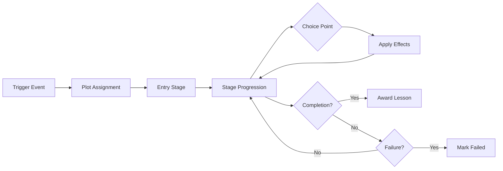
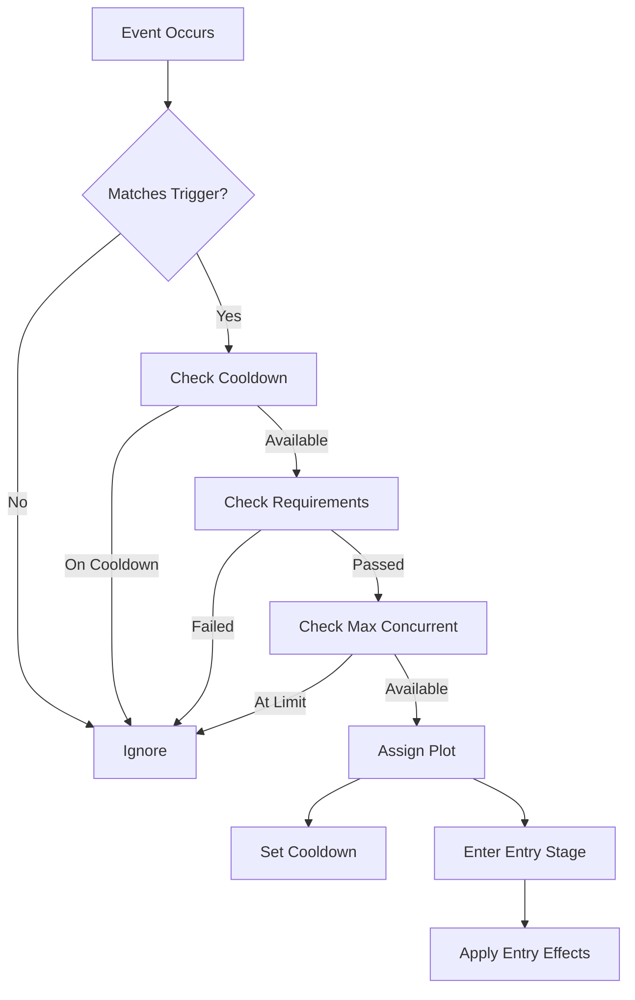
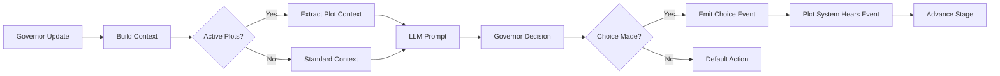
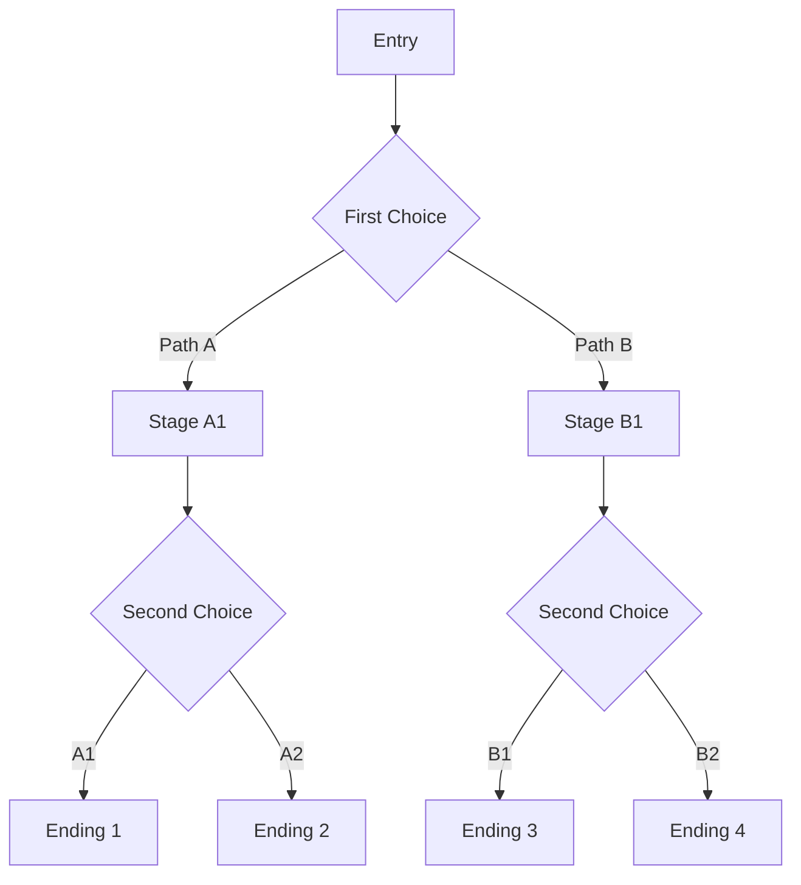
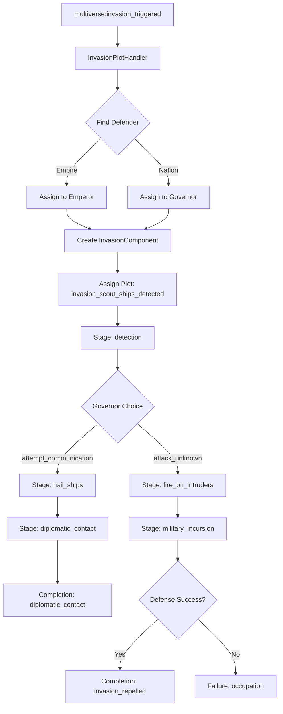
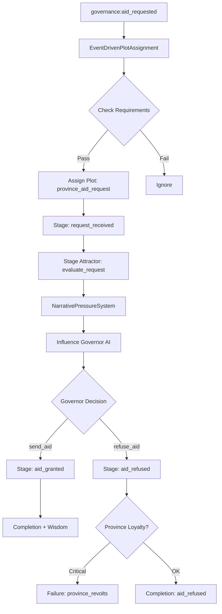
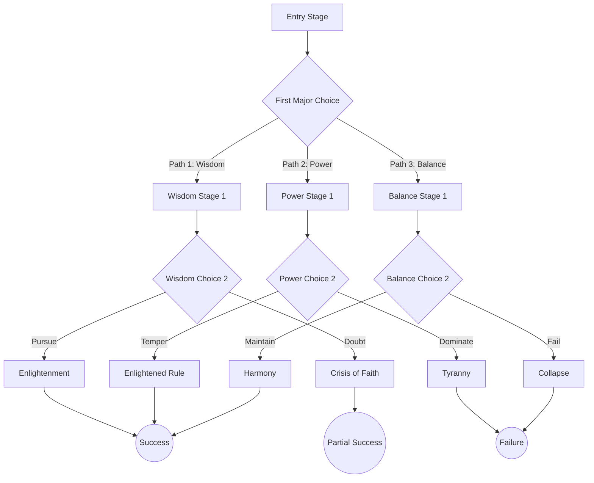

# Plot Template Creation Guide

**Version:** 1.0.0
**Last Updated:** 2026-01-20
**Status:** Production
**Related Specs:** [10-MULTIVERSE-MECHANICS.md](./specs/grand-strategy/10-MULTIVERSE-MECHANICS.md)

---

## Table of Contents

1. [Introduction](#introduction)
2. [Plot System Overview](#plot-system-overview)
3. [Template Anatomy](#template-anatomy)
4. [Field Reference](#field-reference)
5. [Creating Invasion Plots](#creating-invasion-plots)
6. [Creating Governance Plots](#creating-governance-plots)
7. [Creating Resource Discovery Plots](#creating-resource-discovery-plots)
8. [Plot Assignment System](#plot-assignment-system)
9. [Choice Design Best Practices](#choice-design-best-practices)
10. [Testing Plots](#testing-plots)
11. [Integration Points](#integration-points)
12. [Advanced Features](#advanced-features)

---

## Introduction

### What are Plot Templates?

Plot templates are **narrative structures** that guide souls through meaningful story arcs in the Grand Strategy game. They are:

- **JSON-based data files** separate from code
- **Event-driven** - triggered by game state changes
- **Multi-stage** - progress through narrative beats
- **Choice-rich** - offer meaningful consequences
- **LLM-integrated** - governors use them for decision-making

### When to Use Plots vs. Direct Systems

**Use Plots When:**
- Narrative framing enhances the experience
- Multiple choices with long-term consequences
- Teaching wisdom/lessons to souls
- Creating memorable moments
- Integrating LLM governor decisions

**Use Direct Systems When:**
- Pure mechanical interactions (combat, movement)
- No meaningful player/governor choice
- Real-time constraints (per-tick processing)
- Pure data transformations

### Plot Lifecycle



**Phases:**
1. **Trigger** - Event/condition activates plot
2. **Assignment** - Plot assigned to eligible soul(s)
3. **Entry** - Soul enters first stage, effects applied
4. **Progression** - Stages advance via transitions
5. **Resolution** - Completion (lesson) or failure

---

## Plot System Overview

### How Plots Integrate with LLM Governors

Governors (Emperor, Nation, Province, City) use plots as **narrative context** for decision-making:

```typescript
// GovernorContextBuilders.ts extracts active plots
const plotContext = plotLines.active.map(plot => ({
  template_id: plot.template_id,
  current_stage: plot.current_stage,
  narrative: template.stages.find(s => s.stage_id === plot.current_stage)?.description,
  choices_available: getAvailableChoices(plot, template)
}));

// LLM sees: "You are currently dealing with an invasion (stage: diplomatic_contact).
// Do you negotiate or prepare defenses?"
```

Governors **don't execute** plot logic - they **inform** it. Plots provide:
- Narrative framing for political decisions
- Context for resource allocation
- Pressure toward certain goals (via `stage_attractors`)

### Integration with Existing Systems

**Plot System Stack:**

```
┌─────────────────────────────────────┐
│   LLM Governor Systems              │  Priority 200-210
│   (Use plot context for decisions)  │
├─────────────────────────────────────┤
│   InvasionPlotHandler               │  Priority 215
│   (Assigns invasion plots)          │
├─────────────────────────────────────┤
│   EventDrivenPlotAssignment         │  Priority 150
│   (Monitors triggers, assigns plots)│
├─────────────────────────────────────┤
│   PlotProgressionSystem             │  Priority 86
│   (Advances stages, applies effects)│
├─────────────────────────────────────┤
│   NarrativePressureSystem           │  Priority 80
│   (Applies stage attractors to AI)  │
└─────────────────────────────────────┘
```

**Data Files:**
- `/packages/core/data/invasion-plot-templates.json` (1,148 lines, 6 scenarios)
- `/packages/core/data/plot-templates.json` (micro/small/medium plots)
- `/packages/core/data/ascension-plot-templates.json` (epic transcendence)
- `/packages/core/data/exotic-plot-templates.json` (special scenarios)

**Source Files:**
- `/packages/core/src/systems/InvasionPlotHandler.ts` - Invasion event handling
- `/packages/core/src/plot/EventDrivenPlotAssignment.ts` - Trigger monitoring
- `/packages/core/src/plot/PlotProgressionSystem.ts` - Stage advancement
- `/packages/core/src/plot/PlotConditionEvaluator.ts` - Transition logic
- `/packages/core/src/plot/PlotEffectExecutor.ts` - Effect application

---

## Template Anatomy

### Minimal Template Structure

```json
{
  "id": "plot_example",
  "name": "Example Plot",
  "description": "A brief plot for demonstration",
  "scale": "small",
  "fork_behavior": "continue",
  "lesson": {
    "theme": "Learning from example",
    "domain": "wisdom",
    "insight": "Even small moments teach lessons",
    "wisdom_value": 5,
    "repeatable": true
  },
  "entry_stage": "start",
  "completion_stages": ["success"],
  "failure_stages": ["failure"],
  "stages": [
    {
      "stage_id": "start",
      "name": "The Beginning",
      "description": "Something happens that requires a choice.",
      "on_enter_effects": [
        { "type": "modify_mood", "delta": -5 }
      ]
    },
    {
      "stage_id": "success",
      "name": "Good Ending",
      "description": "You made the right choice!",
      "on_enter_effects": [
        { "type": "modify_wisdom", "delta": 5 }
      ]
    }
  ],
  "transitions": [
    {
      "from_stage": "start",
      "to_stage": "success",
      "conditions": [
        { "type": "personal_tick_elapsed", "ticks": 100 }
      ]
    }
  ],
  "assignment_rules": {
    "triggers": [
      { "type": "on_emotional_state", "state": "curious" }
    ],
    "max_concurrent": 1,
    "cooldown_ticks": 5000
  }
}
```

### Complete Example: Invasion Plot

Reference: `/packages/core/data/invasion-plot-templates.json` - `invasion_scout_ships_detected`

```json
{
  "id": "invasion_scout_ships_detected",
  "name": "Unknown Ships Detected",
  "description": "Scout ships from an advanced civilization have entered our space",
  "scale": "epic",
  "fork_behavior": "continue",
  "lesson": {
    "theme": "First contact and strategic response",
    "domain": "political",
    "insight": "How we respond to the unknown shapes who we become.",
    "wisdom_value": 3,
    "repeatable": false
  },
  "entry_stage": "detection",
  "completion_stages": ["diplomatic_contact", "invasion_repelled"],
  "failure_stages": ["occupation", "cultural_assimilation"],
  "stages": [
    {
      "stage_id": "detection",
      "name": "Unknown Contacts",
      "description": "Sensors have detected unidentified vessels at the edge of our territory.",
      "stage_attractors": [
        {
          "attractor_id": "investigate",
          "goal": {
            "type": "investigate_anomaly",
            "parameters": { "investigation_type": "scout_ships" }
          },
          "strength": 0.6,
          "urgency": 0.8,
          "description": "Send scouts to investigate"
        }
      ]
    },
    {
      "stage_id": "hail_ships",
      "name": "Attempting Communication",
      "description": "You've decided to reach out peacefully. Broadcasting on all frequencies...",
      "on_enter_effects": [
        { "type": "modify_mood", "delta": -10 },
        {
          "type": "queue_dream_hint",
          "dream_type": "premonition",
          "content_hint": "Voices from the stars, speaking in patterns you've never heard",
          "intensity": 0.7
        }
      ]
    },
    {
      "stage_id": "diplomatic_contact",
      "name": "First Contact Established",
      "description": "Communication established. They come from beyond our known space.",
      "on_enter_effects": [
        { "type": "modify_mood", "delta": 20 }
      ]
    }
  ],
  "transitions": [
    {
      "from_stage": "detection",
      "to_stage": "hail_ships",
      "conditions": [
        { "type": "player_choice", "choice_id": "attempt_communication" }
      ]
    },
    {
      "from_stage": "hail_ships",
      "to_stage": "diplomatic_contact",
      "conditions": [
        { "type": "personal_tick_elapsed", "ticks": 500 }
      ]
    }
  ],
  "assignment_rules": {
    "triggers": [
      {
        "type": "on_event",
        "event_type": "multiverse:invasion_triggered",
        "invasion_phase": "scout"
      }
    ],
    "max_concurrent": 1,
    "cooldown_ticks": 10000,
    "min_wisdom": 1
  }
}
```

---

## Field Reference

### Top-Level Fields

| Field | Type | Required | Description |
|-------|------|----------|-------------|
| `id` | string | ✅ | Unique identifier (e.g., `invasion_scout_ships_detected`) |
| `name` | string | ✅ | Human-readable title shown to player |
| `description` | string | ✅ | Brief summary of plot arc |
| `scale` | enum | ✅ | `micro`, `small`, `medium`, `large`, `epic` |
| `fork_behavior` | enum | ✅ | `continue`, `fork_required`, `branch` |
| `lesson` | object | ✅ | Wisdom gained upon completion |
| `entry_stage` | string | ✅ | Stage ID where plot begins |
| `completion_stages` | string[] | ✅ | Stage IDs that complete plot successfully |
| `failure_stages` | string[] | ❌ | Stage IDs that fail plot |
| `stages` | Stage[] | ✅ | All narrative stages |
| `transitions` | Transition[] | ✅ | Rules for stage advancement |
| `assignment_rules` | object | ❌ | How/when plot gets assigned |
| `multiverse_scope` | enum | ❌ | `local`, `cross_timeline`, `cross_universe` |
| `parameters` | object | ❌ | Custom data for plot instance |

### Scale Guidelines

| Scale | Duration | Active/Soul | Wisdom | Examples |
|-------|----------|-------------|--------|----------|
| `micro` | Minutes-hours | 5-20 | 1-2 | Moment of courage, act of kindness |
| `small` | Hours-days | 3-8 | 3-5 | Lost item, difficult conversation |
| `medium` | Days-weeks | 2-5 | 8-15 | Paradigm war, prophecy trap |
| `large` | Weeks-months | 1-3 | 15-20 | Tyrant's fall, multiverse invasion |
| `epic` | Months-years | 1 | 50+ | Fae ascension, Enochian journey |

### Fork Behavior

| Value | Meaning | When to Use |
|-------|---------|-------------|
| `continue` | Plot continues in current timeline | Most plots |
| `fork_required` | Plot forces timeline split | Temporal attacks, paradoxes |
| `branch` | Plot allows but doesn't require fork | Player choice consequences |

### Lesson Object

```typescript
{
  "theme": string,           // High-level lesson category
  "domain": string,          // Wisdom domain: political, military, cultural, etc.
  "insight": string,         // Specific wisdom gained (shown to player)
  "wisdom_value": number,    // Wisdom points awarded (1-50+)
  "repeatable": boolean      // Can soul learn this multiple times?
}
```

**Domain Values:**
- `political` - Governance, diplomacy, statecraft
- `military` - Strategy, tactics, defense
- `cultural` - Identity, tradition, assimilation
- `economic` - Trade, resources, development
- `existential` - Cosmic horror, reality limits
- `divinity` - Gods, worship, transcendence
- `temporal` - Time, causality, paradoxes
- `transcendence` - Post-temporal evolution
- `magic` - Paradigms, reality manipulation
- `governance` - Leadership, power, corruption
- `multiverse` - Inter-universe interactions
- `wisdom` - General insight

### Stage Object

```typescript
{
  "stage_id": string,              // Unique within template
  "name": string,                  // Player-facing title
  "description": string,           // Narrative text
  "stage_attractors"?: Attractor[], // Goals AI pursues in this stage
  "on_enter_effects"?: Effect[],   // Applied when entering stage
  "on_exit_effects"?: Effect[]     // Applied when leaving stage
}
```

**Stage Attractors** (Phase 3 addition):
Modify AI behavior during stage via `NarrativePressureSystem`:

```json
{
  "attractor_id": "investigate",
  "goal": {
    "type": "investigate_anomaly",
    "parameters": { "investigation_type": "scout_ships" }
  },
  "strength": 0.6,     // How strongly goal pulls (0.0-1.0)
  "urgency": 0.8,      // How urgent (affects priority)
  "description": "Send scouts to investigate"
}
```

**Goal Types:**
- `investigate_anomaly` - Explore unknown
- `military_mobilization` - Prepare defenses
- `political_decision` - Make governance choice
- `economic_oversight` - Monitor resources
- `tech_threshold` - Advance technology
- `wisdom_threshold` - Gain wisdom
- `relationship_maintained` - Keep allies
- `emotional_state` - Reach mood state

### Transition Object

```typescript
{
  "from_stage": string,         // Source stage ID
  "to_stage": string,           // Destination stage ID
  "conditions": Condition[],    // ALL must be true to transition
  "effects"?: Effect[]          // Applied during transition
}
```

### Condition Types

| Type | Fields | Description |
|------|--------|-------------|
| `player_choice` | `choice_id` | Governor makes specific choice |
| `personal_tick_elapsed` | `ticks` | Time passes (ticks since stage entry) |
| `wisdom_threshold` | `min_wisdom`, `max_wisdom` | Soul's wisdom level |
| `stress_threshold` | `min`, `max` | Soul's stress level |
| `emotional_state` | `state`, `duration_ticks?` | Soul's mood |
| `relationship_maintained` | `min_trust` | Keep trust level |
| `tech_threshold` | `min_level` | Technology advancement |
| `has_skill` | `skill`, `min_level`, `max_level?` | Skill proficiency |
| `has_item` | `item_id` | Possess specific item |
| `custom` | `custom_condition_id` | Code-defined logic |

**Example Conditions:**

```json
// Time-based (most common)
{ "type": "personal_tick_elapsed", "ticks": 1000 }

// Wisdom-based
{ "type": "wisdom_threshold", "min_wisdom": 25 }

// Choice-based
{ "type": "player_choice", "choice_id": "negotiate" }

// Combined (all must pass)
[
  { "type": "wisdom_threshold", "min_wisdom": 30 },
  { "type": "emotional_state", "state": "content", "duration_ticks": 500 }
]

// Custom (requires code implementation)
{ "type": "custom", "custom_condition_id": "invasion_defense_success" }
```

### Effect Types

| Type | Fields | Description |
|------|--------|-------------|
| `modify_mood` | `delta` | Change mood (+/-) |
| `modify_stress` | `delta` | Change stress (+/-) |
| `modify_wisdom` | `delta` | Award wisdom |
| `queue_dream_hint` | `dream_type`, `content_hint`, `intensity` | Show dream |
| `learn_lesson` | `lesson_id` | Mark lesson learned |
| `add_trauma` | `trauma_type` | Add trauma event |

**Dream Types:**
- `prophetic_vision` - Future events
- `memory_echo` - Past memories
- `warning` - Danger ahead
- `symbolic` - Metaphorical imagery
- `nightmare` - Horror/fear

**Example Effects:**

```json
// Mood swing
{ "type": "modify_mood", "delta": -25 }

// Award wisdom
{ "type": "modify_wisdom", "delta": 15 }

// Show prophetic dream
{
  "type": "queue_dream_hint",
  "dream_type": "prophetic_vision",
  "content_hint": "You see the future: your choice ripples across timelines",
  "intensity": 0.9
}

// Mark lesson learned
{ "type": "learn_lesson", "lesson_id": "divine_servitude" }

// Add trauma
{ "type": "add_trauma", "trauma_type": "divine_punishment" }
```

### Assignment Rules

```typescript
{
  "triggers": Trigger[],           // Events that activate plot
  "max_concurrent": number,        // Max active instances per soul
  "cooldown_ticks": number,        // Ticks before re-assignment
  "min_wisdom": number?,           // Minimum wisdom required
  "required_archetype": string[]?, // Must have archetype
  "required_interests": string[]?, // Must have interest
  "forbidden_if_learned": string[]? // Can't have completed these plots
}
```

### Trigger Types

| Type | Fields | Description |
|------|--------|-------------|
| `on_event` | `event_type`, custom fields | System event fired |
| `on_breakdown` | `breakdown_type?` | Mental breakdown |
| `on_trauma` | `trauma_type?` | Traumatic event |
| `on_emotional_state` | `state`, `min_duration_ticks?` | Mood state |
| `on_mood_threshold` | `min?`, `max?` | Mood range |
| `on_stress_threshold` | `min?`, `max?` | Stress range |
| `on_relationship_change` | `delta_threshold` | Trust change |
| `on_relationship_formed` | `min_initial_trust?` | New relationship |
| `on_death_nearby` | `min_relationship_trust?` | Nearby death |
| `on_skill_mastery` | `skill`, `min_level` | Skill achievement |
| `on_social_isolation` | - | No relationships |

**Example Triggers:**

```json
// Event-based (invasion plots)
{
  "type": "on_event",
  "event_type": "multiverse:invasion_triggered",
  "invasion_phase": "scout"
}

// Emotional state
{
  "type": "on_emotional_state",
  "state": "despairing",
  "min_duration_ticks": 500
}

// Breakdown
{
  "type": "on_breakdown",
  "breakdown_type": "tantrum"
}

// Relationship formed
{
  "type": "on_relationship_formed",
  "min_initial_trust": 50
}
```

---

## Creating Invasion Plots

### Step-by-Step: Diplomatic Invasion

**1. Define Invasion Type**

Invasion types from `BackgroundUniverseManager`:
- `military` - Direct conquest
- `cultural` - Soft power assimilation
- `economic` - Trade dependency
- `dimensional` - Reality breach
- `temporal` - Timeline attack
- `viral` - Memetic spread
- `swarm` - Overwhelming numbers

**2. Create Trigger Conditions**

```json
"assignment_rules": {
  "triggers": [
    {
      "type": "on_event",
      "event_type": "multiverse:invasion_started",
      "invasion_type": "cultural"
    }
  ],
  "max_concurrent": 1,
  "cooldown_ticks": 15000,
  "min_wisdom": 2
}
```

**3. Design Narrative Stages**

Follow invasion arc: **Detection → Escalation → Crisis → Resolution**

```json
"stages": [
  {
    "stage_id": "arrival",
    "name": "Benevolent Contact",
    "description": "They arrive with advanced technology and open hands. They want to 'uplift' us.",
    "stage_attractors": [
      {
        "attractor_id": "evaluate_offer",
        "goal": {
          "type": "political_decision",
          "parameters": { "decision_type": "cultural_exchange" }
        },
        "strength": 0.5,
        "urgency": 0.6,
        "description": "Assess their intentions"
      }
    ]
  },
  {
    "stage_id": "tech_adoption",
    "name": "Accepting the Gift",
    "description": "Their technology transforms our world. But our traditional ways begin to fade.",
    "on_enter_effects": [
      { "type": "modify_mood", "delta": 10 }
    ]
  },
  {
    "stage_id": "cultural_resistance",
    "name": "Holding the Line",
    "description": "You've chosen to preserve our culture, even if it means slower progress.",
    "on_enter_effects": [
      { "type": "modify_mood", "delta": 5 }
    ]
  }
]
```

**4. Add Player/Governor Choices**

Choices map to `player_choice` conditions:

```json
"transitions": [
  {
    "from_stage": "arrival",
    "to_stage": "tech_adoption",
    "conditions": [
      { "type": "player_choice", "choice_id": "accept_technology" }
    ]
  },
  {
    "from_stage": "arrival",
    "to_stage": "cultural_resistance",
    "conditions": [
      { "type": "player_choice", "choice_id": "resist_change" }
    ]
  }
]
```

**5. Define Consequences**

Each path leads to different outcomes:

```json
"completion_stages": ["cultural_preservation", "mutual_exchange"],
"failure_stages": ["cultural_erasure", "dependency"]
```

**6. Balance Difficulty**

- **Success paths**: Require wisdom/tech investment
- **Failure paths**: Result from neglect/poor choices
- **Multiple viable paths**: Not obvious good/bad

```json
{
  "from_stage": "tech_adoption",
  "to_stage": "mutual_exchange",
  "conditions": [
    { "type": "custom", "custom_condition_id": "balanced_adoption" }
  ]
},
{
  "from_stage": "tech_adoption",
  "to_stage": "cultural_erasure",
  "conditions": [
    { "type": "custom", "custom_condition_id": "total_adoption" }
  ]
}
```

**7. Add Atmospheric Elements**

Dreams provide foreshadowing and emotional depth:

```json
"on_enter_effects": [
  {
    "type": "queue_dream_hint",
    "dream_type": "warning",
    "content_hint": "You dream of children who speak only their language, forgetting yours",
    "intensity": 0.8
  }
]
```

### Complete Example

See `/packages/core/data/invasion-plot-templates.json` → `invasion_cultural_conquest`

**Key Features:**
- 7 stages (arrival → preservation/erasure)
- 2 player choice points
- 4 possible endings (2 success, 2 failure)
- Stage attractors guide AI behavior
- Dreams telegraph consequences
- Custom conditions for nuanced outcomes

---

## Creating Governance Plots

### Province Aid Request

**Scenario:** Province governor requests resources from nation/empire level.

```json
{
  "id": "province_aid_request",
  "name": "Provincial Crisis",
  "description": "A province requests emergency aid. Do you help or focus on your own needs?",
  "scale": "small",
  "fork_behavior": "continue",
  "lesson": {
    "theme": "Balancing local vs imperial needs",
    "domain": "political",
    "insight": "Leadership means choosing who suffers least.",
    "wisdom_value": 8,
    "repeatable": true
  },
  "entry_stage": "request_received",
  "completion_stages": ["aid_granted", "province_self_sufficient"],
  "failure_stages": ["province_revolts", "aid_refused"],
  "stages": [
    {
      "stage_id": "request_received",
      "name": "The Request",
      "description": "Province Omega reports crop failure. They need food shipments immediately.",
      "stage_attractors": [
        {
          "attractor_id": "evaluate_request",
          "goal": {
            "type": "political_decision",
            "parameters": { "decision_type": "aid_evaluation" }
          },
          "strength": 0.6,
          "urgency": 0.8,
          "description": "Assess province needs and empire capacity"
        }
      ]
    },
    {
      "stage_id": "aid_granted",
      "name": "Relief Arrives",
      "description": "You sent food shipments. The province stabilizes. Loyalty increases.",
      "on_enter_effects": [
        { "type": "modify_mood", "delta": 10 },
        { "type": "modify_wisdom", "delta": 5 }
      ]
    },
    {
      "stage_id": "aid_refused",
      "name": "Request Denied",
      "description": "You chose to preserve imperial reserves. The province suffers.",
      "on_enter_effects": [
        { "type": "modify_mood", "delta": -15 },
        { "type": "modify_stress", "delta": 20 }
      ]
    },
    {
      "stage_id": "province_revolts",
      "name": "Rebellion",
      "description": "Starving, the province declares independence. You failed them.",
      "on_enter_effects": [
        { "type": "modify_mood", "delta": -30 },
        { "type": "add_trauma", "trauma_type": "political_failure" }
      ]
    }
  ],
  "transitions": [
    {
      "from_stage": "request_received",
      "to_stage": "aid_granted",
      "conditions": [
        { "type": "player_choice", "choice_id": "send_aid" }
      ]
    },
    {
      "from_stage": "request_received",
      "to_stage": "aid_refused",
      "conditions": [
        { "type": "player_choice", "choice_id": "refuse_aid" }
      ]
    },
    {
      "from_stage": "aid_refused",
      "to_stage": "province_revolts",
      "conditions": [
        { "type": "personal_tick_elapsed", "ticks": 2000 },
        { "type": "custom", "custom_condition_id": "province_loyalty_critical" }
      ]
    }
  ],
  "assignment_rules": {
    "triggers": [
      { "type": "on_event", "event_type": "governance:aid_requested" }
    ],
    "max_concurrent": 3,
    "cooldown_ticks": 5000,
    "min_wisdom": 5
  }
}
```

### Nation Border Dispute

**Scenario:** Two nations within empire claim same territory.

```json
{
  "id": "nation_border_dispute",
  "name": "Contested Borders",
  "description": "Two nations claim the Disputed Valley. Both have historical ties. You must mediate.",
  "scale": "medium",
  "fork_behavior": "continue",
  "lesson": {
    "theme": "Justice vs expediency in arbitration",
    "domain": "political",
    "insight": "Fair solutions may satisfy no one, but preserve peace.",
    "wisdom_value": 12,
    "repeatable": true
  },
  "entry_stage": "dispute_escalates",
  "completion_stages": ["peaceful_resolution", "shared_sovereignty"],
  "failure_stages": ["military_conflict", "empire_fractures"],
  "stages": [
    {
      "stage_id": "dispute_escalates",
      "name": "Tensions Rise",
      "description": "Nation Alpha and Beta both mobilize troops. War looms unless you intervene.",
      "on_enter_effects": [
        { "type": "modify_stress", "delta": 25 }
      ]
    },
    {
      "stage_id": "investigation",
      "name": "Historical Research",
      "description": "You commission historians to determine legitimate claims.",
      "stage_attractors": [
        {
          "attractor_id": "gather_evidence",
          "goal": {
            "type": "wisdom_threshold",
            "parameters": { "min_wisdom": 20 }
          },
          "strength": 0.5,
          "urgency": 0.6,
          "description": "Understand the truth before judging"
        }
      ]
    },
    {
      "stage_id": "judgment",
      "name": "Imperial Ruling",
      "description": "You must choose: Alpha's claim, Beta's claim, or split the territory.",
      "stage_attractors": [
        {
          "attractor_id": "fair_ruling",
          "goal": {
            "type": "political_decision",
            "parameters": { "decision_type": "border_mediation" }
          },
          "strength": 0.7,
          "urgency": 0.9,
          "description": "Make just decision despite political pressure"
        }
      ]
    }
  ],
  "transitions": [
    {
      "from_stage": "dispute_escalates",
      "to_stage": "investigation",
      "conditions": [
        { "type": "player_choice", "choice_id": "research_claims" }
      ]
    },
    {
      "from_stage": "investigation",
      "to_stage": "judgment",
      "conditions": [
        { "type": "personal_tick_elapsed", "ticks": 1500 }
      ]
    }
  ],
  "assignment_rules": {
    "triggers": [
      { "type": "on_event", "event_type": "governance:border_dispute" }
    ],
    "max_concurrent": 2,
    "cooldown_ticks": 10000,
    "min_wisdom": 15
  }
}
```

### Empire Succession Crisis

**Scenario:** Emperor dies, multiple claimants.

```json
{
  "id": "empire_succession_crisis",
  "name": "The Empty Throne",
  "description": "The Emperor is dead. Three claimants vie for power. Civil war threatens.",
  "scale": "large",
  "fork_behavior": "branch",
  "lesson": {
    "theme": "Legitimacy vs stability in succession",
    "domain": "political",
    "insight": "Sometimes the rightful heir is not the right choice.",
    "wisdom_value": 20,
    "repeatable": false
  },
  "entry_stage": "emperor_dies",
  "completion_stages": ["new_emperor_crowned", "republic_formed"],
  "failure_stages": ["civil_war", "empire_collapses"],
  "stages": [
    {
      "stage_id": "emperor_dies",
      "name": "The Death",
      "description": "The Emperor collapses. No clear succession plan. Chaos begins.",
      "on_enter_effects": [
        { "type": "modify_stress", "delta": 50 },
        {
          "type": "queue_dream_hint",
          "dream_type": "warning",
          "content_hint": "You see the empire fragmenting, armies marching on the capital",
          "intensity": 0.95
        }
      ]
    },
    {
      "stage_id": "claimants_emerge",
      "name": "Three Paths",
      "description": "Prince Legitimate (rightful but weak), General Strong (capable but usurper), Princess Reform (radical but unifying).",
      "stage_attractors": [
        {
          "attractor_id": "evaluate_claimants",
          "goal": {
            "type": "wisdom_threshold",
            "parameters": { "min_wisdom": 30 }
          },
          "strength": 0.8,
          "urgency": 0.95,
          "description": "Choose wisely - empire's future depends on it"
        }
      ]
    }
  ],
  "transitions": [
    {
      "from_stage": "emperor_dies",
      "to_stage": "claimants_emerge",
      "conditions": [
        { "type": "personal_tick_elapsed", "ticks": 500 }
      ]
    }
  ],
  "assignment_rules": {
    "triggers": [
      { "type": "on_event", "event_type": "governance:emperor_death" }
    ],
    "max_concurrent": 1,
    "cooldown_ticks": 50000,
    "min_wisdom": 25
  }
}
```

---

## Creating Resource Discovery Plots

### First Stellar Phenomena Discovery

**Scenario:** First encounter with exotic space object.

```json
{
  "id": "first_stellar_phenomena",
  "name": "The Cosmic Wonder",
  "description": "Your scouts discover a stellar phenomenon never seen before. What is it?",
  "scale": "medium",
  "fork_behavior": "continue",
  "lesson": {
    "theme": "Scientific curiosity vs caution",
    "domain": "wisdom",
    "insight": "The universe rewards the bold observer.",
    "wisdom_value": 10,
    "repeatable": true
  },
  "entry_stage": "detection",
  "completion_stages": ["phenomenon_studied", "resource_claimed"],
  "failure_stages": ["ship_destroyed"],
  "stages": [
    {
      "stage_id": "detection",
      "name": "Sensor Anomaly",
      "description": "Ship sensors detect impossible readings. A star that shouldn't exist.",
      "on_enter_effects": [
        {
          "type": "queue_dream_hint",
          "dream_type": "prophetic_vision",
          "content_hint": "Geometries of light impossible in three dimensions",
          "intensity": 0.7
        }
      ],
      "stage_attractors": [
        {
          "attractor_id": "investigate_safely",
          "goal": {
            "type": "tech_threshold",
            "parameters": { "min_level": 8 }
          },
          "strength": 0.6,
          "urgency": 0.7,
          "description": "Approach with caution and proper instruments"
        }
      ]
    },
    {
      "stage_id": "close_approach",
      "name": "Into the Unknown",
      "description": "Your ship edges closer. The phenomenon defies all models.",
      "on_enter_effects": [
        { "type": "modify_stress", "delta": 20 }
      ]
    },
    {
      "stage_id": "phenomenon_studied",
      "name": "Scientific Breakthrough",
      "description": "Data collected revolutionizes astrophysics. New propulsion theories emerge.",
      "on_enter_effects": [
        { "type": "modify_wisdom", "delta": 10 },
        { "type": "modify_mood", "delta": 30 }
      ]
    }
  ],
  "transitions": [
    {
      "from_stage": "detection",
      "to_stage": "close_approach",
      "conditions": [
        { "type": "player_choice", "choice_id": "investigate" }
      ]
    },
    {
      "from_stage": "close_approach",
      "to_stage": "phenomenon_studied",
      "conditions": [
        { "type": "tech_threshold", "min_level": 9 },
        { "type": "personal_tick_elapsed", "ticks": 2000 }
      ]
    },
    {
      "from_stage": "close_approach",
      "to_stage": "ship_destroyed",
      "conditions": [
        { "type": "tech_threshold", "max_level": 7 },
        { "type": "personal_tick_elapsed", "ticks": 1000 }
      ]
    }
  ],
  "assignment_rules": {
    "triggers": [
      { "type": "on_event", "event_type": "exploration:phenomenon_detected" }
    ],
    "max_concurrent": 2,
    "cooldown_ticks": 8000,
    "min_wisdom": 10
  }
}
```

### Dangerous Mining Accident

**Scenario:** Mine collapse with trapped workers.

```json
{
  "id": "mine_collapse_rescue",
  "name": "Trapped Below",
  "description": "An asteroid mine collapses. Twelve miners trapped. Do you risk rescue?",
  "scale": "small",
  "fork_behavior": "continue",
  "lesson": {
    "theme": "Value of individual lives vs collective risk",
    "domain": "political",
    "insight": "Leaders who abandon their people lose their right to lead.",
    "wisdom_value": 8,
    "repeatable": true
  },
  "entry_stage": "collapse_occurs",
  "completion_stages": ["all_saved", "acceptable_losses"],
  "failure_stages": ["all_lost", "rescue_team_dead"],
  "stages": [
    {
      "stage_id": "collapse_occurs",
      "name": "The Accident",
      "description": "Twelve miners trapped 500 meters down. Oxygen for 48 hours. Mine unstable.",
      "on_enter_effects": [
        { "type": "modify_stress", "delta": 30 }
      ],
      "stage_attractors": [
        {
          "attractor_id": "rescue_decision",
          "goal": {
            "type": "political_decision",
            "parameters": { "decision_type": "rescue_operation" }
          },
          "strength": 0.9,
          "urgency": 1.0,
          "description": "Decide quickly - every minute counts"
        }
      ]
    },
    {
      "stage_id": "rescue_attempt",
      "name": "Into Danger",
      "description": "Rescue team descends. Walls groan. Another collapse could kill everyone.",
      "on_enter_effects": [
        { "type": "modify_stress", "delta": 40 }
      ]
    },
    {
      "stage_id": "all_saved",
      "name": "Miracle Recovery",
      "description": "All twelve miners brought to surface alive. Morale soars.",
      "on_enter_effects": [
        { "type": "modify_mood", "delta": 40 },
        { "type": "modify_wisdom", "delta": 8 }
      ]
    }
  ],
  "transitions": [
    {
      "from_stage": "collapse_occurs",
      "to_stage": "rescue_attempt",
      "conditions": [
        { "type": "player_choice", "choice_id": "send_rescue_team" }
      ]
    },
    {
      "from_stage": "rescue_attempt",
      "to_stage": "all_saved",
      "conditions": [
        { "type": "custom", "custom_condition_id": "rescue_success_roll" }
      ]
    }
  ],
  "assignment_rules": {
    "triggers": [
      { "type": "on_event", "event_type": "resource:mining_accident" }
    ],
    "max_concurrent": 1,
    "cooldown_ticks": 5000,
    "min_wisdom": 5
  }
}
```

### Era Breakthrough Moment

**Scenario:** Civilization reaches new technological era.

```json
{
  "id": "era_breakthrough",
  "name": "The Threshold",
  "description": "Your civilization stands on the brink of a new era. One final push...",
  "scale": "large",
  "fork_behavior": "continue",
  "lesson": {
    "theme": "Technological advancement and responsibility",
    "domain": "wisdom",
    "insight": "With great power comes the choice between creation and destruction.",
    "wisdom_value": 15,
    "repeatable": true
  },
  "entry_stage": "threshold_reached",
  "completion_stages": ["peaceful_ascension", "weapons_era"],
  "failure_stages": ["technological_catastrophe"],
  "stages": [
    {
      "stage_id": "threshold_reached",
      "name": "On the Cusp",
      "description": "Scientists report: the breakthrough is imminent. Next era unlocks tomorrow.",
      "on_enter_effects": [
        {
          "type": "queue_dream_hint",
          "dream_type": "prophetic_vision",
          "content_hint": "Two futures: one of wonder, one of ash. Your choice determines which.",
          "intensity": 0.85
        }
      ],
      "stage_attractors": [
        {
          "attractor_id": "ethical_guidance",
          "goal": {
            "type": "wisdom_threshold",
            "parameters": { "min_wisdom": 35 }
          },
          "strength": 0.7,
          "urgency": 0.8,
          "description": "Ensure technology serves wisdom, not destruction"
        }
      ]
    },
    {
      "stage_id": "breakthrough_achieved",
      "name": "The New Era",
      "description": "The breakthrough succeeds. A new age begins. How will you use this power?",
      "on_enter_effects": [
        { "type": "modify_mood", "delta": 35 }
      ]
    },
    {
      "stage_id": "peaceful_ascension",
      "name": "Era of Enlightenment",
      "description": "Technology uplifts all. Medicine, energy, exploration - wisely guided.",
      "on_enter_effects": [
        { "type": "modify_wisdom", "delta": 15 },
        { "type": "learn_lesson", "lesson_id": "responsible_progress" }
      ]
    },
    {
      "stage_id": "weapons_era",
      "name": "Era of War",
      "description": "First application: weapons. The galaxy trembles at your arsenals.",
      "on_enter_effects": [
        { "type": "modify_wisdom", "delta": -5 },
        { "type": "modify_stress", "delta": 30 }
      ]
    }
  ],
  "transitions": [
    {
      "from_stage": "threshold_reached",
      "to_stage": "breakthrough_achieved",
      "conditions": [
        { "type": "tech_threshold", "min_level": 11 }
      ]
    },
    {
      "from_stage": "breakthrough_achieved",
      "to_stage": "peaceful_ascension",
      "conditions": [
        { "type": "wisdom_threshold", "min_wisdom": 40 },
        { "type": "player_choice", "choice_id": "peaceful_use" }
      ]
    },
    {
      "from_stage": "breakthrough_achieved",
      "to_stage": "weapons_era",
      "conditions": [
        { "type": "wisdom_threshold", "max_wisdom": 30 },
        { "type": "player_choice", "choice_id": "military_use" }
      ]
    }
  ],
  "assignment_rules": {
    "triggers": [
      { "type": "on_tech_level", "min_level": 10 }
    ],
    "max_concurrent": 1,
    "cooldown_ticks": 0,
    "min_wisdom": 25
  }
}
```

---

## Plot Assignment System

### How EventDrivenPlotAssignment Works

**System Priority:** 150 (after mood/relationship systems, before plot progression)
**Update Interval:** 200 ticks (10 seconds) - plots are slow-changing

**Assignment Flow:**



### Finding Eligible Souls

**Requirements Checked:**
1. **Has Required Components:** `SoulIdentity`, `PlotLines`, `Agent` (if incarnated)
2. **Wisdom Threshold:** `min_wisdom` from `assignment_rules`
3. **Archetype Match:** `required_archetype` (if specified)
4. **Interest Match:** `required_interests` (if specified)
5. **Not Forbidden:** No lessons in `forbidden_if_learned`
6. **Capacity Available:** Under `max_concurrent` for this plot scale

**Example from InvasionPlotHandler:**

```typescript
private findLeaders(world: World, politicalEntity: Entity): Entity[] {
  const leaders: Entity[] = [];

  // Prefer governors
  const governorQuery = world.query()
    .with(CT.Governor)
    .with(CT.SoulIdentity)
    .with(CT.PlotLines)
    .executeEntities();

  for (const entity of governorQuery) {
    leaders.push(entity);
  }

  // Fall back to high-wisdom souls
  if (leaders.length === 0) {
    const soulQuery = world.query()
      .with(CT.SoulIdentity)
      .with(CT.PlotLines)
      .executeEntities();

    for (const entity of soulQuery) {
      const soul = entity.getComponent(CT.SoulIdentity);
      if (soul && soul.wisdom_level >= 3) {
        leaders.push(entity);
        if (leaders.length >= 3) break; // Limit to top 3
      }
    }
  }

  return leaders;
}
```

### Priority When Multiple Plots Triggered

When multiple plots match simultaneously:

1. **Epic scale** assigned first (most significant)
2. **Higher `stage_attractors.urgency`** takes priority
3. **Lower cooldown** breaks ties
4. **First registered** in plot registry

**No automatic prioritization** - plots are independent. Soul can have:
- 1 epic plot
- 1-3 large plots
- 2-5 medium plots
- 3-8 small plots
- 5-20 micro plots

### Plot Cooldowns

Cooldowns prevent spamming same plot:

```json
"assignment_rules": {
  "cooldown_ticks": 10000  // 500 seconds (8.3 minutes) at 20 TPS
}
```

**Cooldown Tracking:**
- Per `(soul_id, plot_template_id, trigger_condition)` tuple
- Stored in `EventDrivenPlotAssignmentSystem.conditionCooldowns`
- Cleaned up after 10x default cooldown (5,000 ticks)

**Example:** If invasion plot assigned at tick 1000, can't re-assign until tick 11000.

### Concurrent Plot Limits

Limit active instances per soul:

```json
"assignment_rules": {
  "max_concurrent": 1  // Only one instance of this plot active at a time
}
```

**Use Cases:**
- `max_concurrent: 1` - Epic/unique plots (invasions, ascensions)
- `max_concurrent: 2-3` - Medium plots (can handle multiple crises)
- `max_concurrent: 5-20` - Micro plots (many small moments)

---

## Choice Design Best Practices

### Meaningful Consequences (Not Arbitrary)

**Bad:**
```json
{
  "from_stage": "choice",
  "to_stage": "good_ending",
  "conditions": [
    { "type": "player_choice", "choice_id": "press_red_button" }
  ]
}
// Why is red button good? No narrative logic.
```

**Good:**
```json
{
  "from_stage": "diplomatic_ultimatum",
  "to_stage": "peace_treaty",
  "conditions": [
    { "type": "player_choice", "choice_id": "accept_terms" },
    { "type": "wisdom_threshold", "min_wisdom": 20 }
  ],
  "effects": [
    { "type": "modify_mood", "delta": 15 },
    {
      "type": "queue_dream_hint",
      "dream_type": "memory_echo",
      "content_hint": "You chose peace over pride. Harder than war, wiser than vengeance.",
      "intensity": 0.7
    }
  ]
}
// Clear causality: accepting terms → peace, requires wisdom to swallow pride
```

### Multiple Viable Paths (Not Obvious Good/Bad)

**Bad:**
```json
// Obvious morality choice
"stages": [
  { "stage_id": "choice", "name": "The Decision" },
  { "stage_id": "good_path", "name": "Heroic Outcome" },
  { "stage_id": "evil_path", "name": "Villainous Doom" }
]
```

**Good:**
```json
// Nuanced trade-offs
"stages": [
  {
    "stage_id": "revolution_choice",
    "name": "The People's Voice",
    "description": "Revolution erupts. Support them (risky but just) or suppress (safe but tyrannical)?"
  },
  {
    "stage_id": "supported_revolution",
    "name": "New Government",
    "description": "Democracy installed. Chaotic but free. Economy suffers short-term.",
    "on_enter_effects": [
      { "type": "modify_wisdom", "delta": 10 },
      { "type": "modify_stress", "delta": 25 }
    ]
  },
  {
    "stage_id": "suppressed_revolution",
    "name": "Order Maintained",
    "description": "Rebellion crushed. Stability preserved. At cost of freedom.",
    "on_enter_effects": [
      { "type": "modify_wisdom", "delta": -5 },
      { "type": "modify_mood", "delta": -20 }
    ]
  }
]
// Both choices have costs and benefits
```

### Long-Term Effects (Ripple Through Systems)

**Bad:**
```json
"on_enter_effects": [
  { "type": "modify_mood", "delta": 10 }
]
// Temporary mood boost, no lasting impact
```

**Good:**
```json
"on_enter_effects": [
  { "type": "modify_wisdom", "delta": 15 },
  { "type": "learn_lesson", "lesson_id": "diplomatic_mastery" },
  {
    "type": "queue_dream_hint",
    "dream_type": "prophetic_vision",
    "content_hint": "Future civilizations will study your negotiation as textbook example",
    "intensity": 0.8
  }
]
// Permanent wisdom gain, lesson learned (affects future plot eligibility),
// narrative callback via dream
```

**Integration with Systems:**

```typescript
// Effects can trigger follow-on events
"on_enter_effects": [
  { "type": "emit_event", "event_type": "governance:revolution_succeeded" }
]

// Which triggers OTHER plot assignments
"assignment_rules": {
  "triggers": [
    { "type": "on_event", "event_type": "governance:revolution_succeeded" }
  ]
}
```

### Don't Bypass Systems

**Bad:**
```json
"on_enter_effects": [
  { "type": "set_tech_level", "value": 15 }  // Skip entire tech progression!
]
```

**Good:**
```json
"on_enter_effects": [
  { "type": "tech_boost_modifier", "multiplier": 1.5, "duration_ticks": 2000 }
]
// Accelerates tech research, doesn't skip it
```

**Integration Philosophy:**
- Plots **influence** systems (modifiers, bonuses)
- Plots **don't replace** systems (direct state changes)
- Effects should feel **earned** (wisdom from choices, not free power)

---

## Testing Plots

### Manual Trigger via Debug API

**Browser Console:**

```javascript
// Get plot system
const plotSystem = game.world.getSystem('event_driven_plot_assignment');

// Create manual trigger event
const event = {
  trigger_type: 'on_trauma',
  entity_id: 'soul_123',
  soul_id: 'soul_true_name',
  personal_tick: game.world.tick,
  data: {
    trauma_type: 'betrayal',
    severity: 0.8
  }
};

// Trigger assignment check
plotSystem._evaluateTrigger(
  game.world.getEntity('soul_123'),
  'soul_true_name',
  { type: 'on_trauma', trauma_type: 'betrayal' },
  // ... component references
);
```

### Verify Plot Assignment

**Check PlotLines Component:**

```javascript
const soul = game.world.getEntity('soul_123');
const plotLines = soul.getComponent('plot_lines');

console.log('Active plots:', plotLines.active);
console.log('Current stages:', plotLines.active.map(p => ({
  template: p.template_id,
  stage: p.current_stage
})));
```

### Test All Choice Paths

**For each choice point:**

1. **Save before choice**
2. **Make choice A** → verify stage transition
3. **Load save**
4. **Make choice B** → verify different transition
5. **Compare outcomes**

**Example Test Script:**

```javascript
// Test invasion plot choice paths
async function testInvasionChoices() {
  const soul = findGovernorSoul();
  const plot = soul.getComponent('plot_lines').active
    .find(p => p.template_id === 'invasion_scout_ships_detected');

  // Should be at 'detection' stage
  console.assert(plot.current_stage === 'detection');

  // Save state
  await game.saveLoadService.save(game.world, { name: 'before_choice' });

  // Path 1: Attempt communication
  triggerChoice(soul.id, 'attempt_communication');
  await advanceTicks(100);

  let currentStage = soul.getComponent('plot_lines').active
    .find(p => p.instance_id === plot.instance_id).current_stage;
  console.assert(currentStage === 'hail_ships', 'Communication path works');

  // Load and try path 2
  await game.saveLoadService.load('before_choice', game.world);

  triggerChoice(soul.id, 'attack_unknown');
  await advanceTicks(100);

  currentStage = soul.getComponent('plot_lines').active
    .find(p => p.instance_id === plot.instance_id).current_stage;
  console.assert(currentStage === 'fire_on_intruders', 'Attack path works');
}
```

### Validate Effects Applied

**Check Component State:**

```javascript
function validateEffects(soulId, expectedChanges) {
  const soul = game.world.getEntity(soulId);
  const identity = soul.getComponent('soul_identity');
  const mood = soul.getComponent('mood');

  console.log('Wisdom:', identity.wisdom_level, '(expected:', expectedChanges.wisdom, ')');
  console.log('Mood:', mood.currentMood, '(expected:', expectedChanges.mood, ')');
  console.log('Stress:', mood.stress.level, '(expected:', expectedChanges.stress, ')');
}

// After stage transition
validateEffects('soul_123', {
  wisdom: 25,  // Was 20, gained 5
  mood: -10,   // Was 0, lost 10
  stress: 35   // Was 15, gained 20
});
```

### Check State Transitions

**Verify Transition Logic:**

```javascript
function testTransitionConditions(plotId, fromStage, toStage, conditions) {
  const template = plotLineRegistry.getTemplate(plotId);
  const transition = template.transitions.find(t =>
    t.from_stage === fromStage && t.to_stage === toStage
  );

  console.assert(transition, `Transition ${fromStage} → ${toStage} exists`);
  console.assert(
    JSON.stringify(transition.conditions) === JSON.stringify(conditions),
    'Conditions match expected'
  );
}

// Example
testTransitionConditions(
  'invasion_scout_ships_detected',
  'detection',
  'hail_ships',
  [{ type: 'player_choice', choice_id: 'attempt_communication' }]
);
```

### Testing Checklist

**Before Committing New Plot:**

- [ ] Template JSON validates (no syntax errors)
- [ ] All stage IDs referenced in transitions exist
- [ ] Entry stage exists and is reachable
- [ ] At least one completion stage defined
- [ ] Failure stages exist (if plot can fail)
- [ ] Trigger conditions match event types
- [ ] Effects reference valid types
- [ ] Custom conditions have implementations
- [ ] All choice paths tested
- [ ] Stage transitions work as expected
- [ ] Effects apply correctly
- [ ] Lesson awarded on completion
- [ ] Cooldown prevents immediate re-assignment
- [ ] Max concurrent limit respected
- [ ] Stage attractors valid goal types
- [ ] Dreams render in UI

---

## Integration Points

### PlotLineRegistry

**Global singleton for template storage.**

```typescript
import { plotLineRegistry } from '@ai-village/core/plot/PlotLineRegistry.js';

// Register template (usually done at system init)
plotLineRegistry.register(myTemplate);

// Retrieve template
const template = plotLineRegistry.getTemplate('invasion_scout_ships_detected');

// Get all templates
const allTemplates = plotLineRegistry.getAllTemplates();

// Filter by scale
const epicPlots = allTemplates.filter(t => t.scale === 'epic');
```

**Auto-Registration:**
Templates in JSON files are auto-loaded by systems:
- `InvasionPlotHandler` loads `invasion-plot-templates.json`
- `MicroPlotTemplates` loads `plot-templates.json`

### EventDrivenPlotAssignment

**Monitors game state and assigns plots.**

**Key Methods:**

```typescript
class EventDrivenPlotAssignmentSystem {
  // Check if trigger matches entity state
  private _evaluateTrigger(
    entity: Entity,
    soulId: string,
    trigger: PlotTrigger,
    // ... components
  ): PlotTriggerEvent | undefined;

  // Attempt to assign plot
  private _attemptAssignment(
    world: WorldMutator,
    event: PlotTriggerEvent,
    template: PlotLineTemplate,
    currentTick: number
  ): boolean;

  // Build agent bindings for plot
  private _buildAgentBindings(
    world: World,
    event: PlotTriggerEvent,
    bindings: TriggerAgentBinding[]
  ): Record<string, string>;
}
```

**Event Subscription:**

```typescript
// In onInitialize
this.events.onGeneric('agent:died', (data) => {
  this.recentDeaths.push({
    deceasedId: data.entityId,
    position: data.position,
    tick: data.tick
  });
});
```

### PlotProgressionSystem

**Advances plots through stages.**

**Key Methods:**

```typescript
class PlotProgressionSystem {
  // Progress all plots for soul
  private progressSoulPlots(soul: Entity, world: World): void;

  // Check if plot can advance
  private checkPlotProgression(
    plot: PlotLineInstance,
    soul: Entity,
    agent: Entity | null,
    world: World
  ): void;

  // Evaluate transition conditions
  private evaluateTransitionConditions(
    transition: PlotTransition,
    plot: PlotLineInstance,
    soul: Entity,
    agent: Entity | null,
    world: World
  ): boolean;

  // Advance to next stage
  private advanceStage(
    plot: PlotLineInstance,
    template: PlotLineTemplate,
    transition: PlotTransition,
    soul: Entity,
    agent: Entity | null,
    world: World
  ): void;

  // Handle completion
  private handlePlotCompletion(
    plot: PlotLineInstance,
    soul: Entity,
    world: World
  ): void;
}
```

### GovernorComponent

**LLM governors use plots for context.**

**Governor Decision Flow:**



**Example Context Extraction:**

```typescript
// From GovernorContextBuilders.ts
function extractPlotContext(soul: Entity): string {
  const plotLines = soul.getComponent(CT.PlotLines);
  if (!plotLines || plotLines.active.length === 0) {
    return '';
  }

  const narratives = plotLines.active.map(plot => {
    const template = plotLineRegistry.getTemplate(plot.template_id);
    const stage = template.stages.find(s => s.stage_id === plot.current_stage);

    return `
**Active Situation:** ${template.name}
${stage.description}

Available choices:
${getAvailableChoices(plot, template).map(c => `- ${c.label}: ${c.description}`).join('\n')}
    `.trim();
  }).join('\n\n');

  return `
## Current Situations

You are currently dealing with the following situations:

${narratives}
  `.trim();
}
```

### LLM Integration for Custom Narratives

**Dynamic Narrative Generation:**

Plots provide **structure**, LLMs provide **flavor**.

```typescript
// Future enhancement: LLM-generated stage descriptions
async function generateStageNarrative(
  template: PlotLineTemplate,
  stage: PlotStage,
  soulContext: SoulContext
): Promise<string> {
  const prompt = `
You are narrating a ${template.scale}-scale plot: ${template.name}

Current stage: ${stage.name}
Default description: ${stage.description}

Soul context:
- Name: ${soulContext.name}
- Wisdom: ${soulContext.wisdom}
- Current mood: ${soulContext.mood}
- Recent events: ${soulContext.recentEvents}

Rewrite the stage description to be personalized and atmospheric.
Keep it to 2-3 sentences. Match the tone of the default.
  `;

  const response = await llmService.generate(prompt);
  return response.text;
}
```

**Choice Label Generation:**

```typescript
// Generate choice options dynamically
async function generateChoiceLabels(
  template: PlotLineTemplate,
  currentStage: string,
  soulContext: SoulContext
): Promise<Choice[]> {
  const transitions = template.transitions.filter(t =>
    t.from_stage === currentStage &&
    t.conditions.some(c => c.type === 'player_choice')
  );

  const choices = await Promise.all(transitions.map(async t => {
    const choiceId = t.conditions.find(c => c.type === 'player_choice')!.choice_id;

    const prompt = `
Generate a choice label for plot decision.

Context: ${soulContext.narrative}
Choice ID: ${choiceId}
Leads to stage: ${t.to_stage}

Return JSON: { "label": "...", "description": "..." }
    `;

    const response = await llmService.generate(prompt);
    return JSON.parse(response.text);
  }));

  return choices;
}
```

---

## Advanced Features

### Conditional Stages

**Unlock stages based on previous choices:**

```json
{
  "stages": [
    {
      "stage_id": "secret_path",
      "name": "Hidden Knowledge",
      "description": "Only those who chose wisdom over power reach this stage.",
      "stage_requirements": {
        "visited_stages": ["chose_wisdom"],
        "not_visited_stages": ["chose_power"]
      }
    }
  ],
  "transitions": [
    {
      "from_stage": "mid_game",
      "to_stage": "secret_path",
      "conditions": [
        { "type": "custom", "custom_condition_id": "visited_wisdom_path" }
      ]
    }
  ]
}
```

### Branching Narratives

**Multiple paths with different outcomes:**



**Implementation:**

```json
{
  "stages": [
    { "stage_id": "entry" },
    { "stage_id": "path_a_1" },
    { "stage_id": "path_a_2" },
    { "stage_id": "path_b_1" },
    { "stage_id": "path_b_2" },
    { "stage_id": "ending_1" },
    { "stage_id": "ending_2" },
    { "stage_id": "ending_3" },
    { "stage_id": "ending_4" }
  ],
  "transitions": [
    {
      "from_stage": "entry",
      "to_stage": "path_a_1",
      "conditions": [{ "type": "player_choice", "choice_id": "choose_a" }]
    },
    {
      "from_stage": "entry",
      "to_stage": "path_b_1",
      "conditions": [{ "type": "player_choice", "choice_id": "choose_b" }]
    },
    {
      "from_stage": "path_a_1",
      "to_stage": "ending_1",
      "conditions": [{ "type": "player_choice", "choice_id": "a_ending_1" }]
    },
    {
      "from_stage": "path_a_1",
      "to_stage": "ending_2",
      "conditions": [{ "type": "player_choice", "choice_id": "a_ending_2" }]
    }
    // ... etc
  ],
  "completion_stages": ["ending_1", "ending_2", "ending_3", "ending_4"]
}
```

### Multi-Actor Plots

**Multiple souls involved in same plot:**

```json
{
  "id": "diplomatic_marriage",
  "name": "Political Union",
  "description": "Two nations seek to unite through marriage of their rulers.",
  "assignment_rules": {
    "trigger_bindings": [
      {
        "role": "suitor",
        "source": "trigger_target"
      },
      {
        "role": "proposed",
        "source": "highest_affinity"
      }
    ]
  },
  "stages": [
    {
      "stage_id": "proposal",
      "name": "The Proposal",
      "description": "{{suitor}} proposes marriage to {{proposed}}. Political necessity vs personal feelings.",
      "multi_actor_choices": {
        "suitor": ["propose_sincerely", "propose_coldly"],
        "proposed": ["accept_proposal", "reject_proposal", "negotiate_terms"]
      }
    }
  ],
  "transitions": [
    {
      "from_stage": "proposal",
      "to_stage": "accepted",
      "conditions": [
        { "type": "actor_choice", "actor": "suitor", "choice_id": "propose_sincerely" },
        { "type": "actor_choice", "actor": "proposed", "choice_id": "accept_proposal" }
      ]
    }
  ]
}
```

**Implementation Note:** Multi-actor plots require custom system support. Current system handles single-soul plots.

### Timed Plots

**Must decide within X ticks:**

```json
{
  "stages": [
    {
      "stage_id": "ticking_bomb",
      "name": "Time Running Out",
      "description": "The bomb detonates in 60 seconds. Choose now!",
      "time_limit_ticks": 1200,  // 60 seconds at 20 TPS
      "on_timeout": {
        "force_stage": "explosion",
        "effects": [
          { "type": "modify_stress", "delta": 100 },
          { "type": "add_trauma", "trauma_type": "catastrophic_failure" }
        ]
      }
    }
  ]
}
```

**Custom Condition:**

```typescript
// In PlotConditionEvaluator.ts
case 'time_limit_exceeded': {
  const stageEnteredAt = plot.stage_entered_at;
  const currentTick = context.personal_tick;
  const timeLimit = condition.time_limit_ticks;

  if (currentTick - stageEnteredAt >= timeLimit) {
    // Force timeout transition
    return true;
  }
  return false;
}
```

### Cascading Plots

**One plot triggers another:**

```json
{
  "id": "empire_collapse_aftermath",
  "name": "The Ashes",
  "description": "Your empire fell. Now what?",
  "assignment_rules": {
    "triggers": [
      {
        "type": "on_plot_completed",
        "completed_plot_id": "empire_succession_crisis",
        "completed_stage": "empire_collapses"
      }
    ]
  },
  "stages": [
    {
      "stage_id": "aftermath",
      "name": "Picking Up Pieces",
      "description": "The empire is gone. You survived. Barely. Now rebuild or flee?"
    }
  ]
}
```

**Implementation:**

```typescript
// In PlotProgressionSystem.ts
private handlePlotCompletion(plot: PlotLineInstance, soul: Entity, world: World): void {
  // ... existing completion logic

  // Emit completion event for cascading plots
  this.events.emitGeneric('plot:completed', {
    plot_id: plot.template_id,
    instance_id: plot.instance_id,
    final_stage: plot.current_stage,
    soul_id: soul.id,
    tick: world.tick
  });
}

// In EventDrivenPlotAssignment
case 'on_plot_completed': {
  // Listen for plot completion events
  const completedPlotId = trigger.completed_plot_id;
  const completedStage = trigger.completed_stage;

  // Check if this trigger matches
  if (event.data.plot_id === completedPlotId &&
      event.data.final_stage === completedStage) {
    return {
      trigger_type: 'on_plot_completed',
      entity_id: event.soul_id,
      soul_id: event.data.soul_id,
      personal_tick: event.tick,
      data: { completed_plot: completedPlotId }
    };
  }
  return undefined;
}
```

---

## Appendix: Plot Flow Diagrams

### Invasion Plot Flow



### Governance Plot Flow



### Choice Tree Example



---

## Summary

This guide covers:

✅ **Plot system architecture** - How plots integrate with LLM governors and game systems
✅ **Template anatomy** - Complete field reference with examples
✅ **Creating invasion plots** - Step-by-step tutorial for multiverse conflicts
✅ **Creating governance plots** - Aid requests, border disputes, succession crises
✅ **Creating resource plots** - Discoveries, accidents, era breakthroughs
✅ **Assignment system** - Triggers, cooldowns, concurrent limits
✅ **Choice design** - Meaningful consequences, multiple paths, long-term effects
✅ **Testing procedures** - Manual triggers, validation, choice path testing
✅ **Integration points** - Registry, assignment, progression, governors
✅ **Advanced features** - Conditional stages, branching, multi-actor, timed, cascading

**Next Steps:**

1. **Study existing templates** in `/packages/core/data/`
2. **Create simple plot** (small scale, 3-5 stages)
3. **Test thoroughly** (all choice paths, effects, transitions)
4. **Register in appropriate JSON file**
5. **Submit PR with tests**

**Resources:**

- [invasion-plot-templates.json](../packages/core/data/invasion-plot-templates.json) - 6 epic invasion scenarios
- [plot-templates.json](../packages/core/data/plot-templates.json) - Micro/small/medium plots
- [InvasionPlotHandler.ts](../packages/core/src/systems/InvasionPlotHandler.ts) - Event handling
- [EventDrivenPlotAssignment.ts](../packages/core/src/plot/EventDrivenPlotAssignment.ts) - Trigger monitoring
- [PlotProgressionSystem.ts](../packages/core/src/plot/PlotProgressionSystem.ts) - Stage advancement

Questions? Check [SYSTEMS_CATALOG.md](./SYSTEMS_CATALOG.md) for system details or [COMPONENTS_REFERENCE.md](./COMPONENTS_REFERENCE.md) for component fields.
