# System Dependency Graph

Generated: 2026-01-20T09:55:07.672Z
Systems Analyzed: 197

---

## Mermaid Diagram

```mermaid
graph TD
  %% System Dependency Graph
  %% Generated from System Interaction Audit

  subgraph Empire_&_Space
    AIGodBehaviorSystem["AIGodBehavior<br/>p:500"]
    AfterlifeMemoryFadingSystem["AfterlifeMemoryFading<br/>p:500"]
    AgeTrackingSystem["AgeTracking<br/>p:500"]
    AgentCombatSystem["AgentCombat<br/>p:500"]
    AgentVisualsSystem["AgentVisuals<br/>p:500"]
    AncestorTransformationSystem["AncestorTransformation<br/>p:500"]
    AngelSystem["Angel<br/>p:500"]
    AnimalVisualsSystem["AnimalVisuals<br/>p:500"]
    AnimationSystem["Animation<br/>p:500"]
    AvatarSystem["Avatar<br/>p:500"]
    BackgroundChunkGeneratorSystem["BackgroundChunkGenerator<br/>p:500"]
    BookstoreSystem["Bookstore<br/>p:500"]
    CanonEventSystem["CanonEvent<br/>p:260"]
    ChunkLoadingSystem["ChunkLoading<br/>p:500"]
    CompanionSystem["Companion<br/>p:500"]
    ConversionWarfareSystem["ConversionWarfare<br/>p:500"]
    CookingSystem["Cooking<br/>p:500"]
    CourtshipSystem["Courtship<br/>p:500"]
    CreatorInterventionSystem["CreatorIntervention<br/>p:500"]
    CreatorSurveillanceSystem["CreatorSurveillance<br/>p:500"]
    CrewStressSystem["CrewStress<br/>p:420"]
    CrossRealmPhoneSystem["CrossRealmPhone<br/>p:500"]
    DeathBargainSystem["DeathBargain<br/>p:500"]
    DeathJudgmentSystem["DeathJudgment<br/>p:500"]
    DeathTransitionSystem["DeathTransition<br/>p:500"]
    DeityEmergenceSystem["DeityEmergence<br/>p:500"]
    DivergenceTrackingSystem["DivergenceTracking<br/>p:250"]
    DominanceChallengeSystem["DominanceChallenge<br/>p:500"]
    EmpireDiplomacySystem["EmpireDiplomacy<br/>p:202"]
    EmpireSystem["Empire<br/>p:200"]
    EmpireWarSystem["EmpireWar<br/>p:605"]
    EquipmentSystem["Equipment<br/>p:500"]
    EventCoalescingMonitorSystem["EventCoalescingMonitor<br/>p:500"]
    EventReportingSystem["EventReporting<br/>p:500"]
    FactoryAISystem["FactoryAI<br/>p:500"]
    FederationGovernanceSystem["FederationGovernance<br/>p:205"]
    FleetCoherenceSystem["FleetCoherence<br/>p:400"]
    FleetCombatSystem["FleetCombat<br/>p:600"]
    FriendshipSystem["Friendship<br/>p:500"]
    GalacticCouncilSystem["GalacticCouncil<br/>p:210"]
    GovernorDecisionSystem["GovernorDecision<br/>p:850"]
    GuardDutySystem["GuardDuty<br/>p:500"]
    HeartChamberNetworkSystem["HeartChamberNetwork<br/>p:450"]
    HolyTextSystem["HolyText<br/>p:500"]
    HuntingSystem["Hunting<br/>p:500"]
    IdleBehaviorSystem["IdleBehavior<br/>p:500"]
    InjurySystem["Injury<br/>p:500"]
    JournalingSystem["Journaling<br/>p:500"]
    LandmarkNamingSystem["LandmarkNaming<br/>p:500"]
    LibrarySystem["Library<br/>p:500"]
    LoreSpawnSystem["LoreSpawn<br/>p:500"]
    MagicSystem["Magic<br/>p:500"]
    MarketEventSystem["MarketEvent<br/>p:500"]
    MassEventSystem["MassEvent<br/>p:500"]
    MegastructureConstructionSystem["MegastructureConstruction<br/>p:300"]
    MegastructureMaintenanceSystem["MegastructureMaintenance<br/>p:310"]
    MoodSystem["Mood<br/>p:500"]
    MythRetellingSystem["MythRetelling<br/>p:500"]
    NavyBudgetSystem["NavyBudget<br/>p:850"]
    OffScreenProductionSystem["OffScreenProduction<br/>p:500"]
    ParadoxDetectionSystem["ParadoxDetection<br/>p:220"]
    ParentingSystem["Parenting<br/>p:500"]
    PixelLabSpriteGenerationSystem["PixelLabSpriteGeneration<br/>p:500"]
    PlanetTravelSystem["PlanetTravel<br/>p:350"]
    PlantVisualsSystem["PlantVisuals<br/>p:500"]
    PlayerInputSystem["PlayerInput<br/>p:500"]
    PortalSystem["Portal<br/>p:500"]
    PossessionSystem["Possession<br/>p:500"]
    PredatorAttackSystem["PredatorAttack<br/>p:500"]
    PredictiveChunkLoadingSystem["PredictiveChunkLoading<br/>p:500"]
    PriesthoodSystem["Priesthood<br/>p:500"]
    ProductionScalingSystem["ProductionScaling<br/>p:280"]
    PublishingProductionSystem["PublishingProduction<br/>p:500"]
    PublishingUnlockSystem["PublishingUnlock<br/>p:500"]
    QueryCacheMonitorSystem["QueryCacheMonitor<br/>p:500"]
    RealityAnchorSystem["RealityAnchor<br/>p:500"]
    RealmTimeSystem["RealmTime<br/>p:500"]
    RebellionEventSystem["RebellionEvent<br/>p:500"]
    ReflectionSystem["Reflection<br/>p:500"]
    ReincarnationSystem["Reincarnation<br/>p:500"]
    ReligiousCompetitionSystem["ReligiousCompetition<br/>p:500"]
    ReproductionSystem["Reproduction<br/>p:500"]
    RitualSystem["Ritual<br/>p:500"]
    RoofRepairSystem["RoofRepair<br/>p:500"]
    SchismSystem["Schism<br/>p:500"]
    ShipCombatSystem["ShipCombat<br/>p:620"]
    SkillSystem["Skill<br/>p:500"]
    SleepSystem["Sleep<br/>p:500"]
    SoulAnimationProgressionSystem["SoulAnimationProgression<br/>p:500"]
    SoulCreationSystem["SoulCreation<br/>p:500"]
    SoulRepositorySystem["SoulRepository<br/>p:500"]
    SpeciesCreationSystem["SpeciesCreation<br/>p:500"]
    SquadronCombatSystem["SquadronCombat<br/>p:610"]
    StragglerRecoverySystem["StragglerRecovery<br/>p:430"]
    SyncretismSystem["Syncretism<br/>p:500"]
    TechnologyEraSystem["TechnologyEra<br/>p:200"]
    TempleSystem["Temple<br/>p:500"]
    TerrainModificationSystem["TerrainModification<br/>p:500"]
    ThreatResponseSystem["ThreatResponse<br/>p:500"]
    TradeEscortSystem["TradeEscort<br/>p:450"]
    TreeFellingSystem["TreeFelling<br/>p:500"]
    UniversityResearchManagementSystem["UniversityResearchManagement<br/>p:500"]
    UniversitySystem["University<br/>p:500"]
    VillageDefenseSystem["VillageDefense<br/>p:500"]
    WisdomGoddessSystem["WisdomGoddess<br/>p:500"]
    WorkerMonitorSystem["WorkerMonitor<br/>p:500"]
  end

  subgraph Core
    AfterlifeNeedsSystem["AfterlifeNeeds<br/>p:16"]
    AgentBrainSystem["AgentBrain<br/>p:10"]
    AgentSwimmingSystem["AgentSwimming<br/>p:18"]
    AnimalSystem["Animal<br/>p:15"]
    BackgroundUniverseSystem["BackgroundUniverse<br/>p:15"]
    BodySystem["Body<br/>p:13"]
    BuildingSpatialAnalysisSystem["BuildingSpatialAnalysis<br/>p:17"]
    BuildingSystem["Building<br/>p:16"]
    CityBuildingGenerationSystem["CityBuildingGeneration<br/>p:17"]
    CityDirectorSystem["CityDirector<br/>p:45"]
    CommunicationSystem["Communication<br/>p:15"]
    DoorSystem["Door<br/>p:19"]
    ExplorationSystem["Exploration<br/>p:25"]
    FluidDynamicsSystem["FluidDynamics<br/>p:16"]
    InterestEvolutionSystem["InterestEvolution<br/>p:18"]
    InterestsSystem["Interests<br/>p:46"]
    MemorySystem["Memory<br/>p:25"]
    MovementSystem["Movement<br/>p:20"]
    NeedsSystem["Needs<br/>p:15"]
    PassageSystem["Passage<br/>p:15"]
    PlanetaryCurrentsSystem["PlanetaryCurrents<br/>p:17"]
    RelationshipConversationSystem["RelationshipConversation<br/>p:16"]
    SoASyncSystem["SoASync<br/>p:10"]
    SocialFatigueSystem["SocialFatigue<br/>p:16"]
    SocialGradientSystem["SocialGradient<br/>p:22"]
    SoilSystem["Soil<br/>p:15"]
    SpatialGridMaintenanceSystem["SpatialGridMaintenance<br/>p:15"]
    SteeringSystem["Steering<br/>p:15"]
    TechnologyUnlockSystem["TechnologyUnlock<br/>p:16"]
    TemperatureSystem["Temperature<br/>p:14"]
    TileConstructionSystem["TileConstruction<br/>p:18"]
    TradeAgreementSystem["TradeAgreement<br/>p:26"]
    TradingSystem["Trading<br/>p:25"]
    UniverseForkingSystem["UniverseForking<br/>p:10"]
    VerificationSystem["Verification<br/>p:35"]
  end

  subgraph Agent_Systems
    AnimalHousingSystem["AnimalHousing<br/>p:51"]
    AnimalProductionSystem["AnimalProduction<br/>p:60"]
    AquaticAnimalSpawningSystem["AquaticAnimalSpawning<br/>p:91"]
    ArmadaSystem["Armada<br/>p:75"]
    AssemblyMachineSystem["AssemblyMachine<br/>p:54"]
    BeltSystem["Belt<br/>p:53"]
    CityGovernanceSystem["CityGovernance<br/>p:53"]
    DirectConnectionSystem["DirectConnection<br/>p:52"]
    DurabilitySystem["Durability<br/>p:56"]
    ExperimentationSystem["Experimentation<br/>p:70"]
    FaithMechanicsSystem["FaithMechanics<br/>p:85"]
    FireSpreadSystem["FireSpread<br/>p:70"]
    FleetSystem["Fleet<br/>p:80"]
    GovernanceDataSystem["GovernanceData<br/>p:50"]
    NavySystem["Navy<br/>p:70"]
    PassageTraversalSystem["PassageTraversal<br/>p:90"]
    PowerGridSystem["PowerGrid<br/>p:50"]
    ProvinceGovernanceSystem["ProvinceGovernance<br/>p:54"]
    ResearchSystem["Research<br/>p:55"]
    SquadronSystem["Squadron<br/>p:85"]
    TamingSystem["Taming<br/>p:70"]
    TimelineMergerSystem["TimelineMerger<br/>p:95"]
    VillageGovernanceSystem["VillageGovernance<br/>p:52"]
    WildAnimalSpawningSystem["WildAnimalSpawning<br/>p:90"]
  end

  subgraph Utilities
    AutoSaveSystem["AutoSave<br/>p:999"]
    MetricsCollectionSystem["MetricsCollection<br/>p:999"]
  end

  subgraph Cognition_&_Social
    BeliefFormationSystem["BeliefFormation<br/>p:110"]
    BeliefGenerationSystem["BeliefGeneration<br/>p:115"]
    BuildingMaintenanceSystem["BuildingMaintenance<br/>p:120"]
    BuildingSummoningSystem["BuildingSummoning<br/>p:150"]
    DivinePowerSystem["DivinePower<br/>p:120"]
    ExplorationDiscoverySystem["ExplorationDiscovery<br/>p:180"]
    GoalGenerationSystem["GoalGeneration<br/>p:115"]
    InvasionSystem["Invasion<br/>p:100"]
    MemoryConsolidationSystem["MemoryConsolidation<br/>p:105"]
    MemoryFormationSystem["MemoryFormation<br/>p:100"]
    MythGenerationSystem["MythGeneration<br/>p:118"]
    NationSystem["Nation<br/>p:195"]
    NavyPersonnelSystem["NavyPersonnel<br/>p:175"]
    PrayerAnsweringSystem["PrayerAnswering<br/>p:117"]
    PrayerSystem["Prayer<br/>p:116"]
    ProfessionWorkSimulationSystem["ProfessionWorkSimulation<br/>p:151"]
    SacredSiteSystem["SacredSite<br/>p:118"]
    ShippingLaneSystem["ShippingLane<br/>p:160"]
    ShipyardProductionSystem["ShipyardProduction<br/>p:170"]
    SpaceshipConstructionSystem["SpaceshipConstruction<br/>p:156"]
    SpaceshipManagementSystem["SpaceshipManagement<br/>p:155"]
    SpatialMemoryQuerySystem["SpatialMemoryQuery<br/>p:105"]
    SpiritualResponseSystem["SpiritualResponse<br/>p:117"]
    StellarMiningSystem["StellarMining<br/>p:185"]
    TradeNetworkSystem["TradeNetwork<br/>p:165"]
  end

  subgraph Infrastructure
    ResourceGatheringSystem["ResourceGathering<br/>p:5"]
    StateMutatorSystem["StateMutator<br/>p:5"]
    TimeCompressionSystem["TimeCompression<br/>p:5"]
    TimeSystem["Time<br/>p:3"]
    WeatherSystem["Weather<br/>p:5"]
  end

  %% Dependencies
  ArmadaSystem --> fleet_management
  CityGovernanceSystem --> village_governance
  CrewStressSystem --> fleet_coherence
  EmpireDiplomacySystem --> empire
  EmpireWarSystem --> fleet_combat
  FederationGovernanceSystem -.->|"⚠️ CYCLE"| empire
  FederationGovernanceSystem --> nation
  FleetCoherenceSystem --> squadron_management
  FleetCombatSystem -.->|"⚠️ CYCLE"| fleet_coherence
  HeartChamberNetworkSystem -.->|"⚠️ CYCLE"| fleet_coherence
  InvasionSystem --> fleet
  InvasionSystem --> passage
  MegastructureConstructionSystem --> economy
  MegastructureConstructionSystem --> inventory
  NationSystem --> province_governance
  NavyPersonnelSystem --> shipyard_production
  NavySystem --> armada_management
  ProvinceGovernanceSystem -.->|"⚠️ CYCLE"| village_governance
  ShipCombatSystem -.->|"⚠️ CYCLE"| fleet_combat
  ShipyardProductionSystem --> navy_budget
  SpaceshipManagementSystem --> emotional_navigation
  SquadronCombatSystem -.->|"⚠️ CYCLE"| fleet_combat
  SquadronCombatSystem -.->|"⚠️ CYCLE"| squadron_management
  SquadronSystem --> emotional_navigation
  StragglerRecoverySystem --> crew_stress
  StragglerRecoverySystem --> heart_chamber_network
  TradeEscortSystem --> trade_agreement
  TradeEscortSystem --> squadron_management

  %% Styling
  classDef cycleNode fill:#f99,stroke:#d55
  class ProvinceGovernanceSystem cycleNode
  class village_governance cycleNode
  class FederationGovernanceSystem cycleNode
  class empire cycleNode
  class HeartChamberNetworkSystem cycleNode
  class fleet_coherence cycleNode
  class trade_agreement cycleNode
  class squadron_management cycleNode
  class trade_agreement cycleNode
  class trade_agreement cycleNode
  class FleetCombatSystem cycleNode
  class fleet_coherence cycleNode
  class SquadronCombatSystem cycleNode
  class fleet_combat cycleNode
  class SquadronCombatSystem cycleNode
  class squadron_management cycleNode
  class ShipCombatSystem cycleNode
  class fleet_combat cycleNode
```



---

# System Dependency Tree

```

[Priority 0-99]
├─ Time (3)
├─ ResourceGathering (5)
├─ StateMutator (5)
├─ TimeCompression (5)
├─ Weather (5)
├─ AgentBrain (10)
├─ SoASync (10)
├─ UniverseForking (10)
├─ Body (13)
├─ Temperature (14)
├─ Animal (15)
├─ BackgroundUniverse (15)
├─ Communication (15)
├─ Needs (15)
├─ Passage (15)
├─ Soil (15)
├─ SpatialGridMaintenance (15)
├─ Steering (15)
├─ AfterlifeNeeds (16)
├─ Building (16)
├─ FluidDynamics (16)
├─ RelationshipConversation (16)
├─ SocialFatigue (16)
├─ TechnologyUnlock (16)
├─ BuildingSpatialAnalysis (17)
├─ CityBuildingGeneration (17)
├─ PlanetaryCurrents (17)
├─ AgentSwimming (18)
├─ InterestEvolution (18)
├─ TileConstruction (18)
├─ Door (19)
├─ Movement (20)
├─ SocialGradient (22)
├─ Exploration (25)
├─ Memory (25)
├─ Trading (25)
├─ TradeAgreement (26)
├─ Verification (35)
├─ CityDirector (45)
├─ Interests (46)
├─ GovernanceData (50)
├─ PowerGrid (50)
├─ AnimalHousing (51)
├─ DirectConnection (52)
├─ VillageGovernance (52)
├─ Belt (53)
├─ CityGovernance (53)
│  └── depends on: village_governance
├─ AssemblyMachine (54)
├─ ProvinceGovernance (54)
│  └── depends on: village_governance
├─ Research (55)
├─ Durability (56)
├─ AnimalProduction (60)
├─ Experimentation (70)
├─ FireSpread (70)
├─ Navy (70)
│  └── depends on: armada_management
├─ Taming (70)
├─ Armada (75)
│  └── depends on: fleet_management
├─ Fleet (80)
├─ FaithMechanics (85)
├─ Squadron (85)
│  └── depends on: emotional_navigation
├─ PassageTraversal (90)
├─ WildAnimalSpawning (90)
├─ AquaticAnimalSpawning (91)
├─ TimelineMerger (95)

[Priority 100-199]
├─ Invasion (100)
│  ├── depends on: fleet
│  └── depends on: passage
├─ MemoryFormation (100)
├─ MemoryConsolidation (105)
├─ SpatialMemoryQuery (105)
├─ BeliefFormation (110)
├─ BeliefGeneration (115)
├─ GoalGeneration (115)
├─ Prayer (116)
├─ PrayerAnswering (117)
├─ SpiritualResponse (117)
├─ MythGeneration (118)
├─ SacredSite (118)
├─ BuildingMaintenance (120)
├─ DivinePower (120)
├─ BuildingSummoning (150)
├─ ProfessionWorkSimulation (151)
├─ SpaceshipManagement (155)
│  └── depends on: emotional_navigation
├─ SpaceshipConstruction (156)
├─ ShippingLane (160)
├─ TradeNetwork (165)
├─ ShipyardProduction (170)
│  └── depends on: navy_budget
├─ NavyPersonnel (175)
│  └── depends on: shipyard_production
├─ ExplorationDiscovery (180)
├─ StellarMining (185)
├─ Nation (195)
│  └── depends on: province_governance

[Priority 200-299]
├─ Empire (200)
├─ TechnologyEra (200)
├─ EmpireDiplomacy (202)
│  └── depends on: empire
├─ FederationGovernance (205)
│  ├── depends on: empire
│  └── depends on: nation
├─ GalacticCouncil (210)
├─ ParadoxDetection (220)
├─ DivergenceTracking (250)
├─ CanonEvent (260)
├─ ProductionScaling (280)

[Priority 300-399]
├─ MegastructureConstruction (300)
│  ├── depends on: economy
│  └── depends on: inventory
├─ MegastructureMaintenance (310)
├─ PlanetTravel (350)

[Priority 400-499]
├─ FleetCoherence (400)
│  └── depends on: squadron_management
├─ CrewStress (420)
│  └── depends on: fleet_coherence
├─ StragglerRecovery (430)
│  ├── depends on: crew_stress
│  └── depends on: heart_chamber_network
├─ HeartChamberNetwork (450)
│  └── depends on: fleet_coherence
├─ TradeEscort (450)
│  ├── depends on: trade_agreement
│  └── depends on: squadron_management

[Priority 500-599]
├─ AIGodBehavior (500)
├─ AfterlifeMemoryFading (500)
├─ AgeTracking (500)
├─ AgentCombat (500)
├─ AgentVisuals (500)
├─ AncestorTransformation (500)
├─ Angel (500)
├─ AnimalVisuals (500)
├─ Animation (500)
├─ Avatar (500)
├─ BackgroundChunkGenerator (500)
├─ Bookstore (500)
├─ ChunkLoading (500)
├─ Companion (500)
├─ ConversionWarfare (500)
├─ Cooking (500)
├─ Courtship (500)
├─ CreatorIntervention (500)
├─ CreatorSurveillance (500)
├─ CrossRealmPhone (500)
├─ DeathBargain (500)
├─ DeathJudgment (500)
├─ DeathTransition (500)
├─ DeityEmergence (500)
├─ DominanceChallenge (500)
├─ Equipment (500)
├─ EventCoalescingMonitor (500)
├─ EventReporting (500)
├─ FactoryAI (500)
├─ Friendship (500)
├─ GuardDuty (500)
├─ HolyText (500)
├─ Hunting (500)
├─ IdleBehavior (500)
├─ Injury (500)
├─ Journaling (500)
├─ LandmarkNaming (500)
├─ Library (500)
├─ LoreSpawn (500)
├─ Magic (500)
├─ MarketEvent (500)
├─ MassEvent (500)
├─ Mood (500)
├─ MythRetelling (500)
├─ OffScreenProduction (500)
├─ Parenting (500)
├─ PixelLabSpriteGeneration (500)
├─ PlantVisuals (500)
├─ PlayerInput (500)
├─ Portal (500)
├─ Possession (500)
├─ PredatorAttack (500)
├─ PredictiveChunkLoading (500)
├─ Priesthood (500)
├─ PublishingProduction (500)
├─ PublishingUnlock (500)
├─ QueryCacheMonitor (500)
├─ RealityAnchor (500)
├─ RealmTime (500)
├─ RebellionEvent (500)
├─ Reflection (500)
├─ Reincarnation (500)
├─ ReligiousCompetition (500)
├─ Reproduction (500)
├─ Ritual (500)
├─ RoofRepair (500)
├─ Schism (500)
├─ Skill (500)
├─ Sleep (500)
├─ SoulAnimationProgression (500)
├─ SoulCreation (500)
├─ SoulRepository (500)
├─ SpeciesCreation (500)
├─ Syncretism (500)
├─ Temple (500)
├─ TerrainModification (500)
├─ ThreatResponse (500)
├─ TreeFelling (500)
├─ UniversityResearchManagement (500)
├─ University (500)
├─ VillageDefense (500)
├─ WisdomGoddess (500)
├─ WorkerMonitor (500)

[Priority 600-699]
├─ FleetCombat (600)
│  └── depends on: fleet_coherence
├─ EmpireWar (605)
│  └── depends on: fleet_combat
├─ SquadronCombat (610)
│  ├── depends on: fleet_combat
│  └── depends on: squadron_management
├─ ShipCombat (620)
│  └── depends on: fleet_combat

[Priority 800-899]
├─ GovernorDecision (850)
├─ NavyBudget (850)

[Priority 900-999]
├─ AutoSave (999)
├─ MetricsCollection (999)
```

---

## Critical Dependency Chains

Systems with the longest dependency chains (potential bottlenecks):

- **ArmadaSystem**: depth 1, priority 75
  - Depends on: fleet_management
- **CityGovernanceSystem**: depth 1, priority 53
  - Depends on: village_governance
- **CrewStressSystem**: depth 1, priority 420
  - Depends on: fleet_coherence
- **EmpireDiplomacySystem**: depth 1, priority 202
  - Depends on: empire
- **EmpireWarSystem**: depth 1, priority 605
  - Depends on: fleet_combat
- **FederationGovernanceSystem**: depth 1, priority 205
  - Depends on: empire, nation
- **FleetCoherenceSystem**: depth 1, priority 400
  - Depends on: squadron_management
- **FleetCombatSystem**: depth 1, priority 600
  - Depends on: fleet_coherence
- **HeartChamberNetworkSystem**: depth 1, priority 450
  - Depends on: fleet_coherence
- **InvasionSystem**: depth 1, priority 100
  - Depends on: fleet, passage
- **MegastructureConstructionSystem**: depth 1, priority 300
  - Depends on: economy, inventory
- **NationSystem**: depth 1, priority 195
  - Depends on: province_governance
- **NavyPersonnelSystem**: depth 1, priority 175
  - Depends on: shipyard_production
- **NavySystem**: depth 1, priority 70
  - Depends on: armada_management
- **ProvinceGovernanceSystem**: depth 1, priority 54
  - Depends on: village_governance
- **ShipCombatSystem**: depth 1, priority 620
  - Depends on: fleet_combat
- **ShipyardProductionSystem**: depth 1, priority 170
  - Depends on: navy_budget
- **SpaceshipManagementSystem**: depth 1, priority 155
  - Depends on: emotional_navigation
- **SquadronCombatSystem**: depth 1, priority 610
  - Depends on: fleet_combat, squadron_management
- **SquadronSystem**: depth 1, priority 85
  - Depends on: emotional_navigation


---

## ⚠️ Circular Dependencies Detected

- **ProvinceGovernanceSystem → village_governance**
- **FederationGovernanceSystem → empire**
- **HeartChamberNetworkSystem → fleet_coherence**
- **trade_agreement → squadron_management**
- **trade_agreement → trade_agreement**
- **FleetCombatSystem → fleet_coherence**
- **SquadronCombatSystem → fleet_combat**
- **SquadronCombatSystem → squadron_management**
- **ShipCombatSystem → fleet_combat**
